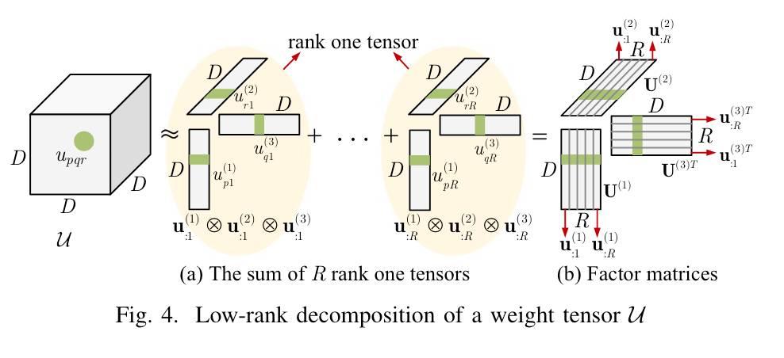

# 1.24 LTP张量填充

### Lightweight Trilinear Pooling based Tensor Completion for Network Traffic Monitoring

LTP，LSTM时序梯度连接思想，

* Q：啥领域
  * Network traffic engineering and anomaly detection rely heavily on network traffic measurement.

* Q：啥挑战
  * 由于缺乏测量所有兴趣点的基础设施、高昂的测量成本以及不可避免的传输损耗，网络监测系统存在**仅测量部分路径或时隙的网络流量数据不完整的问题**。
  * 尽管有前途，但目前张量补全算法中采用的交互模型只能捕获交通数据中的线性和简单相关性，这损害了恢复性能。

* Q：做了啥
  * 我们提出了一种新的基于轻量级三线性池化的张量补全方案，
  * ( 1 )三线性池化，一种新的多模态融合方法来建模交互函数以捕获复杂的相关性，
  * ( 2 )基于低秩分解的神经网络压缩方法来降低存储和计算复杂度，
  * ( 3 )注意力增强的LSTM来编码和整合张量补全方案中的时间模式。

* Q：解决了什么挑战
  * 内积积只能捕获同一特征维度上的线性和简单相关性，而不能捕获交通数据中的非线性和复杂相关性。
  * 交通数据通常随时间缓慢变化，并且在不同天数的相同期间具有相似的模式。因此，数据具有时间稳定性和周期性。然而，目前的张量补全算法通常以相同的方式直接嵌入不同的模式，忽略了上述时间相关性。

* Q：作者如何做
  * 我们进一步提出了一种轻量级的三线性池化方法来压缩三线性池化，在捕获与三线性池化相同且复杂的相关性的同时，**极大地降低了存储和计算开销。**
  * 我们还利用注意力增强的LSTM，通过考虑交通数据中的时间模式来细化时间嵌入。

* Q：作者的交互函数是怎么做的

  Using the multi-modal joint feature space, we design Trilinear Pooling method as
  $$
  \hat{x}_{i j k}=\mathcal{U} \cdot \mathcal{Y}=\sum_{p=1}^D \sum_{q=1}^D \sum_{r=1}^D u_{p q r} a_{i p} b_{j q} c_{k r}
  $$
  where $\mathcal{U} \in \mathbb{R}^{D \times D \times D}$​ is a transformation weight tensor.

  我觉得是不错的思路

* 低秩分解的轻量级三线性池化，如何轻量（这个应该才是作者的主要创新点）**先看原文⬇️**

  ​	虽然基于三线性池化的方法可以捕捉数据中的复杂相关性来训练神经网络模型，但其高存储和计算成本阻碍了它的实际应用。

  ​	为了降低模型的复杂性，我们提出了一种基于低秩分解的轻量级三线性池化方法，该方法将权重张量 $\mathcal{U}$ 近似为 $R$ 个秩为一的张量（外积）之和，表示为 $\mathcal{U} \approx$ $\sum_{r=1}^R \mathbf{u}_{: r}^{(1)} \otimes \mathbf{u}_{: r}^{(2)} \otimes \mathbf{u}_{: r}^{(3)}$，其中 $\mathbf{u}_{: r}^{(1)}, \mathbf{u}_{: r}^{(2)}, \mathbf{u}_{: r}^{(3)} \in \mathbb{R}^{D \times 1}$ 是秩为一张量的基向量，$R$ 表示 $\mathcal{U}$ 的秩。图 4(a) 展示了将权重张量 $\mathcal{U}$ 近似为 $R$​​ 个秩为一张量之和的过程。

  

  After such approximation, (9) can rewritten as
  $$
  \begin{aligned}
  \hat{x}_{i j k} & =\left(\sum_{r=1}^R \mathbf{u}_{: r}^{(1)} \otimes \mathbf{u}_{: r}^{(2)} \otimes \mathbf{u}_{: r}^{(3)}\right) \cdot\left(\mathbf{a}_i^T \otimes \mathbf{b}_j^T \otimes \mathbf{c}_k^T\right) \\
  & =\sum_{r=1}^R\left(\mathbf{u}_{: r}^{(1)} \otimes \mathbf{u}_{: r}^{(2)} \otimes \mathbf{u}_{: r}^{(3)}\right) \cdot\left(\mathbf{a}_i^T \otimes \mathbf{b}_j^T \otimes \mathbf{c}_k^T\right) \\
  & =\sum_{r=1}^R\left(\mathbf{u}_{: r}^{(1)} \cdot \mathbf{a}_i^T\right) \cdot\left(\mathbf{u}_{: r}^{(2)} \cdot \mathbf{b}_j^T\right) \cdot\left(\mathbf{u}_{: r}^{(3)} \cdot \mathbf{c}_k^T\right)
  \end{aligned}
  $$
  ​	幸运的是，(10)式可以在不显式创建大型多模态联合特征空间 $\mathcal{Y}$ 的情况下计算并输出 $\hat{x}_{i j k}$。

  ​	通过收集秩一张量的基向量，我们得到三个因子矩阵 $\mathbf{U}^{(1)}=\left[\mathbf{u}_{: 1}^{(1)}, \cdots, \mathbf{u}_{: R}^{(1)}\right] \in$ $\mathbb{R}^{D \times R}$，$\mathbf{U}^{(2)}=\left[\mathbf{u}_{: 1}^{(2)}, \cdots, \mathbf{u}_{: R}^{(2)}\right] \in \mathbb{R}^{D \times R}$ 和 $\mathbf{U}^{(3)}=$ $\left[\mathbf{u}_{: 1}^{(3)}, \cdots, \mathbf{u}_{: R}^{(3)}\right] \in \mathbb{R}^{D \times R}$，如图 4(b) 所示。使用这些因子矩阵，我们可以通过重写(10)式来定义我们的轻量级三线性池化，
  $$
  \hat{x}_{i j k}=\left(\mathbf{U}^{(1)} \cdot \mathbf{a}_i^T\right) \cdot\left(\mathbf{U}^{(2)} \cdot \mathbf{b}_j^T\right) \cdot\left(\mathbf{U}^{(3)} \cdot \mathbf{c}_k^T\right)
  $$

  我们在表 I 中比较了(9)式和(11)式的存储和计算成本，即压缩前后的情况。
  - 使用(9)式计算 $\hat{x}_{i j k}$ 需要存储 $\mathcal{U}$ 和 $\mathcal{Y}$，这涉及 $2 D^3$ 的空间开销，而使用(11)式计算 $\hat{x}_{i j k}$ 需要存储 $\mathbf{U}^{(1)}, \mathbf{U}^{(2)}, \mathbf{U}^{(3)}$，以及 $\mathbf{a}_i$, $\mathbf{b}_j, \mathbf{c}_k$，其存储开销是 $3 D(R+1)$。空间压缩比是 $\left(2 D^2\right) / 3(R+1)$。
  - 使用(9)式计算 $\hat{x}_{i j k}$ 涉及 $\mathrm{O}\left(D^3\right)$ 的浮点运算复杂度，而使用(11)式估计 $\hat{x}_{i j k}$ 的计算复杂度是 $\mathrm{O}(D R)$。计算复杂度压缩比是 $D^2 / R$。

  

  基于(11)式，我们为我们的轻量级三线性池化基张量补全设计了神经网络，如图 5(a) 所示。为了比较，在图 5(b) 中，我们还绘制了基于(9)式的原始三线性池化。通过对 $\mathcal{U}$ 进行低秩分解，我们将三线性池化转换为轻量级三线性池化。在图中，我们还展示了这样的分解。

  

  请注意，在图 5(a) 中，与(11)式不同，我们还增加了三个偏置项 $(+1)$ 和一个激活函数 $(\sigma)$ 来捕获其他非线性隐藏特征，以增强网络设计。因此，我们的神经网络定义的最终交互函数表示为
  $$
  \hat{x}_{i j k}=\sigma\left(\left(\mathbf{U}^{(1)} \cdot\left[\mathbf{a}_i^T, 1\right]\right) \cdot\left(\mathbf{U}^{(2)} \cdot\left[\mathbf{b}_j^T, 1\right]\right) \cdot\left(\
  
  \mathbf{U}^{(3)} \cdot\left[\mathbf{c}_k^T, 1\right]\right)\right)
  $$

* Q：他轻量在哪里
  * 大致明白了。
* Q：作者是如何针对时序维度进行嵌入（这个是不错的学习思路）
  * 时序：嵌入 + Attention + LSTM
  * LSTM与GRU，
  * **那时序的内容，我似乎可以去交通流里面找组件了（话不能说太满，效果不一定，一切实战，理论分析为主）！**
* Q：三维度的交互，如何才是重点，这个方向是不是已经做满了？
  * MLP
  * 内积
  * FM（我还没见过在本领域使用）
  * Attention（也见过在本领域使用）
  * 外积，已经有人做了
  * CNN卷积
  * 上面这些，等待实战机会
* Q：读后感
  * 这篇论文读起来似乎知识浓度没那么大。
  * 

