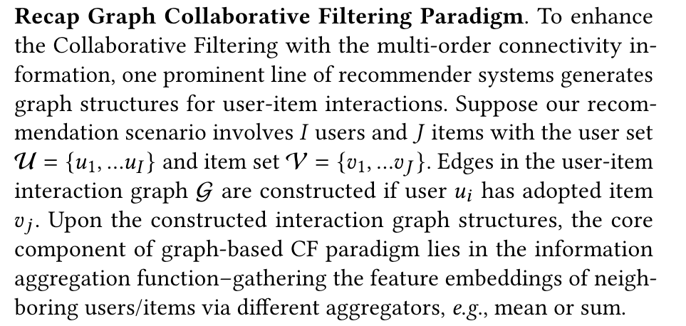

# 1.24 SHT超图论文精读

### 超图，图神经网络最后一舞？

* Q：为了什么而做

  * 许多实际推荐场景中的用户行为数据往往是有噪声的，并且呈现偏态分布，这可能导致基于GNN的模型的表示性能次优。

* Q：做了什么

  * 我们提出了SHT，一个新颖的自监督超图转换器框架( SHT )，它通过显式地探索全局协作关系来增加用户表示。
  * 我们首先通过超图变换网络为图神经CF范式赋权，以保持用户和项目之间的全局协作效应。
  * 在提取的全局上下文的基础上，提出了一个跨视图生成自监督学习组件用于用户-项目交互图上的数据增强，从而增强推荐系统的鲁棒性。

* Q：解决了什么挑战

  * 尽管上述基于图的CF模型通过提供先进的推荐性能而取得了一定的效果，但在现有的方法中，几个关键的挑战并没有得到很好的解决。
    * 首先，由于多种因素的影响，数据噪声在许多推荐场景中普遍存在。（过推荐）
    * 直接聚合来自所有交互边的信息会损害准确的用户表示。（交互边并不意味真交互）
    * 数据稀疏性和偏态分布问题仍然阻碍着有效的用户-项目交互建模，导致现有的基于图的CF模型大多偏向流行项目[ 14、41]：因此，现有方法的推荐性能随着用户数据稀缺问题而严重下降，因为高质量的训练信号可能较小。

* Q：现有方法是怎么做的

  * 虽然最近出现了一些利用自监督学习改进用户表示的推荐方法( SGL 和SLRec )，但这些方法主要通过基于概率的随机掩码操作来产生额外的监督信息，这可能会在数据增强过程中保留一些噪音交互和丢失一些重要的训练信号。

* Q：作者的核心贡献

  * 为了增强基于图的CF范式推荐的鲁棒性和泛化性能。
    * 具体来说，我们将超图神经网络与拓扑感知的Transformer相结合，以使我们的SHT能够维护全局的跨用户协作关系。
    * 在局部图卷积网络上，我们首先对拓扑感知的用户嵌入进行编码，并将其注入到Transformer架构中，在整个用户/项目表示空间中进行超图引导的消息传递。
  * 我们在生成式自监督学习框架下将局部协作关系编码器的建模与全局超图依赖学习统一起来。我们提出的新的自监督推荐系统通过图拓扑去噪方案提取辅助监督信号进行数据增强。
  * 引入基于图的元转换层，将基于图的全局表示映射为基于图的用户和项目维度的局部交互建模。
  * 我们新提出的SHT是一种模型不可知的方法，并在现有的基于图的推荐系统中作为插件学习组件。
  * 具体来说，SHT能够实现局部级别和全局级别的协作关系的合作，以促进基于图的CF模型从噪声和稀疏的用户交互数据中学习高质量的用户嵌入。
  
  *****
  
* Q：传统图神经网络是怎么样的

  

* Q：图神经网络在推荐系统中，有什么问题，怎么解决的

  * 然而，现有的大多数图神经CF模型本质上仅依赖于观测交互标签进行模型训练，**无法有效具有稀疏和噪声监督信号的交互图。**
  * 为了克服这些挑战，本文提出了一种自监督超图转换器架构，通过局部和全局协同视图之间的有效交互来生成信息丰富的知识。

* Q：什么是超图：

  图神经网络（Graph Neural Networks, GNNs）领域中的“超图”。在这个背景下，超图（Hypergraph）是一种用于表示复杂关系的数学结构，它是传统图的扩展。在传统的图结构中，每条边连接两个顶点，而在超图中，一条边可以连接两个以上的顶点，这样的边被称为超边（Hyperedge）。

  超图的特点：

  1. **超边连接多个顶点**：在超图中，一条超边可以同时连接多个顶点。这允许超图表示更为复杂和多对多的关系。

  2. **更强的表达能力**：由于其能连接多个顶点，超图能表达更复杂的关系，如群体间的互动，这在传统图中难以实现。

  3. **应用广泛**：超图在许多领域都有应用，如社交网络分析、生物信息学、通信网络等。

  图神经网络中的超图：

  在图神经网络的背景下，超图被用于模拟和学习复杂的关系。传统的图神经网络（GNN）主要处理标准图，但当面对复杂的多对多关系时，其表达能力可能受限。超图神经网络（Hypergraph Neural Networks, HGNN）被提出来处理这种更为复杂的数据结构。

  1. **超图的消息传递**：在HGNN中，消息传递（信息在节点之间的传递过程）不仅仅发生在成对的节点之间，而是在超边连接的所有节点之间。

  2. **更丰富的学习能力**：由于能处理更复杂的结构，HGNN能学习到传统GNN可能无法捕捉到的数据特征。

  3. **应用案例**：例如，在推荐系统中，一个超边可以连接一个用户和他喜欢的多个物品，从而有效地表示用户的偏好。

  总的来说，超图在图神经网络中提供了一种处理和分析复杂多对多关系的有效方法，扩展了传统图神经网络的应用范围和深度。

* Q：与现有超图在推荐系统区别：

  * 与这些通过手工设计生成超图结构的工作不同，
  * 本工作通过对全局协作关系的建模，实现了超图结构学习过程的自动化。

* Q：什么是自监督转换

  * 为了提高监督学习的嵌入质量，自监督学习( SSL )已经成为一种有前途的解决方案，具有辅助训练信号[ 16 ]，例如增强图像数据[ 12 ]，语言数据的前文序列任务[ 24 ]，知识图谱增强[ 36 ]。最近，自监督学习在图表示方面也引起了广泛的关注[ 10 ] .例如，DGI [ 23 ]和GMI [ 18 ]在带有辅助任务的GNN框架上执行生成式自监督学习。受图自监督学习的启发SGL [ 31 ]通过随机的节点和边丢弃操作生成对比视图来产生最新的性能。遵循这一研究路线，HCCF [ 33 ]利用超图生成对比信号来改进基于图的推荐系统。与他们不同的是，本工作使用生成式自监督学习框架增强了基于图的协同过滤范式。（本文相关工作）

    自监督学习是一种无需或少需人工标注数据的机器学习方法，它通过从数据本身生成训练信号来学习数据的有用表示。

  * 自监督学习在深度学习的应用：

    1. **定义与特点**：自监督学习是一种利用数据本身的结构来创建学习任务的方法。在这种设置中，模型试图从给定的输入数据中预测其未标注的部分，通过这种方式，模型能够学习到数据的内部表示。
    2. **领域应用**：自监督学习已在多个领域取得成功，包括图像处理（通过图像增强来训练模型）、自然语言处理（通过预测句子中缺失的单词来训练模型）和知识图谱增强等。

  * 段落解读

    * **图表示的自监督学习**：最近，自监督学习在图表示领域引起了广泛关注。这意味着在没有显式标签的情况下学习图的有效表示。
    * **DGI和GMI**：这两种方法是在图神经网络框架上实现自监督学习的例子。它们通过辅助任务（如重建或预测图中节点的属性）来训练模型。
    * **SGL**：这种方法通过随机丢弃节点和边来生成不同的图视图，并使用这些对比视图来训练模型。这是一种对比学习方法，通过比较不同视图的节点，模型学会了区分它们。
    * **HCCF**：这是一种利用超图生成对比信号的方法，以改进基于图的推荐系统。它扩展了自监督学习的概念，将其应用于超图结构。
    * **本文的贡献**：与上述方法不同，本文使用生成式自监督学习框架来增强基于图的协同过滤方法。这意味着本文的方法专注于使用生成任务（如重建图的一部分）来提高图基协同过滤的效果。

* Q：什么是知识图谱

  * 知识图谱（Knowledge Graph）是一种结构化的知识表示方法，它以图的形式组织和表达知识。在这个图中，节点通常代表实体（如人、地点、物体等），而边则表示这些实体之间的各种关系。知识图谱的目的是以一种易于计算机处理和理解的方式，存储和表示大量的信息和数据。

    知识图谱的关键特点：

    1. **结构化的知识表示**：知识图谱通过实体和关系的图结构，将知识组织成易于理解和查询的形式。

    2. **实体和关系**：实体可以是具体的或抽象的事物，关系定义了实体间的各种联系。

    3. **语义信息**：知识图谱中的数据不仅包含事实信息，还包含了语义信息，即数据的含义和上下文。

    4. **可扩展性和动态性**：知识图谱可以不断扩展和更新，以包含更多的实体和关系。

    5. **多种数据源**：构建知识图谱通常需要整合来自多种来源的数据，如文本、数据库、互联网等。

    知识图谱的应用领域：

    1. **搜索引擎**：提升搜索结果的相关性和丰富性。例如，Google的知识图谱用于优化搜索结果和提供事实信息。

    2. **推荐系统**：通过理解用户和内容之间的关系来提供个性化推荐。

    3. **自然语言处理**：帮助机器更好地理解和处理自然语言。

    4. **企业数据管理**：组织和解析企业内部的大量数据。

    5. **智能助手和聊天机器人**：提供更准确的信息和服务。

    总体而言，知识图谱是将复杂的信息以图形的方式组织起来，使得机器能够更有效地处理、查询和利用大量数据和信息。这在数据密集型的应用中尤为重要。

* Q：用代码简单展示一下知识图谱：

  ```python
  import networkx as nx
  import matplotlib.pyplot as plt
  
  # 创建一个空的有向图
  G = nx.DiGraph()
  
  # 添加实体（节点）
  entities = ["爱因斯坦", "相对论", "物理学", "普林斯顿大学"]
  
  # 在图中添加这些实体
  for entity in entities:
      G.add_node(entity)
  
  # 添加关系（边）
  relations = [("爱因斯坦", "提出", "相对论"), 
               ("相对论", "属于", "物理学"), 
               ("爱因斯坦", "工作于", "普林斯顿大学")]
  
  # 在图中添加这些关系
  for start, relation, end in relations:
      G.add_edge(start, end, label=relation)
   
  # 绘制图
  plt.figure(figsize=(10, 6))
  pos = nx.spring_layout(G)  # 为图形设置布局
  nx.draw(G, pos, with_labels=True, node_color='skyblue', node_size=3000, edge_color='black', linewidths=1, font_size=15)
  
  # 绘制边的标签
  edge_labels = {(start, end): G.edges[start, end]['label'] for start, end in G.edges}
  nx.draw_networkx_edge_labels(G, pos, edge_labels=edge_labels, font_color='red', font_size=12)
  
  plt.show()
  
  ```

* 作者是怎么使用超图的

  * 第一段：简单使用二阶纯GCN，学习本地图结构信息

    * Note that SHT considers neighboring nodes in different distance through residual connections.
    * The topologyaware embeddings for items can be calculated analogously.

  * 第二段：超图

    * 

  * 第三段：局部-全局自增强学习

    * 见下文

  * 第四段：模型优化
    $$
    \mathcal{L}=\sum_{r=1}^{R^{\prime}} \max \left(0,1-\left(p_{u_{r, 1}, v_{r, 1}}-p_{u_{r, 2}, v_{r, 2}}\right)\right)+\lambda_1 \mathcal{L}_{\mathrm{sa}}+\lambda_2\|\Theta\|_{\mathrm{F}}^2
    $$

  * 第五段：复杂度分析（作者表示超图具备和GNN相当的复杂度

    * 我们将我们的SHT框架与一些最新的协同过滤方法进行了比较，包括图神经架构（例如 NGCF [26]、LightGCN [6]）和超图神经网络（例如 DHCF [11]）。
    * 正如之前讨论的那样，我们的超图变换器能够将复杂度从 $O(K \times (I+J) \times d)$ 降低到 $O((I+J+K) \times d^2)$。由于超边的数量 $K$ 通常比节点数 $I$ 和 $J$ 小，但比嵌入大小 $d$ 大，所以后者的项较小，接近于 $O((I+J) \times d^2)$。
    * 相比之下，典型的图神经架构的复杂度为 $O(M \times d + (I+J) \times d^2)$。因此，我们的超图变换网络在模型推断方面可以达到与GNNs（例如图卷积网络）相当的效率。
    * 现有的基于超图的方法通常预处理高阶节点关系以构建超图，这使它们通常比图神经网络更复杂。在我们的SHT中，自增强任务与原始主任务具有相同的复杂度，其损失为 $\mathcal{L}_{\text{sa}}$​。

* 作者具体超图部分

  针对这一局限性（噪声），SHT采用超图转换框架，

  ​	i )通过自适应超图关系学习增强用户协作关系建模，缓解噪声问题；

  ​	Ii )将知识从稠密的用户/项目节点转移到稀疏的用户/项目节点。

  ​	具体来说，SHT配置了用于结构学习的Transformer - like注意力机制。将编码后的图拓扑感知嵌入注入节点表示中，以保持图的局部性和拓扑位置。同时，多通道注意[ 22 ]进一步有利于我们在SHT中的结构学习。

  ​	具体来说，SHT通过结合与ID相对应的嵌入向量 $\left(\mathbf{e}_i, \mathbf{e}_j\right)$ 和拓扑感知嵌入向量（来自嵌入表 $\overline{\mathbf{E}}^{(u)}$ 和 $\overline{\mathbf{E}}^{(v)}$ 的向量 $\overline{\mathbf{e}}_i, \overline{\mathbf{e}}_j$）生成用户 $u_i$ 和物品 $v_j$ 的输入嵌入向量，如下所示：
  $$
  \tilde{\mathbf{e}}_i=\mathbf{e}_i+\overline{\mathbf{e}}_i ; \quad \tilde{\mathbf{e}}_j=\mathbf{e}_j+\overline{\mathbf{e}}_j
  $$

  然后，SHT使用 $\tilde{\mathbf{e}}_i, \tilde{\mathbf{e}}_j$ 作为输入进行基于超图的信息传播以及超图结构学习。我们利用 $K$ 个超边从全局视角提炼协作关系。节点嵌入通过超边作为中介枢纽相互传播，其中节点与超边之间的连接被优化以反映节点之间的隐含依赖关系。

  3.2.1 节点到超边的传播。

  ​	为了简单起见，我们主要讨论用户节点与用户侧超边之间的信息传播。对于物品节点的相同过程也类似地适用。用户节点到用户侧超边的传播可以正式表示如下：
  $$
  \tilde{\mathbf{z}}_k=\|_{h=1}^H \overline{\mathbf{z}}_{k, h} ; \quad \overline{\mathbf{z}}_{k, h}=\sum_{i=1}^I \mathbf{v}_{i, h} \mathbf{k}_{i, h}^{\top} \mathbf{q}_{k, h}
  $$
  其中 $\tilde{\mathbf{z}}_k \in \mathbf{R}^d$ 表示第 $k$ 个超边的嵌入。它是通过连接 $H$ 个头特定的超边嵌入 $\overline{\mathbf{z}}_{k, h} \in \mathbb{R}^{d / H}$ 来计算的。$\mathbf{q}_{k, h}, \mathbf{k}_{i, h}, \mathbf{v}_{i, h} \in \mathbb{R}^{d / H}$ 分别是注意力机制中的查询、键和值向量，稍后将详细阐述。这里，我们通过线性点积 $\mathbf{k}_{i, h}^{\top} \mathbf{q}_{k, h}$ 计算超边 $k$ 和用户 $u_i$ 之间的边权重，这将复杂度从 $O(K \times I \times d / H)$ 降低到 $O((I+K) \times d^2 / H^2)$，避免了直接计算节点-超边连接（即 $\left.\mathbf{k}_{i, h}^{\top} \mathbf{q}_{k, h}\right)$，而是首先计算键-值点积（即 $\sum_{i=1}^I \mathbf{v}_{i, h} \mathbf{k}_{i, h}^{\top}$）。

  ​	具体而言，多头查询、键和值向量通过线性变换和切片计算得出。$h$-头特定的嵌入通过以下方式计算：
  $$
  \mathbf{q}_{k, h}=\mathbf{Z}_{k, p_{h-1}: p_h} ; \quad \mathbf{k}_{i, h}=\mathbf{K}_{p_{h-1}: p_h,}: \tilde{\mathbf{e}}_i ; \quad \mathbf{v}_{i, h}=\mathbf{V}_{p_{h-1}: p_h,:} \tilde{\mathbf{e}}_i
  $$
  其中 $\mathbf{q}_{k, h} \in \mathbb{R}^{d / H}$ 表示第 $k$ 个超边的 $h$-头特定查询嵌入，$\mathbf{k}_{i, h}, \mathbf{v}_{i, h} \in \mathbb{R}^{d / H}$ 分别表示用户 $u_i$ 的 $h$-头特定键和值嵌入。$\mathbf{Z} \in \mathbb{R}^{K \times d}$ 代表 $K$ 个超边的嵌入矩阵。$\mathbf{K}, \mathbf{V} \in \mathbb{R}^{d \times d}$ 分别代表所有 $H$ 个头的键和值变换。$p_{h-1}=\frac{(h-1) d}{H}$ 和 $p_h=\frac{h d}{H}$ 表示 $h$-头切片的起始和结束索引。

  ​	为了进一步挖掘超边之间复杂的非线性特征交互，SHT增加了两层分层超图神经网络，用于用户侧和物品侧。具体来说，最终的超边嵌入通过以下方式计算：
  $$
  \hat{\mathbf{
  
  Z}}=\operatorname{HHGN}^2(\tilde{\mathbf{Z}}) ; \quad \operatorname{HHGN}(\mathbf{X})=\sigma(\mathcal{H} \cdot \mathbf{X}+\mathbf{X})
  $$
  其中 $\hat{\mathbf{Z}}, \tilde{\mathbf{Z}} \in \mathbb{R}^{K \times d}$ 分别代表最终和原始超边嵌入的嵌入表，由超边特定嵌入向量 $\hat{\mathbf{z}}, \tilde{\mathbf{z}} \in \mathbb{R}^d$ 组成。$\operatorname{HHGN}^2(\cdot)$ 表示两次应用分层超图网络（HHGN）。HHGN 配置了一个可学习的参数矩阵 $\mathcal{H} \in \mathbb{R}^{K \times K}$，用以表征超边间的关系。引入了激活函数 $\sigma(\cdot)$ 以进行非线性关系建模。此外，我们在超图神经结构中使用了残差连接，以促进梯度传播。

  3.2.2 超边到节点的传播。**（这一部分需要注意是否有代码上的学习过程）**

  ​	有了最终的超边嵌入 $\hat{\mathbf{Z}}$，我们通过一个类似但相反的过程将信息从超边传播到用户/物品节点：
  $$
  \tilde{\mathbf{e}}_i^{\prime}=\|_{h=1}^H \overline{\mathbf{e}}_{i, h}^{\prime} ; \quad \overline{\mathbf{e}}_{i, h}^{\prime}=\sum_{k=1}^K \mathbf{v}_{k, h}^{\prime} \mathbf{k}_{k, h}^{\prime \top} \mathbf{q}_{i, h}^{\prime}
  $$
  其中 $\tilde{\mathbf{e}}_i^{\prime} \in \mathbb{R}^d$ 表示经超图神经网络精炼的用户 $u_i$ 的新嵌入。$\overline{\mathbf{e}}_{i, h}^{\prime} \in \mathbb{R}^{d / H}$ 表示由第 $h$ 个注意力头为 $u_i$ 计算出的节点嵌入。$\mathbf{q}_{i, h}^{\prime}, \mathbf{k}_{k, h}^{\prime}, \mathbf{v}_{k, h}^{\prime} \in \mathbb{R}^{d / H}$ 分别代表用户 $u_i$ 和超边 $k$ 的查询、键和值向量。这个超边到节点传播过程中的注意力计算与前述的节点到超边传播共享大部分参数。之前的查询这里作为键，之前的键作为查询。值的计算应用相同的值变换来处理超边嵌入。该计算过程可以正式表示为：
  $$
  \mathbf{q}_{i, h}^{\prime}=\mathbf{k}_{i, h} ; \quad \mathbf{k}_{k, h}^{\prime}=\mathbf{q}_{k, h} ; \quad \mathbf{v}_{k, h}^{\prime}=\mathbf{V}_{p_{h-1}: p_h,: \hat{\mathbf{z}}_k}
  $$
  3.2.3 迭代超图传播。

  ​	基于通过学习到的超图结构捕获的突出节点关系，我们提出通过堆叠多个超图变换器层来进一步传播编码的全局协作关系。通过这种方式，我们的SHT框架可以通过迭代超图传播来表征长距离的用户/物品依赖关系。具体来说，以 $(l-1)$-次迭代中的嵌入表 $\tilde{\mathbf{E}}_{l-1}$ 作为输入，SHT 递归地应用超图编码（用 HyperTrans $(\cdot)$ 表示）并获得最终的节点嵌入 $\hat{\mathbf{E}} \in \mathbb{R}^{I \times d}$ 或 $\mathbb{R}^{J \times d}$，如下所示：
  $$
  \tilde{\mathbf{E}}_l=\operatorname{HyperTrans}\left(\tilde{\mathbf{E}}_{l-1}\right) ; \quad \hat{\mathbf{E}}=\sum_{l=1}^L \tilde{\mathbf{E}}_l
  $$
  其中，通过逐元素求和来组合特定层的嵌入。用户节点和物品节点的迭代超图传播是相同的。最后，SHT 通过点积作出预测，即 $p_{i, j}=\hat{\mathbf{e}}_i^{(u) \top} \hat{\mathbf{e}}_j^{(v)}$，其中 $p_{i, j}$ 是预测分数，表示 $u_i$ 与 $v_j$ 交互的概率。

<<<<<<< HEAD
* 超图的整个过程，大致理解，那么如何构建超图呢

  ```python
  import dgl
  import torch
  
  class Hypergraph:
      def __init__(self):
          # 创建一个空的双向图
          self.g = dgl.heterograph({
              ('node', 'node_hyperedge', 'hyperedge'): ([], []),
              ('hyperedge', 'hyperedge_node', 'node'): ([], [])
          })
  
      def add_hyperedge(self, node_ids):
          # 为新的超边添加节点
          hyperedge_id = self.g.number_of_nodes('hyperedge')
          self.g.add_nodes(1, ntype='hyperedge')
  
          # 添加节点到超边的边
          self.g.add_edges(node_ids, hyperedge_id, etype='node_hyperedge')
   
          # 添加超边到节点的边
          self.g.add_edges(hyperedge_id, node_ids, etype='hyperedge_node')
  
  # 创建超图实例
  hypergraph = Hypergraph()
  
  # 添加超边
  hypergraph.add_hyperedge([0, 1, 2])
  hypergraph.add_hyperedge([1, 2, 3, 4])
  hypergraph.add_hyperedge([4, 5])
  
  # 输出图信息
  print(hypergraph.g)
  ```
  


* 超图：


1

2