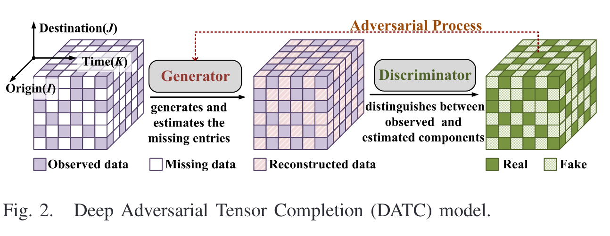
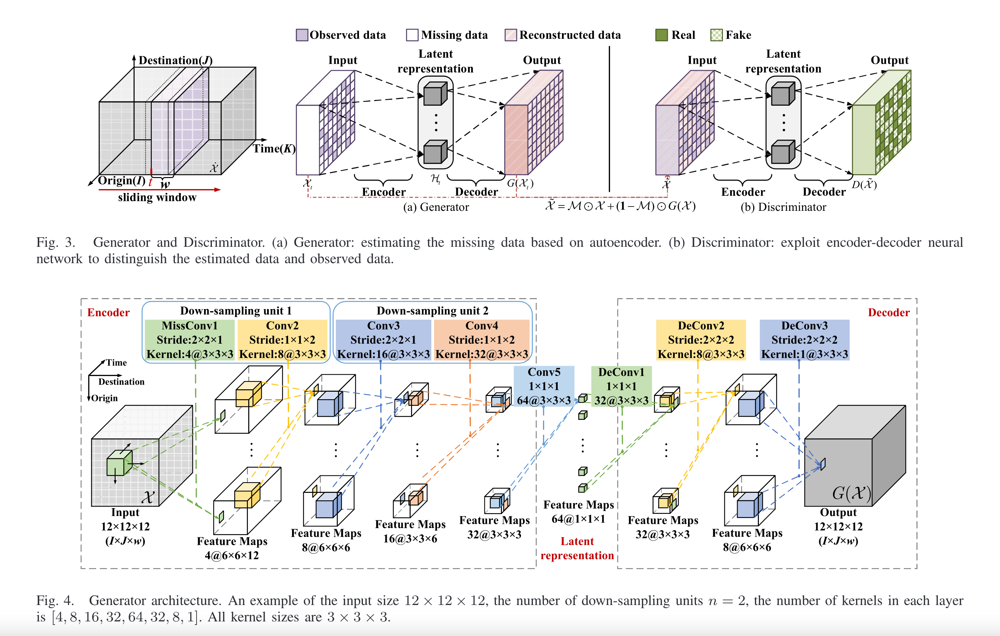
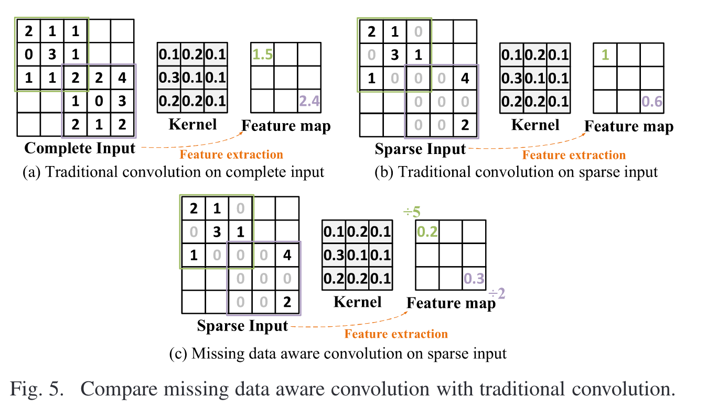

# 1.27 DATC张量对抗网络

### 对抗网络：Deep Adversarial Tensor Completion for Accurate Network Traffic Measurement

* Q：为什么而作
  * 网络故障排查、故障定位和异常检测严重依赖于网络流量测量数据。由于测量基础设施的缺乏、测量成本的高昂以及不可避免的传输损耗，网络监测系统存在网络流量数据不完整的问题。本文将交通数据建模为张量，利用其强大的特征提取能力来恢复缺失数据。
  * os：这是啥，感觉没提到什么实质性的问题
* Q：做了什么
  * DATC是第一个利用自编码器的数据重构能力和生成对抗网络的对抗训练能力来推断缺失数据的方案。
  * 尽管DL技术在图像领域取得了巨大成功，但由于交通数据的偏态分布和稀疏性，设计基于DL技术的算法来恢复含有缺失项的交通数据面临着额外的挑战。
  * 为了克服这些挑战，我们提出使用两种技术，对抗训练和缺失数据感知卷积。这些技术有助于DATC学习交通数据的复杂特征，并根据交通数据的数据分布推断缺失数据。
* Q：解决了什么挑战
  * Capturing only the linear and simple correlation（这个问题其实很好解决，感觉都不算挑战了）.
  * 无法捕获数据分布情况。这些算法通常采用对称最小二乘损失函数作为度量准则来指导隐因子的训练，其目标是最小化观测样本的估计值与实际值之间的聚合损失。它的解估计了观测样本的条件均值，并且当应用数据服从正态分布时可以很好地工作。(即,高斯分布)，但不能很好地处理具有重尾的高度倾斜的交通数据(图1 )。这可能会导致流量较大的流的测量数据恢复不好，误差较大，而这些流数据对于拥塞控制和异常检测非常重要。
* Q：如何解决挑战
  * 我们提出了一种新颖的深度对抗张量补全( Deep Adversarial Tensor Completion，DATC )模型，该模型基于生成对抗网络( Generative Adversarial Networks，GANs ) [ 26 ]架构，包含两个主要组件，生成器( Generator，G )和判别器( Discriminator，D )。我们将实测OD对的部分交通量数据作为真实数据，提出对抗训练过程来训练生成器( G )和判别器( D )。G试图推断丢失的数据条目，并将恢复的全部交通数据传递给D，D评估数据条目来自于真实值(即,真实测量)的可能性，而不是从G中推断出来。我们的DATC包括几个贡献：
  * 通过对抗过程捕获数据分布的同时准确恢复缺失数据。我们将训练过程建模为G和D之间的minimax博弈：G试图增加(即,傻子)D的错误率，而D试图准确区分真实数据和虚假数据。作为这种对抗过程的结果，G学习如何在捕获训练数据分布的同时准确推断缺失数据。
  * 全局学习非线性和时空特征进行缺失数据恢复。DATC利用3D卷积自编码器和3D卷积编码器-解码器分别作为生成器和判别器来学习隐藏在交通数据中的非线性和复杂特征。我们从理论上证明了我们的设计可以利用三维卷积神经网络( 3D Convolutional Neural Networks，3D CNNs )来学习局部范围和全局范围之间的复杂相关性
  * 缓解神经网络训练中缺失值的影响。只有部分观测值的交通数据很难应用于DL模型。为了缓解神经网络中缺失值的影响，我们设计了一个缺失数据感知卷积来建立第一个神经网络层，以便更好地进行特征提取使用经验损失函数来防止缺失值对反向传播过程的影响。

通过开会学习已经基本学懂了这篇论文大致流程

