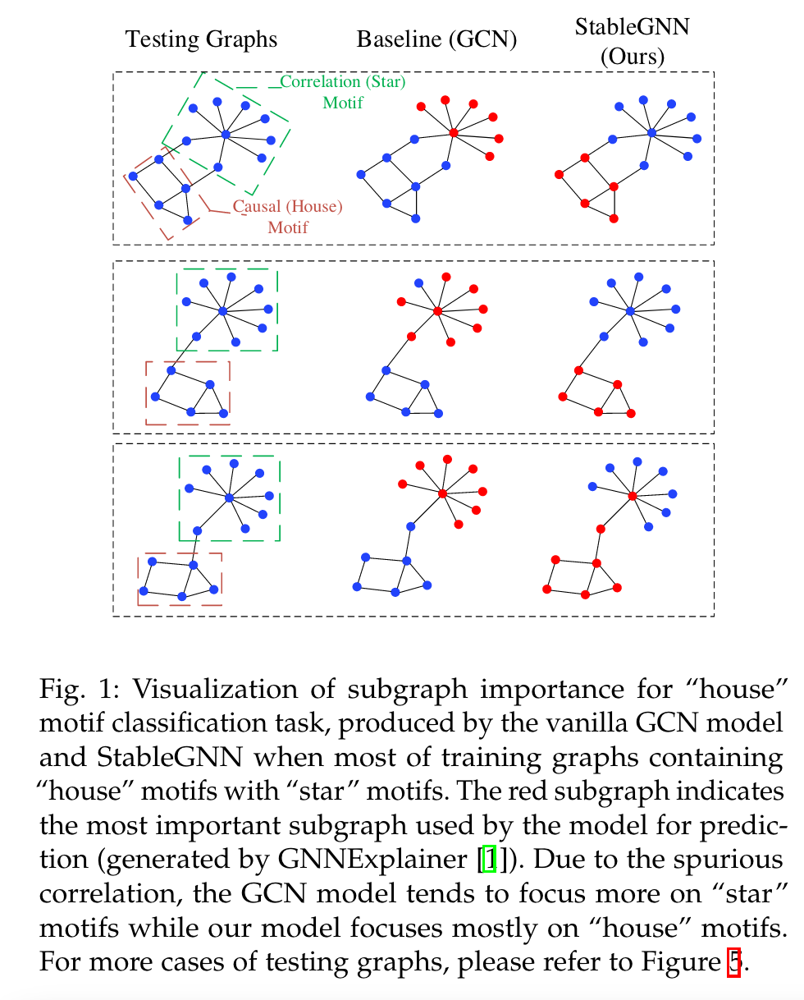
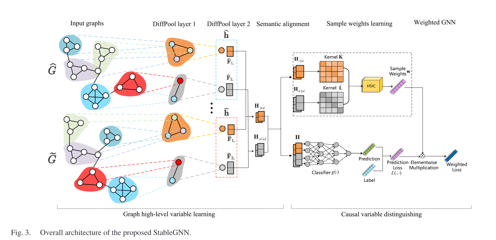

# 2.22 一个图神经网络论文阅读

Generalizing Graph Neural Networks on Out-Of-Distribution Graphs

* Q：什么领域
  * 图神经网络( Graph Neural Networks，GNNs )的提出没有考虑训练图和测试图之间的未知分布偏移，导致GNNs在Out - Of - Distribution ( OOD )环境下的泛化能力下降。
* Q：为什么而做
  * 造成这种退化的根本原因是大多数GNN是基于I . I . D假设发展起来的。在这种情况下，GNNs倾向于利用训练集中存在的细微统计相关性进行预测，尽管这是一种虚假的相关性。这种学习机制继承了机器学习方法的共同特征。然而，这种虚假的相关性在野外测试环境中可能会发生变化，导致GNNs失效。因此，消除虚假关联的影响对于稳定运行至关重要
* Q：做了什么
  * 为此，本文论证了子图级单元之间存在虚假关联，并从因果角度分析了GNN的退化现象。基于因果视图分析，我们提出了一个通用的稳定GNN因果表示框架，称为稳定GNN。
  * 该框架的主要思想是首先从原始图数据中提取高层表示，并借助因果推断的区分能力帮助模型摆脱虚假关联。特别地，为了提取有意义的高层表示，我们利用一个可微的图池化层，通过端到端的方式提取基于子图的表示。
  * 此外，受因果推断中混杂平衡技术的启发，基于学习到的高层表示，我们提出了一个因果变量区分正则器，通过学习一组样本权重来纠正有偏的训练分布。因此，GNNs将更专注于判别子结构和标签之间的真实联系。
  * I.I.D.是啥
    * IID" 是 "Independent and Identically Distributed" 的缩写，中文翻译为“独立同分布”。

* Q：现有工作的存在的问题

  * 现有GNNs的基本学习图是从训练图中学习GNNs的参数，然后对看不见的测试图进行预测。保证这种学习图成功的最基本的假设是I . I . D。假设，即训练图和测试图是独立采样的同分布[ 11 ]。然而，在现实中，由于真实数据的生成机制不可控，如数据选择偏差、混杂因素或其他特殊性等[ 12 ]、[ 13 ]、[ 14 ]、[ 15 ]，使得这样的假设很难得到满足。测试分布可能会导致训练分布的不可控和未知的偏移，称为Out - Of - Distribution ( OOD )偏移[ 16 ]，[ 17 ]，这使得大多数GNN模型无法做出稳定的预测。正如OGB benchmark [ 6 ]报道的那样，当根据OOD设置将数据集分割时，GNN方法会发生5.66 %到20 %的退化，即将结构不同的图分割成训练集和测试集。
  * 本质上，对于一般的机器学习模型，当出现分布偏移时，精度退化的主要原因是无关特征和类别标签之间的虚假相关性。这种虚假的相关性本质上是由给定类别的无关特征和相关特征之间的意外相关性引起的[ 18 ]，[ 19 ]，[ 20 ]。对于本文关注的图级别任务，由于图的预测属性通常由子图单元(例如,代表分子中功能单元的原子团和化学键) [ 1 ]，[ 8 ]，[ 21 ]决定，我们定义一个子图单元可以是一个与图标签相关的特征或不相关的特征。以"房子"模体的分类任务为例，如图1所示，其中图的标签是该图是否具有"房子"模体，第一列代表测试图。GCN模型在大多数训练图中'房子'模体与'星'模体共存的数据集上进行训练。有了这个数据集，"房子"模体和"星星"模体的结构特征将具有很强的相关性。这种出乎意料的相关性导致"明星"母题的结构特征与标签"房子"之间存在虚假的相关性。图1的第二列显示了GCN用于预测(用红色显示,由GNNExplainer生成)的最重要子图的可视化。因此，GCN模型倾向于使用这种虚假的相关性，即"星"模体进行预测。当遇到没有"星"模体的图，或者其他有"星"模体的模体(例如, "钻石"母题)时，模型容易做出错误的预测(见5.1节)。

* Q：作者遇到了什么挑战

  * 为了提高GNNs的OOD泛化能力，一个重要的方法是使GNNs摆脱这种子图级的虚假相关。然而，这并不是一项微不足道的任务，它将面临以下两个挑战：
    * ( 1 )如何将子图级信息显式地编码到图表示中?由于子图之间通常存在虚假相关性，因此有必要将这种子图信息编码到图表示中，从而开发基于子图级表示的去相关方法。
    * ( 2 )如何去除子图级表示之间的虚假相关性?同一类子图单元中的节点可能存在相关性，例如分子图的' NO2 '基团中的' N '原子和' O '原子的信息可能被编码进去一个完整的整体和这种相关性在看不见的测试分布中是稳定的。因此，我们不应该去除一类子图内部变量之间的相关性，而只需要去除子图级变量之间的虚假相关性。

  

* Q：作者是如何解决这些挑战的

  * 针对第一个挑战，我们提出了一个图的高层变量学习模块，该模块使用一个图池化层将附近的节点映射到一组簇，其中每个簇将是原始图的一个稠密连接的子图单元。此外，我们从理论上证明了聚类的语义会通过有序的串联操作在图之间进行对齐。给定对齐的高层变量，
  * 为了克服第二个挑战，我们从因果角度分析了GNNs的退化，并提出了一种新颖的因果变量区分正则化器，通过学习一组样本权重来消除每个高层变量对之间的相关性。这两个模块在我们的框架中进行了联合优化。此外，如图1所示，StableGNN可以有效地部分排除不相关的子图(即, "星"母题)，并利用真正相关的子图(即, "房子"母题)进行预测。

* Q：什么是虚假相关性

  * 训练集和测试集存在虚假相关性。

* Q：模型是什么样的

  

* Q：

素材原文C：

​	到目前为止，变量学习部分提取了所有密集连接子图的所有高层表示，而不管它是由于因果关系还是偶然相关性与图标签相关。在本节中，我们首先从因果视角分析导致GNN在OOD情景下退化的原因，然后提出因果变量区分（Causal Variable Distinguishing，CVD）正则化器和样本重加权技术。

​	回顾GNN的因果视角：如第三节所述，我们的目标是基于相关变量$Z$学习一个分类器$g(\cdot)$。为此，我们需要区分学习到的高层表示$\mathbf{H}$中的哪个变量属于$Z$或$M$。$Z$和$M$之间的主要区别是它们是否对$Y$有因果效应。对于图级别的分类任务，在学习了图表示之后，将其输入分类器以预测其标签。预测过程可以通过具有三个变量及其关系的因果图表示，如图4（a）所示，其中$T$是处理变量，$Y$是预测/结果变量，$X$是混杂变量，对处理变量和结果变量都有影响。路径$T \rightarrow Y$表示GNN的目标，旨在估计一个学习变量$T$（例如，第$i$个高层表示$\mathbf{H}_{,(i-1)d:id}$）对$Y$的因果效应。同时，其他学习变量（例如，第$j$个高层表示$\mathbf{H}_{,(j-1)d:jd}$）将作为混杂因素$X$。由于子图的偶然相关性存在，它们的学习嵌入之间存在偶然相关性。因此，$X$和$T$之间产生了一条路径。由于GNN也使用混杂因素（例如，碳环的表示）进行预测，存在一条路径$X \rightarrow Y$。因此，这两条路径形成了$X$和$Y$之间的后门路径（即$T \leftarrow X \rightarrow Y$）并引起$T$和$Y$之间的偶然相关性。偶然相关性会放大处理变量和标签之间的真实相关性，并可能在测试环境中改变。在这种情况下，现有的GNN无法准确估计子图的因果效应，所以当测试阶段偶然相关性发生变化时，GNN的性能会退化。

混杂平衡技术[51]，[52]通过平衡不同处理水平下混杂因素的分布来纠正处理变量的非随机分配。因为矩可以唯一确定一个分布，混杂平衡方法通过调整样本权重直接平衡混杂因素的矩[51]，[53]。二元处理情景下的样本权重$\mathrm{w}$​是通过以下方式学习的：
$$
\mathbf{w}=\underset{\mathbf{w}}{\arg \min }\left\|\frac{\sum_{i: T_i=1} \mathbf{w}_i \cdot \mathbf{X}_{i,}}{\sum_{i: T_i=1} \mathbf{w}_i}-\frac{\sum_{j: T_j=0} \mathbf{w}_j \cdot \mathbf{X}_j}{\sum_{j: T_j=0} \mathbf{w}_j}\right\|_2^2,
$$
其中$\mathbf{X}$是混杂因素矩阵，$\mathbf{X}_i$是第$i$个图的混杂向量。给定一个二元处理特征$T$，$\frac{\sum_{i: T_i=1} \mathbf{w}_i \cdot \mathbf{X}_{i,}}{\sum_{i: T_i=1} \mathbf{w}_i}$和$\frac{\sum_{j: T_j=0} \mathbf{w}_j \cdot \mathbf{X}_j}{\sum_{j: T_j=0} \mathbf{w}_j}$分别指的是有无处理样本上混杂因素的平均值。混杂平衡后，$X$和$T$之间的依赖关系（即$T \leftarrow X$）将被消除，因此处理变量和输出变量之间的相关性将代表因果效应（即$X \rightarrow Y$）。

​	对于GNN模型，我们对学习到的高层变量$\left\{\mathbf{H}_{, 0: d}, \ldots, \mathbf{H}_{,\left(n_L-1\right) d: n_L d}\right\}$之间的因果关系知之甚少，因此我们必须逐一将每个学习到的高层变量设置为处理变量，而剩余的高层变量被视为混杂变量，例如，将$\mathbf{H}_{, 0: d}$设置为处理变量，而$\left\{\mathbf{H}_{, d: 2 d}, \ldots, \mathbf{H}_{,\left(n_L-1\right) d: n_L d}\right\}$被视为混杂因素。注意，对于特定的处理变量，以往的混杂因素平衡技术主要设计用于单维度处理特征，而混杂因素通常由多个变量组成，每个变量是一个单维度特征。

​	然而，在我们的场景中，如图4(b)所示，我们应该处理由多个多维度混杂变量$\left\{X^{(1)}, \ldots, X^{(p)}\right\}$组成的混杂因素，其中每个多维度混杂变量对应于一个学习到的高层表示$\left\{\mathbf{H}_{, 0: d}, \ldots, \mathbf{H}_{,\left(n_L-1\right) d: n_L d}\right\}$。多维变量单元通常具有综合意义，如代表一个子图，因此不必要消除处理变量与一个多维特征单元中的每个特征$\mathbf{H}_{, i}$之间的相关性，例如$\mathbf{H}_{, 0: d}$。我们只应该消除处理变量$T$与多个多维变量单元$\left\{X^{(1)}, \ldots, X^{(p)}\right\}$之间的子图级相关性。实现这一目标的一种可能方法是学习一组样本权重，以平衡针对目标处理变量的所有混杂变量的分布，如图??所示，即随机分配处理$T^3$与混杂因素$\left\{X^{(1)}, \ldots, X^{(p)}\right\}$。样本权重$\mathrm{w}$可以通过以下多个多维混杂因素平衡目标来学习：
$$
\begin{aligned}
\mathbf{w}= & \underset{\mathbf{w}}{\arg \min } \sum_{k=1}^p \| \frac{\sum_{i: T_i=1} \mathbf{w}_i \cdot \mathbf{X}_{i,}^{(k)}}{\sum_{i: T_i=1} \mathbf{w}_i} \\
& -\frac{\sum_{j: T_j=0} \mathbf{w}_j \cdot \mathbf{X}_{j,}^{(k)}}{\sum_{j: T_j=0} \mathbf{w}_j} \|_2^2,
\end{aligned}
$$
其中$\mathbf{X}^{(k)}$是第$k$个混杂变量$X^{(k)}$的嵌入矩阵。

​	加权Hilbert-Schmidt独立性准则：由于上述混杂因素平衡方法主要设计用于二元处理变量，需要处理值将样本分为处理组或对照组，将其应用于GNN学习的连续多维变量是困难的。受到混杂因素平衡的直觉启发，即去除处理与相应混杂变量之间的依赖性，我们提出去除连续多维随机变量$T$与$\left\{X^{(1)}, \ldots, X^{(p)}\right\}$中每个混杂因素之间的依赖性。此外，由于表示模块学习到的表示之间的关系高度非线性，测量它们之间的非线性依赖性是必要的。可以采用HSIC测量来实现这一点。对于两个随机变量$U$和$V$以及核$k$和$l$，HSIC定义为$\operatorname{HSIC}^{k, l}(U, V):=\left\|C_{U V}^{k, l}\right\|_{\mathrm{HS}}^2$，其中$C^{k, l}$是在$k$和$l$的再生核希尔伯特空间(RKHS)中的交叉协方差算子，是协方差矩阵在RKHS中的类比。$\|\cdot\|_{\text {HS }}$是Hilbert-Schmidt范数，是Frobenius范数在希尔伯特空间中的类比。对于两个随机变量$U$和$V$以及径向基函数(RBF)核$k$和$l$，如果$U \perp V$，则$\operatorname{HSIC}^{k, l}(U, V)=0$。为了用有限样本估计$\operatorname{HSIC}^{k, l}(U, V)$，我们采用一种广泛使用的估计器$\operatorname{HSIC}_0^{k, l}(U, V)$，使用$m$个样本定义为：
$$
\operatorname{HSIC}_0^{k, l}(U, V)=(m-1)^{-2} \operatorname{tr}(\mathbf{K P L P}),
$$
where $\mathbf{K}, \mathbf{L} \in \mathbb{R}^{m \times m}$ are $\mathrm{RBF}$ kernel matrices containing entities $\mathbf{K}_{i j}=k\left(U_i, U_j\right)$ and $\mathbf{L}_{i j}=l\left(V_i, V_j\right) . \mathbf{P}=\mathbf{I}-m^{-1} 11^{\mathrm{T}} \in$ $\mathbb{R}^{m \times m}$ is a centering matrix, where $\mathbf{I}$ is an identity matrix and $\mathbf{1}$ is an all-one column vector. $\mathbf{P}$ is used to center the $\mathrm{RBF}$ kernel matrices to have zero mean in the feature space.

​	为了消除高级治疗表示与相应混杂因素之间的依赖性，样本重新加权技术可以生成一个伪分布，该分布中变量之间的依赖性较小【18】【56】。我们提出了一种样本重新加权方法来消除高级变量之间的依赖性，其中非线性依赖性通过HSIC来测量。

​	我们使用 $(\mathbf{w} \in \mathbb{R}_{+}^m)$ 来表示一组样本权重。对于任意两个随机变量 $(U)$ 和 $(V)$，我们首先利用随机初始化的权重来重新加权这两个变量：
$$
\begin{aligned}
& \hat{U}=\left(\mathbf{w} \cdot \mathbf{1}^{\mathrm{T}}\right) \odot U, \\
& \hat{V}=\left(\mathbf{w} \cdot \mathbf{1}^{\mathrm{T}}\right) \odot V,
\end{aligned}
$$
其中 ' $(\odot)$ ' 是哈达玛德乘积。将 $(\hat{U})$ 和 $(\hat{V})$ 代入到（12）式中，我们得到加权HSIC值：
$$
\operatorname{HSIC}_0^{k, l}(U, V, \mathbf{w})=(m-1)^{-2} \operatorname{tr}(\hat{\mathbf{K}} \mathbf{P} \hat{\mathbf{L}} \mathbf{P}),
$$
其中 $(\hat{\mathbf{K}}, \hat{\mathbf{L}} \in \mathbb{R}^{m \times m})$ 是加权的RBF核矩阵，包含条目 $(\hat{\mathbf{K}}_{i j}=k\left(\hat{U}_i, \hat{U}_j\right))$ 和 $(\hat{\mathbf{L}}_{i j}=l\left(\hat{V}_i, \hat{V}_j\right))$。具体来说，对于治疗变量 $(\mathbf{H}_{, 0: d})$ 及其对应的多个混杂因素变量 $(\left\{\mathbf{H}_{, d: 2 d}, \ldots, \mathbf{H}_{,\left(n_L-1\right) d: n_L d}\right\})$，我们在多个混杂因素之间共享样本权重 $(\mathbf{w})$，并提出通过以下方式优化 $(w)$：
$$
\mathbf{w}^*=\underset{\mathbf{w} \in \Delta_m}{\arg \min } \sum_{1<p<n_L} \operatorname{HSIC}_0^{k, l}\left(\mathbf{H}_{, 0: d}, \mathbf{H}_{,(p-1) d: p d}, \mathbf{w}\right),
$$
其中 $(\Delta_m=\left\{\mathbf{w} \in \mathbb{R}_{+}^m \mid \sum_{i=1}^m \mathbf{w}_i=m\right\}) $用于控制 d每批次的总损失几乎不变，我们使用 $ (\mathbf{w}=\operatorname{softmax}(\mathbf{w}))$ 来满足这个约束。因此，用最优的 $(\mathbf{w}^*)$ 重新加权训练样本可以最大程度地减轻高级处理变量与混杂因素之间的依赖性。

​	

​	全局多维变量去相关：上述方法是为了去除单一治疗变量 $(\mathbf{H}_{, 0: d}) $与混杂因素 $\left\{\mathbf{H}_{, d: 2 d}, \ldots, \mathbf{H}_{,\left(n_L-1\right) d: n_L d}\right\}$ 之间的相关性。然而，我们需要估计所有学习到的高级表示 $\left\{\mathbf{H}_{, 0: d}, \mathbf{H}_{, d: 2 d}, \ldots, \mathbf{H}_{,\left(n_L-1\right) d: n_L d}\right\}$的因果效应。如上所述，我们需要将每个高级表示设置为一个治疗变量，其余高级表示为混杂因素，并消除每个治疗变量与相应混杂因素之间的依赖性。实现这一目标的一种有效方法是去除变量之间的所有依赖性。具体来说，我们学习一组样本权重，全局去除每对高级表示之间的依赖性，定义如下：
$$
\mathbf{w}^*=\underset{\mathbf{w} \in \Delta_m}{\arg \min } \sum_{1 \leq i<j \leq n_L} \operatorname{HSIC}_0^{k, l}\left(\mathbf{H}_{,(i-1) d: i d}, \mathbf{H}_{,(j-1) d: j d}, \mathbf{w}\right) .
$$

从（17）式可以看出，全局样本权重 $(\mathbf{w})$ 同时减少了所有高级表示之间的依赖性。

原文D

​	在传统的图神经网络（GNN）模型中，模型的参数是在原始图数据集 $\mathcal{G}=\left\{G_1, \ldots, G_m\right\}$ 上学习的。由于因果变量区分正则化器学习的样本权重 $w$ 能够全局地解耦高级变量，我们提出使用样本权重对 GNN 损失进行加权，然后迭代优化样本权重 $w$ 和加权 GNN 模型的参数，如下所示：
$$
\begin{aligned}
f^{(t+1)}, g^{(t+1)}= & \underset{f, g}{\arg \min } \sum_{i=1}^m \mathbf{w}_i^{(t)} L\left(g\left(f\left(\mathbf{A}_i, \mathbf{F}_i\right)\right), y_i\right), \\
\mathbf{w}^{(t+1)}= & \underset{\mathbf{w}^{(t+1)} \in \Delta_m}{\arg \min } \sum_{1 \leq i<j \leq n_L} \mathrm{HSIC}_0^{k, l} \\
& \times\left(\mathbf{H}_{,(i-1) d: i d}^{(t+1)}, \mathbf{H}_{,(j-1) d: j d}^{(t+1)}, \mathbf{w}^{(t)}\right)
\end{aligned}
$$
其中 $f(\cdot)$ 是我们模型的表示部分，其输出是高级表示 $\mathbf{H}, \mathbf{H}^{(t+1)}=f^{(t+1)}(\mathbf{A}, \mathbf{F})$，$t$ 代表迭代次数，$g(\cdot)$ 是一个线性预测层，$L(\cdot, \cdot)$ 表示损失函数，具体取决于我们的目标任务。在更新样本权重和 GNN 模型参数固定时，我们需要优化目标函数（19）。我们通过成熟的优化技术（例如，Adam）来更新样本权重。在批处理中获得每个图的样本权重后，我们通过 Adam 优化器优化加权 GNN 的目标函数（18）。对于分类任务，使用交叉熵损失；对于回归任务，使用最小二乘损失。最初，每个小批次中的 $\mathbf{w}^{(0)}=(1,1, \ldots, 1)^{\mathrm{T}}$。在训练阶段，我们使用（18）和（19）迭代优化样本权重和模型参数。在推理阶段，预测模型直接基于 GNN 模型进行预测，无需计算样本权重。我们模型的详细过程显示在算法 1 中。

​	尽管 StableGNN 仍在数据集 $\mathcal{G}$ 上执行，但每个图的权重 $\mathbf{w}_i$​ 不再相同。这个权重调整了每个图在小批量损失中的贡献，使得 GNN 参数是在每个高级特征解耦的数据集上学习的，这可以更好地学习相关特征和标签之间的真实相关性。

​	限制：在我们的模型中，我们假设了图4中的一般因果变量关系。然而，对于某些数据集或任务，可能存在更复杂的高级变量之间的因果关系，因此发现这些高级变量的因果结构可能对于重建潜在的数据生成过程和实现更好的泛化能力很有用。

​	时间复杂度分析：由于提出的框架包含两部分，我们分别对其进行分析。对于图高级表示学习部分，聚集节点虽然需要额外计算一个分配矩阵，但我们观察到Diffpool层在实践中并没有引入大量额外的运行时间。原因是每个DiffPool层通过提取图的更粗糙的高级表示来减小图的大小，这加快了下一层中图卷积操作的速度。对于CVD正则化器，给定$n_L$个学习到的高级表示，计算每对高级变量的HSIC值的复杂度是$\mathcal{O}\left(m^2\right)$[58]，其中$m$是批大小。因此，对于每个批次，CVD正则化器的计算复杂度是$\mathcal{O}\left(t n_L(n_L-1) m^2\right)$，其中$t$是优化$\mathbf{w}$的时期数，$n_L$是一个非常小的数。

* Q：混杂变量和

  在给出的情境中，关于图神经网络（GNN）模型，变量被组织成高层次的表示，而这些表示之间的因果关系尚不清楚。在尝试理解这些高层表示的因果关系时，一个关键的步骤是区分处理变量和混杂变量。

  - **处理变量**（Treatment Variables）: 在这个上下文中，处理变量是你主动操作或设置的变量，以观察其对其他变量或系统的影响。在你的描述中，$\mathbf{H}_{, 0: d}$ 被选作处理变量。这意味着你会改变 $\mathbf{H}_{, 0: d}$ 的值，以观察它如何影响系统的其他部分。

  - **混杂变量**（Confounding Variables）: 混杂变量是那些既影响处理变量，也影响结果变量的变量，它们可能导致处理变量和结果变量之间的关系出现偏差。在你的案例中，$\left\{\mathbf{H}_{, d: 2d}, \ldots, \mathbf{H}_{,(n_L-1)d: n_Ld}\right\}$ 被视为混杂因素。这表示，这些变量是在观察 $\mathbf{H}_{, 0: d}$ 对其他变量影响时必须考虑的变量，因为它们可能会影响到你试图测量的效果。

  简而言之，你已经将 $\mathbf{H}_{, 0: d}$ 定义为处理变量，而所有其他的高层变量 $\left\{\mathbf{H}_{, d: 2d}, \ldots, \mathbf{H}_{,(n_L-1)d: n_Ld}\right\}$ 被视为混杂变量。这种区分对于尝试揭示变量之间的因果关系至关重要，尤其是在混杂因素可能混淆这些关系的情境中。在实践中，处理混杂变量的策略需要精心设计，以确保因果推断的准确性。

ABC

AB：93
AC：95
BC：90
ABC：96

A>C>B