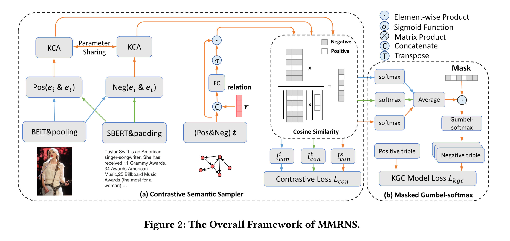
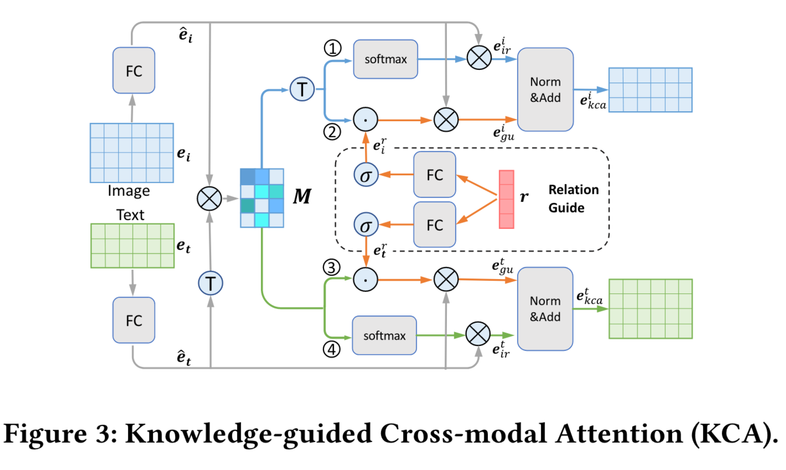

# 3.22  KGC：面向多模态知识图谱补全的关系增强负采样
* **什么领域，什么问题**
  * 领域是多模态知识图谱补全（Multimodal Knowledge Graph Completion，MKGC），问题是如何利用多模态数据（如文本、图像）和知识图谱中的关系来改善知识图谱补全的性能，特别是通过改进负样本采样策略来解决模型训练中的消失梯度问题 。

* **作者做了什么**
  
  * 作者提出了一种新的多模态关系增强负样本采样框架（MMRNS），它包括知识引导的跨模态注意力机制和对比语义采样器，以及一种掩码Gumbel-Softmax优化机制，这些设计旨在充分利用多模态数据和复杂关系，提高负样本的质量 。
  
* **现有工作是怎么做的，有哪些欠考虑的**
  * 现有的MKGC方法主要通过均匀采样来构建负样本，这种方法在训练后期容易遇到消失梯度问题。尽管现有研究尝试通过生成对抗网络等方式来发现高质量的负样本，但这些技术主要集中在结构知识上，没有充分利用丰富的多模态线索，这限制了其在多模态知识图谱补全任务上的有效性 。

* **所以作者为什么选择了当前框架做法**
  * 作者认为，通过结合多模态数据和复杂的知识图谱关系，可以更有效地识别出难负样本，进而提高模型对知识图谱中缺失信息的补全能力。当前的框架通过知识引导的跨模态注意力机制来整合视觉和文本特征，通过对比学习进一步学习正负样本之间的语义相似度/差异，使用掩码Gumbel-Softmax机制解决采样过程的不可微问题，这种方法在提高负样本质量和优化参数方面都具有潜在优势 。

* **作者在实现框架过程, 遇到了什么挑战**
  * 在实现框架的过程中，一个主要挑战是如何模拟多模态数据和知识图谱关系的复杂交互，特别是如何通过关系来引导跨模态注意力的计算，以及如何设计有效的对比语义采样器和采样过程的可微优化策略 。

* **作者是怎么解决这些挑战的**
  * 为了解决这些挑战，作者提出了知识引导的跨模态注意力机制，该机制可以整合视觉和文本特征，通过关系嵌入来引导注意力的计算。此外，作者设计了对比语义采样器来进一步提升负样本的质量，并引入掩码Gumbel-Softmax机制来实现采样过程的可微优化，这些设计帮助框架有效地处理了多模态数据和复杂关系的交互 。

* 文章细节
  
  问题定义：
  
  ​	给定一个知识图谱 $\mathcal{G}=\{(h, r, t)\} \subseteq \mathcal{E} \times \mathcal{R} \times \mathcal{E}$，我们用 $\mathcal{E}$ 表示实体集合，用 $\mathcal{R}$ 表示关系集合。知识图谱中的每个三元组表示为 $(h, r, t)$，意味着头实体 $h \in \mathcal{E}$ 和尾实体 $t \in \mathcal{E}$ 通过有向关系 $r \in \mathcal{R}$ 连接。此外，我们用 $t \in \mathbb{R}^{d_{emb}}$ 和 $r \in \mathbb{R}^{d_{emb}}$ 分别表示尾实体和关系的嵌入。同时，我们用 $\boldsymbol{e}_{\boldsymbol{i}} \in \mathbb{R}^{d_i \times d_N}$ 表示视觉特征，用 $\boldsymbol{e}_{\boldsymbol{t}} \in \mathbb{R}^{d_t \times d_M}$​ 表示文本特征来描述多模态线索。
  
  
  
  ​	这样，知识图谱补全（KGC）任务可以被建模为一个排序问题，即给定一个正例三元组 $\left(h, r, t^{+}\right)$ 和若干负例三元组 $\left(h, r, t^{-}\right)$，KGC 模型旨在通过一个有效的评分函数提高正例三元组的得分并降低负例三元组的得分。
  
  
  
  ​	沿着这条线，我们采样策略的目标是利用正例三元组和相应的多模态数据来最大化难负例样本 $t^{-}$ 的采样概率，这些负例样本在语义上与正例相似，以提高模型的区分能力。
  
  
  
  知识交叉模态注意力
  
  ​	接下来，我们详细介绍知识引导的跨模态注意力（KCA）机制的细节，该机制通过整合多个关系来学习跨模态双向注意力权重。
  
  ​	具体来说，KCA首先尝试捕获不同模态之间的交互，即图像和文本，旨在同时突出跨模态数据之间相同的语义特征，以学习与关系无关的特征。我们通过跨模态特征来表示与关系无关的特征，这些特征在不同的关系下都很重要，用于识别难样本。例如，在图1中，泰勒·斯威夫特的负样本预期是一个与人相关的实体，包含更多与人体或面部相关的属性，而不管关系是AwardOf还是Girlfriend，都与其他不相关的实体（如位置）无关。
  
  ​	同时，在描述了多模态交互之后，KCA进一步整合关系信息，以指导模型确定哪些多模态语义特征应该被突出，以学习由关系引导的特征。例如，当关系是AwardOf时，KCA旨在增强如歌手和音乐等属性的跨模态注意力。当关系是Girlfriend时，KCA旨在增强如女性等属性的跨模态注意力。值得注意的是，关系作为一种分类数据，包含有限且粗粒度的标签信息，通常与图像和文本没有语义相似性或相关性。因此，在引入关系进行引导时，我们首先通过建模文本和视觉特征的交互，然后分别引入关系嵌入来指导图像和文本的跨模态注意力权重。
  
  
  
  ​	根据这一思路，给定视觉特征 $\boldsymbol{e}_{\boldsymbol{i}}$ 和文本特征 $\boldsymbol{e}_{\boldsymbol{t}}$，它们首先被输入到一个全连接网络中进行非线性映射和维度统一：
  $$
  \hat{\boldsymbol{e}}_{\boldsymbol{i}}=R\left(\boldsymbol{e}_{\boldsymbol{i}} \boldsymbol{W}_{\boldsymbol{i}}+\boldsymbol{b}_{\boldsymbol{i}}\right) \in \mathbb{R}^{d_i \times d_{att}} \quad \hat{\boldsymbol{e}}_{\boldsymbol{t}}=R\left(\boldsymbol{e}_{\boldsymbol{t}} \boldsymbol{W}_{\boldsymbol{t}}+\boldsymbol{b}_{\boldsymbol{t}}\right) \in \mathbb{R}^{d_t \times d_{att}}
  $$
  其中 $R(\cdot)$ 是激活函数 LeakyRELU，$\boldsymbol{W}$ 和 $\boldsymbol{b}$ 分别代表可训练的权重和偏置。跨模态矩阵 $\boldsymbol{M} \in \mathbb{R}^{d_i \times d_t}$ 通过下式计算：
  $$
  \boldsymbol{M}=\hat{\boldsymbol{e}}_{\boldsymbol{i}} \cdot \hat{\boldsymbol{e}}_{\boldsymbol{t}}^T
  $$
  $\boldsymbol{M}$ 的目标是捕获和突出图像和文本之间相同的语义特征。这里，该模块被划分为四个分支，如图3所示：(1) 文本引导的视觉注意力，(2) 关系-文本引导的视觉注意力，(3) 关系-图像引导的文本注意力，以及 (4) 图像引导的文本注意力。
  	在分支 (1) 中，KCA 标准化 $\boldsymbol{M}$ 来产生由文本的每个句子条件化的视觉区域的注意力权重。注意力权重乘以图像特征 $\hat{\boldsymbol{e}}_{\boldsymbol{i}}$ 来得到关注的与关系无关的视觉表示 $\boldsymbol{e}_{i r}^i$，这适用于任何关系类型。
  
  ​	在分支 (2) 中，KCA 旨在进一步整合关系嵌入来引导跨模态语义信息。与 (1) 的区别在于，(2) 利用知识图谱中的关系来引导标准化的注意力权重。在这种情况下，注意力权重也乘以图像特征 $\hat{\boldsymbol{e}}_{\boldsymbol{i}}$ 来得到关注的由关系引导的视觉表示 $\boldsymbol{e}_{g u}^i$：
  $$
  \boldsymbol{e}_{g u}^i=\hat{\boldsymbol{e}}_{\boldsymbol{i}} \cdot\left(\boldsymbol{M}^T \odot \boldsymbol{e}_{\boldsymbol{i}}^{\boldsymbol{r}}\right)
  $$
  这里的 $\odot$ 表示元素乘法操作，$\boldsymbol{e}_{\boldsymbol{i}}^{\boldsymbol{r}}$​ 代表关系的嵌入，用于调制注意力权重，从而使注意力机制可以根据关系的不同而突出不同的视觉特征。
  
  ​	这里 $\boldsymbol{e}_{\boldsymbol{i}}^r$ 和 $\boldsymbol{e}_{\boldsymbol{t}}^{\boldsymbol{r}}$ 是通过将关系 $r$ 的嵌入输入到两个不同的全连接层产生的，分别引导视觉和文本注意力的双向生成：
  $$
  \boldsymbol{e}_i^r=\sigma\left(\boldsymbol{r} \cdot W_i^r+b_i^r\right) \quad e_t^r=\sigma\left(\boldsymbol{r} \cdot W_t^r+b_t^r\right)
  $$
  
  相应地，分支 (3) 和 (4) 尝试学习由图像和关系引导的被关注的文本表示，其动机类似于分支 (2) 和 (1)。跨模态和关系引导的表示 $\boldsymbol{e}_{i r}^i$ 和 $\boldsymbol{e}_{g u}^i$ 都被输入到层归一化中以统一分布，然后相加得到知识引导的视觉表示：
  $$
  \boldsymbol{e}_{k c a}^i=\operatorname{Norm}\left(\boldsymbol{e}_{i r}^i\right)+\operatorname{Norm}\left(\boldsymbol{e}_{g u}^i\right)
  $$
  同样地，我们采用相同的过程产生知识引导的文本表示 $\boldsymbol{e}_{k c a}^t$​。
  
  ### 对比语义采样
  
  我们进一步构建了一个对比语义采样器，以计算负样本的采样分布。采样器首先应用预训练模型来提取语义特征，然后使用KCA机制来模拟多模态交互，并以关系为指导。我们采样器的核心是通过挖掘正样本和负样本之间的相似性和差异性，进一步学习多模态语义表示。
  
  3.3.1 特征预处理
  
  ​	我们首先通过BEiT[3]提取初步视觉特征，这可以用于学习语义区域和对象边界。我们对语义视觉表示应用平均池化，以降低计算复杂性。然后，我们通过SBERT[30]提取初步文本特征，这在常见的语义文本相似性任务上有显著改进。此外，我们通过裁剪和填充使表示张量具有相同的维度。由于实体也是结构嵌入，如同关系一样，我们只需连接它们并将它们输入到全连接网络中以整合关系信息。
  $$
  \boldsymbol{e}_{\boldsymbol{s}}=\boldsymbol{t} \cdot \sigma\left(\operatorname{concat}(\boldsymbol{r}, \boldsymbol{t}) \cdot \boldsymbol{W}_{\boldsymbol{s}}+\boldsymbol{b}_{\boldsymbol{s}}\right)
  $$
  
  3.3.2 余弦相似性
  
  正样本和负样本的图像-文本对的初步特征分别被输入到KCA中。正样本和负样本的KCA共享参数。两个实体的视觉表示之间的视觉特征相似性 $z_i$ 和 $z_j$ 使用余弦相似性来测量。$\delta$ 是一个小数，以确保分母不为零。
  $$
  \operatorname{sim}^i\left(z_i, z_j\right)=\frac{z_i{ }^T z_j}{\left\|z_i\right\|\left\|z_j\right\|+\delta}
  $$
  3.3.3 对比损失
  
  最后，我们构建了一个与文献[10]类似的对比损失函数，该函数以相似性为输入，但仅具有一个正样本对。然而，由于知识图谱中的1对多关系，我们有多个正样本。
  
  因此，该模块的目标是缩小正样本之间的差距，同时扩大正样本和负样本之间的差距。此外，我们在框架中整合了自对抗技术[32]，以进一步提高模型性能。对于第 $i$ 个三元组的损失权重 $p\left(h_i, r, t_i\right)$ 由KGC模型的分数计算得出。对于那些未被采样的三元组，我们将其权重设置为 $1 /|\mathcal{E}|$：
  $$
  p\left(h_i, r, t_i\right)=\left\{\begin{array}{lr}
  \frac{\exp \left(\alpha \cdot K G C\left(h_i, r, t_i\right)\right)}{\sum_{j \in S} \exp \left(\alpha \cdot K G C\left(h_j, r, t_j\right)\right)} & i \in S \\
  1 /|\mathcal{E}| & \text { otherwise }
  \end{array}\right.
  $$
  其中，$S$ 是采样三元组的集合，$\alpha$ 是采样的温度。这样，视觉特征相似性的最终对比损失函数如下：
  $$
  l_{\text {con }}^i=-\log \frac{\sum_{j \in P} p\left(h_j, r, t_j\right) \exp \left(\operatorname{sim}^i\left(z, z_j\right)\right)}{\sum_{n \in N} p\left(h_n, r, t_n\right) \exp \left(\operatorname{sim}^i\left(z, z_n\right)\right)}
  $$
  其中，$P$ 是正样本集，$N$ 是负样本集。我们同时按照公式8计算文本和结构特征的相似性，以及按照公式10计算对比损失，分别表示为 $l_{\text {con }}^t$ 和 $l_{\text {con }}^s$。总的对比损失通过对它们取平均获得：
  $$
  L_{\text {con }}=\left(l_{\text {con }}^i+l_{\text {con }}^t+l_{\text {con }}^s\right) / 3
  $$
  在这一部分中，我们将解释如何使用提出的可微采样方法，该方法结合了掩码操作和gumbel-softmax来确保有效的梯度反向传播。掩码操作旨在解决将gumbel-softmax引入KGC采样过程中的问题。
  
  3.4.1 Gumbel-Softmax
  
  由于类别分布的采样过程与优化过程是独立的，KGC模型的梯度无法反向传播到采样网络。因此，对比语义采样器的可训练参数不能与KGC模型的训练阶段以端到端的方式优化。为了实现梯度反向传播，我们引入了gumbel-softmax的重参数化技巧[17]，它产生一个连续分布，可以使用softmax函数作为argmax的可微近似，从离散概率分布$\boldsymbol{p}$中近似采样：$\boldsymbol{y}=\operatorname{softmax}((\log (\boldsymbol{p})+\boldsymbol{g}) / \tau)$。其中，$\boldsymbol{g}$中的每个元素$g_i$是从标准Gumbel分布[14, 25]中独立同分布(i.i.d)采样得到的。
  
  3.4.2 掩码向量
  
  考虑到图像、文本和结构中正样本和负样本的语义相似性分别用于计算概率分布$\boldsymbol{p}$，我们使用softmax将相似性转换为采样概率：
  $$
  \boldsymbol{p}=\left(S F\left(\operatorname{sim}^i / \epsilon\right)+S F\left(\operatorname{sim}^t / \epsilon\right)+S F\left(\operatorname{sim}^s / \epsilon\right)\right) / 3
  $$
  其中$S F(\cdot)$表示softmax函数，$\epsilon$是一个用于平衡探索和利用的因子，将在下文中详细说明。然而，$\boldsymbol{p}$不是最终的采样概率分布。由于知识图谱中1对多关系非常常见，不是所有的实体都可以被视为负样本。最常见的方法将过滤掉正样本$[4,32]$。一种常见的做法是将采样概率分布$\boldsymbol{p}$中正样本的位置设为零。但这将使gumbel-softmax不可微，这与我们的目的相悖。因此，我们提出了一种非可微的掩码向量，其中负位置的值设置为1.0，正位置的值设置为接近零的数值。概率分布$\boldsymbol{p}$与掩码向量进行元素乘法。我们注意到，由于对数函数，乘法可以被加法替代，以减少计算复杂性。以下是掩码gumbel-softmax：
  $$
  \boldsymbol{y}_{\boldsymbol{m}}=S F((\log (\boldsymbol{p})+\log (\boldsymbol{m a s k})+\boldsymbol{g}) / \tau)
  $$
  这里$\boldsymbol{y}_{\boldsymbol{m}}$是采样结果。值得注意的是，掩码向量还有助于实现无替换采样。总损失$L$通过将KGC模型的损失$L_{k g c}$和采样器的损失$L_{\text {con }}$相加获得。损失率$\beta$的影响将在4.5节中分析。
  $$
  L=L_{k g c}+\beta L_{c o n}
  $$
  
  3.4.3 探索与利用
  
  ### 3.4.3 探索与利用
  在这里，考虑到在不同训练阶段使采样策略适应性强，我们进一步定义了一个探索与利用因子 $\epsilon$。其动机是在早期训练阶段学习难样本和简单样本，并在后期训练阶段更多地关注难样本的利用。$\epsilon$ 的值随着迭代次数的增加而减小。$\epsilon$ 的效果将在4.5节中详细讨论。
  $$
  \epsilon=\epsilon_o /(1+\log (\text { iter }))
  $$

‘


在这个模型中，有四个分支，旨在通过引导跨模态语义信息来融合和利用知识图谱中的关系嵌入。以下是对这四个分支的详细描述：

1. **关注与关系无关的视觉表示**：在这个分支中，KCA（知识条件化注意力）标准化注意力权重矩阵$\boldsymbol{M}$，以生成文本的每个句子条件化的视觉区域的注意力权重。这些注意力权重随后乘以图像特征$\hat{\boldsymbol{e}}_{\boldsymbol{i}}$，以得到关注的与关系无关的视觉表示$\boldsymbol{e}_{i r}^i$。这一表示适用于任何关系类型。

2. **由关系引导的视觉表示**：与第一个分支相比，这个分支进一步整合了关系嵌入来指导跨模态语义信息。不同之处在于，这里利用知识图谱中的关系来指导标准化的注意力权重。在这种情况下，注意力权重也乘以图像特征$\hat{\boldsymbol{e}}_{\boldsymbol{i}}$，以产生由关系引导的视觉表示$\boldsymbol{e}_{g u}^i$。这里的操作包括元素乘法$\odot$，$\boldsymbol{e}_{\boldsymbol{i}}^{\boldsymbol{r}}$代表关系的嵌入，用于调制注意力权重，使得注意力机制能够根据不同的关系突出不同的视觉特征。

3. **关注与关系无关的文本表示**：这个分支的目的是学习由图像和关系引导的被关注的文本表示。它试图通过视觉特征和关系嵌入来引导文本注意力，从而获取与关系无关的文本表示。

4. **由关系引导的文本表示**：这个分支与第二个分支类似，但专注于文本方面。它利用知识图谱中的关系和图像特征来引导文本注意力权重的标准化，从而产生由关系引导的文本表示。

在所有分支中，关系嵌入$\boldsymbol{e}_{\boldsymbol{i}}^{\boldsymbol{r}}$和$\boldsymbol{e}_{\boldsymbol{t}}^{\boldsymbol{r}}$是通过将关系$r$的嵌入输入到两个不同的全连接层来生成的，分别用于引导视觉和文本的双向生成。最后，通过层归一化和相加操作，将跨模态和关系引导的视觉表示$\boldsymbol{e}_{i r}^i$和$\boldsymbol{e}_{g u}^i$合并，以得到知识引导的视觉和文本表示$\boldsymbol{e}_{k c a}^i$和$\boldsymbol{e}_{k c a}^t$​。


在对比学习中，我们的目标是最小化对比损失$l_{\text{con}}^i$。因此，我们实际上希望$l_{\text{con}}^i$的值越小越好。

当分子（即实例$z$与其正样本集$P$中样本的加权相似度之和）相对于分母（即实例$z$与其正样本集和负样本集$N$中样本的加权相似度之和）较大时，这意味着实例$z$与其正样本之间的相似度明显高于与负样本之间的相似度。这是理想的情况，因为它表示模型能够有效地将正样本与负样本区分开来。

由于对比损失$l_{\text{con}}^i$是通过对这个比值取负对数来计算的，所以当分子相对分母变大时，$l_{\text{con}}^i$实际上会变小。换句话说，模型表现得越好（即正样本与实例$z$之间的相似度显著高于负样本与实例$z$之间的相似度），$l_{\text{con}}^i$的值就越小。

总结来说，我们的目标是最小化$l_{\text{con}}^i$，而分子较大导致$l_{\text{con}}^i$减小，这正是我们想要的结果。


在对比损失公式
$$
l_{\text {con }}^i=-\log \frac{\sum_{j \in P} p\left(h_j, r, t_j\right) \exp \left(\operatorname{sim}^i\left(z, z_j\right)\right)}{\sum_{n \in N} p\left(h_n, r, t_n\right) \exp \left(\operatorname{sim}^i\left(z, z_n\right)\right)}
$$
中，如果分子（正样本相似度的加权和）较大，意味着实例$z$与其正样本集$P$中样本的相似度总体较高，这在直觉上表示模型能够较好地将正样本与实例$z$关联起来。

当分子增大时，分子与分母的比值增大，从而使得整个分数变大。然而，由于这个比值被放在负对数函数$-\log(\cdot)$中，整个表达式$l_{\text {con }}^i$的值会变小。这是因为负对数函数是单调递减的，当其输入（即分子与分母的比值）增大时，输出值（即$l_{\text {con }}^i$）减小。

总的来说，当分子较大时，即实例与正样本之间的相似度高于与负样本之间的相似度时，$l_{\text {con }}^i$的值减小，这表明模型在区分正样本和负样本方面的性能较好。在对比学习中，模型的目标是最小化$l_{\text {con }}^i$，以提高其对正负样本的区分能力。因此，分子较大是优化过程中所期望的结果。


在推荐系统中，确实常见的任务是预测用户对某个项目（如电影或商品）的评分或偏好程度。而在知识图谱补全（Knowledge Graph Completion, KGC）任务中，目标有所不同。


KGC的任务是预测和推断知识图谱中缺失的关系或实体。具体来说，KGC旨在识别并验证给定头实体$h$和关系$r$时，哪些尾实体$t$是正确的，即三元组$(h, r, t)$在知识图谱中是否应该存在。

这里提到的"评分函数"不同于推荐系统中用于评分预测的函数。

在KGC的上下文中，评分函数用来给每个可能的三元组$(h, r, t)$​赋予一个得分，反映了这个三元组作为知识图谱中一个正确事实的可能性。模型的目标是给真正存在的（正例）三元组分配更高的得分，而给不正确的（负例）三元组分配更低的得分。


而这里提到的"最大化难负例样本$t^{-}$的采样概率"则是指在训练过程中，选择那些与正例在语义上接近但实际上是不正确的负例。这种选择策略可以增强模型的学习效率和预测能力，因为它迫使模型学习区分那些难以区分的例子，从而提高其泛化能力。

总结来说，知识图谱补全任务和推荐系统中的评分预测任务虽然在技术上有相似之处，但它们的目标和应用场景是不同的。KGC专注于识别知识图谱中可能的关系正确性，而推荐系统则专注于用户对项目的个性化偏好预测。


这张图展示的是“知识引导的跨模态注意力（Knowledge-guided Cross-modal Attention, KCA）”模块，它是设计用来增强多模态学习，特别是在结合了知识图谱的情境下。这个KCA模块通过以下步骤处理图像和文本信息：

1. **无关系引导的视觉注意力**（标记为1）：
   - 使用softmax函数对注意力权重矩阵$M$进行标准化，这些权重是基于图像特征$e_i$和文本特征$e_t$计算得出的。
   - 然后将这些权重应用于图像特征$\hat{e}_i$（通过全连接层FC处理的$e_i$）以获得无关系引导的视觉表示$e_{ir}^i$。

2. **由关系引导的视觉注意力**（标记为2）：
   - 在这一步中，额外的关系向量$r$被用来调整注意力权重矩阵，这是通过两个全连接层和sigmoid激活函数来完成的，结果用于产生由关系引导的视觉表示$e_{gu}^i$。

3. **由关系引导的文本注意力**（标记为3）：
   - 类似于步骤2，但是这一步针对的是文本特征$e_t$，以获得由关系引导的文本表示$e_{gu}^t$。

4. **无关系引导的文本注意力**（标记为4）：
   - 使用softmax函数来获得文本特征相对于图像特征的标准化注意力权重，这些权重再应用于文本特征$\hat{e}_t$（通过全连接层FC处理的$e_t$）以获得无关系引导的文本表示$e_{ir}^t$。

最终，通过层归一化（Norm）和累加（Add）操作，这四个分支生成的表示被合并为最终的知识引导的视觉表示$e_{kca}^i$和文本表示$e_{kca}^t$。

整体上，这个模型旨在融合来自不同模态（图像和文本）的信息，并利用知识图谱中的关系知识来增强跨模态表示的学习。这样的方法有助于提升模型在面对需要理解和结合不同类型数据及其内在关系的复杂任务时的性能，例如在图像和文本的匹配和分类中，或是在其它涉及理解多模态内容和背后知识的应用中。


这张图展示了一个对比语义采样器的框架，其中包含了知识引导的跨模态注意力（KCA）模块，用于处理多模态数据（图像和文本），并且结合了知识图谱中的关系信息。下面是对各部分的具体解释：

1. **两个KCA模块**：
   - 这两个KCA模块处理的输入是图像和文本的特征，分别表示为$e_i$和$e_t$。KCA利用这些特征来计算跨模态注意力权重，但两个KCA模块的处理方式不同。一个处理正样本（Pos）对，另一个处理负样本（Neg）对，其中正样本对可能是图像和描述的匹配对，而负样本对可能是不匹配的图像和描述。
   - 这些KCA模块通过参数共享，这意味着它们在学习如何关联图像和文本特征时使用相同的权重。

2. **正负采样**：
   - 正样本对（Pos）通常是正确的图像和文本的组合，即数据集中实际匹配的图像和描述。
   - 负样本对（Neg）是错误的组合，即图像与不相关或错误的描述配对，这些用于训练模型识别不匹配的多模态数据。

3. **关系引导（Relation Guide）**：
   - 关系嵌入$r$作为一个额外的信息源加入到框架中，用于指导KCA模块如何计算注意力权重。关系嵌入通常由知识图谱预先训练得到，并在这里用于帮助区分正负样本对。

4. **余弦相似度**：
   - 余弦相似度用于计算图像和文本嵌入之间的相似性。通过比较正负样本对之间的相似度，模型能够学习区分匹配和不匹配的多模态数据。

5. **对比损失 $L_{con}$**：
   - 对比损失用于训练模型，以优化正样本对的相似度高于负样本对的相似度。这种训练方式使得模型能够更准确地关联图像和文本，并能够在给定图像时检索到正确的文本描述，反之亦然。

总的来说，这个框架的目的是通过对比学习和知识引导来提升多模态数据处理的性能，同时结合知识图谱中的关系信息来增强模型的语义理解能力。通过这种方式，模型不仅学习图像和文本之间的相似性，还考虑了它们与知识图谱中定义的关系之间的兼容性。这对于那些依赖于丰富语义理解的任务，比如自动图像标注、视觉问答或跨模态检索等，特别有用。


知识图谱补全（Knowledge Graph Completion, KGC）问题主要关注的是填补知识图谱中的缺失信息，这通常涉及以下两类任务：

1. **链接预测（Link Prediction）**：
   - 这个任务关注的是预测知识图谱中可能存在但尚未记录的实体间的链接。给定一个实体对（头实体和尾实体），目标是预测它们之间可能存在的关系。例如，如果我们知道“巴拉克·奥巴马”是一个“政治人物”，那么模型可能会被要求预测“巴拉克·奥巴马”和“美国”之间的可能关系，正确的预测可能是“是国家领导人”。

2. **实体消歧（Entity Disambiguation）**：
   - 在这个任务中，目标是识别指向知识图谱中同一个实体的不同文本描述。例如，根据不同上下文中的“苹果”，确定它是指“苹果公司”还是指“水果”。

在这两种任务中，通常会有一个包含实体（entities）和关系（relations）的现有知识图谱。这个图谱被用作训练数据，来教模型学习如何推断图谱中未记录的信息。训练期间，模型会接触到正例（实际存在于图谱中的链接）和负例（人为构造的、不存在的链接）。

在多模态KGC中，可能还会考虑除了传统文本描述外的其他模态数据，比如图像或声音，这可以进一步提升模型的性能，尤其是在处理那些文本信息不足以准确描述或消歧的实体的情况。

正样本和负样本在多模态KGC中扮演的角色类似于传统KGC。正样本帮助模型学习正确的实体和关系的模式，而负样本则用于教导模型识别不正确或不可能的链接，增强其鲁棒性和推理能力。在多模态环境中，正负样本的选择可能还会基于图像或其他模态的特征，进一步挖掘和利用多模态数据中的丰富语义信息。


*****

​	在训练知识图谱补全（KGC）模型时，需要正样本（图谱中已存在的三元组）和负样本（假设的、不正确的三元组）。

​	

​	负样本对模型学习至关重要，因为它们帮助模型学习区分什么样的三元组是不可能或不正确的。


​	在传统的方法中，负样本通常是通过随机替换三元组中的头实体或尾实体来生成的，这被称为均匀采样。


​	均匀采样在训练初期可以很有效，因为随机生成的负样本与正样本区分很大，模型可以容易地学习到区分它们的特征。


​	但在训练的后期，当模型已经学会了识别大多数明显错误的负样本时，这种简单的负样本就不足以对模型提供足够的学习信号了


​	模型对这些负样本的预测几乎都是正确的，因此，这些负样本对应的梯度很小，甚至趋近于零。这就是所谓的梯度消失问题，此时模型已经不再学习了。

*****


​	消失梯度问题的一个解决方案是引入一种更复杂的负样本采样策略，如**负采样**。


​	而Gumbel-Softmax则提供了一种生成“硬”负样本的方法，这些负样本在与正样本的区别上更加微妙和有挑战性，这可以迫使模型在训练后期继续学习和进步。


​	Gumbel-Softmax是一种基于Gumbel分布的采样方法，它允许从分类分布中进行可微分采样，适用于需要随机选择类别的场景，例如生成模型中的离散采样。

​	在KGC中，Gumbel-Softmax可以用于选择更有挑战性的负样本，这些负样本与正样本在语义上更为接近，从而提供了更强的训练信号并缓解梯度消失问题。


​	总结来说，均匀采样在训练后期可能导致模型遇到梯度消失问题，因为模型已经能够很容易地识别这些负样本。而Gumbel-Softmax通过允许从一个调整过的、更有信息量的分类分布中采样，可以帮助生成更有难度的负样本，从而推动模型在训练过程中持续地学习和改进。这种方法可以帮助利用多模态


1. **样例1：** 给定知识图谱：

   - (Cat, isA, Mammal)
   - (Dog, isA, Mammal)
   - (Mammal, isA, Animal)

   问题：预测 `(Cat, isA, Animal)` 是否成立。

   在这个例子中，我们已经知道 Cat 是 Mammal 的一种，Mammal 是 Animal 的一种，因此预测 `(Cat, isA, Animal)` 是合理的。

2. **样例2：** 给定知识图谱：

   - (Paris, isCapitalOf, France)
   - (Rome, isCapitalOf, Italy)
   - (Italy, isCountryOf, Rome)

   问题：预测 `(France, isCapitalOf, Rome)` 是否成立。

   在这个例子中，我们知道 France 的首都是 Paris，Italy 的首都是 Rome，但我们并不知道 France 和 Rome 之间是否存在首都关系，因此预测 `(France, isCapitalOf, Rome)` 是不确定的。

3. **样例3：** 给定知识图谱：

   - (Apple, isA, Fruit)
   - (Banana, isA, Fruit)
   - (Apple, growsIn, Orchard)

   问题：预测 `(Banana, growsIn, ?)` 中的 `?`。

   在这个例子中，我们知道 Banana 和 Apple 都是水果，但我们并不知道 Banana 的生长地点，因此可以尝试预测出这个信息，比如可能是 Farm 或者 Plantation 等。


```python
text_emb = self.relu(self.linear_text(self.ent_text_emb))  # e x 4 x 200
img_emb = self.relu(self.linear_img(self.ent_img_emb))  # e x 24 x 200

num_entity = text_emb.size(0)
cross_mat = torch.matmul(img_emb, text_emb.permute(0, 2, 1))  # e x 24 x 4

#### Negative KCA
img_att = torch.matmul(torch.softmax(cross_mat.permute(0, 2, 1), dim=2), img_emb)  # e x 4 x 200
rel_guided_img = torch.sigmoid(self.linear_rel1(relation_emb)).view(batchsize, 24, 4)  # B x 24 x 4
rel_guided_img = torch.mul(rel_guided_img.unsqueeze(1).expand(-1, num_entity, -1, -1), cross_mat)  # B x e x 24 x 4
img_att_rel_guided = torch.matmul(rel_guided_img.permute(0, 1, 3, 2), img_emb)  # B x e x 4 x 200
img_att_all = self.layernorm(img_att_rel_guided) + self.layernorm(img_att)  # # B x e x 4 x 200

text_att = torch.matmul(torch.softmax(cross_mat, dim=2), text_emb)  # e x 24 x 200
rel_guided_text = torch.sigmoid(self.linear_rel2(relation_emb)).view(batchsize, 24, 4)
rel_guided_text = torch.mul(rel_guided_text.unsqueeze(1).expand(-1, num_entity, -1, -1), cross_mat)  # B x e x 24 x 4
text_att_rel_guided = torch.matmul(rel_guided_text, text_emb)  # B x e x 24 x 200
text_att_all = self.layernorm(text_att_rel_guided) + self.layernorm(text_att)  # # B x e x 24 x 200

#####
img_att_all = self.linear_img_project(img_att_all.view(batchsize, num_entity, -1))  # B x Entity x dim
text_att_all = self.linear_text_project(text_att_all.view(batchsize, num_entity, -1))  # B x Entity x dim

if self.args.pre_sample_num:
		t = kge_model.entity_embedding[pre_sample]  # Num_Entity x dim
else:
		t = kge_model.entity_embedding  # Num_Entity x dim

relation_emb = relation_emb.unsqueeze(1).expand(-1, num_entity, -1)
t = t.unsqueeze(0).expand(batchsize, -1, -1)
att = torch.cat([t, relation_emb], dim=2)
att = self.relu(self.linear1(att))
att = torch.sigmoid(self.linear3(att))  # B x Entity x dim
t_att = t * att  # B x Entity x dim

if self.args.pre_sample_num:
		pos_img_emb, pos_text_emb, pos_tail_emb = self.positive_KCA(kge_model, positive_sample, h_or_t)
else:
    pos_tail_index = positive_sample[:, h_or_t]  # B
    pos_img_emb = img_att_all[self.batch_index, pos_tail_index, :]  # B x dim
    pos_text_emb = text_att_all[self.batch_index, pos_tail_index, :]  # B x dim
    pos_tail_emb = t_att[self.batch_index, pos_tail_index, :]  # B x dim

### compute the similiarity. consine.
simil_img = torch.matmul(img_att_all, pos_img_emb.unsqueeze(-1)).squeeze(-1)  # batchsize x nEntity
simil_img = torch.div(simil_img, (torch.norm(img_att_all, 2, dim=2) * torch.norm(pos_img_emb, 2, dim=1).unsqueeze(1)).detach() + 1e-10)
simil_text = torch.matmul(text_att_all, pos_text_emb.unsqueeze(-1)).squeeze(-1)
simil_text = torch.div(simil_text, (torch.norm(text_att_all, 2, dim=2) * torch.norm(pos_text_emb, 2, dim=1).unsqueeze(1)).detach() + 1e-10)
simil_t = torch.matmul(t_att, pos_tail_emb.unsqueeze(-1)).squeeze(-1)
simil_t = torch.div(simil_t, (torch.norm(t_att, 2, dim=2) * torch.norm(pos_tail_emb, 2, dim=1).unsqueeze(1)).detach() + 1e-10)

simil_t_forsample = torch.softmax(simil_t / temperature, dim=1)  # batchsize x nEntity
simil_img_forsample = torch.softmax(simil_img / temperature, dim=1)
simil_text_forsample = torch.softmax(simil_text / temperature, dim=1)

return simil_t_forsample + simil_img_forsample + simil_text_forsample, simil_img, simil_text, simil_t

```


负样本部分：

```python
if args.sample_method == 'uni':
    if args.model in ['RotatE', 'PairRE']:
        self_adversarial_weight = F.softmax(negative_score * args.adversarial_temperature, dim=1).detach()
        negative_score = (self_adversarial_weight * F.logsigmoid(-negative_score)).sum(dim=1)
    else:
        negative_score = F.logsigmoid(-negative_score).mean(dim=1)

        
        
elif args.sample_method == 'gumbel':
    temperature = args.exploration_temp / (1 + torch.log(torch.tensor([step + 1], device=device)))
    pre_sample = torch.randperm(args.nentity)[:args.pre_sample_num].to(device)
    pos_neg_mask = torch.le(mask, 0.5)
    neg_distribution, simil_img, simil_text, simil_t = KCA(kge_model, positive_sample, mode, temperature, pre_sample, pos_neg_mask)
    if args.pre_sample_num:
        neg_distribution = torch.log(neg_distribution) + torch.log(mask.to(device)[:, pre_sample])
    else:
        neg_distribution = torch.log(neg_distribution) + torch.log(mask.to(device))
    neg_all = []
    neg_for_adv = []
    for it in range(args.negative_sample_size):
        neg_onehot = F.gumbel_softmax(neg_distribution, tau=1, hard=True, dim=1)
        neg_all.append(neg_onehot)
        neg_for_adv.append(torch.argmax(neg_onehot, dim=1, keepdim=True))
        neg_distribution[neg_onehot.bool()] += torch.log(torch.tensor([1e-38], device=device))
    neg_all = torch.stack(neg_all, dim=1)
    neg_for_adv = torch.cat(neg_for_adv, dim=1)
    if args.pre_sample_num:
        neg_emb = torch.matmul(neg_all, kge_model.entity_embedding[pre_sample])
    else:
        neg_emb = torch.matmul(neg_all, kge_model.entity_embedding)

```


计算对比损失

```python
self_adversarial_weight_for_presample = torch.ones_like(simil_img, device=device, requires_grad=False) / simil_img.shape[-1]
batch_index = torch.arange(args.batch_size)
for n in range(neg_for_adv.shape[-1]):
    self_adversarial_weight_for_presample[batch_index, neg_for_adv[:, n]] *= self_adversarial_weight[:, n]

simil_img = torch.mul(torch.exp(simil_img), self_adversarial_weight_for_presample)
simil_text = torch.mul(torch.exp(simil_text), self_adversarial_weight_for_presample)
simil_t = torch.mul(torch.exp(simil_t), self_adversarial_weight_for_presample)

contra_loss_img = -torch.log(torch.sum(simil_img[pos_neg_mask[:, pre_sample]]) / torch.sum(simil_img[~pos_neg_mask[:, pre_sample]]))
contra_loss_text = -torch.log(torch.sum(simil_text[pos_neg_mask[:, pre_sample]]) / torch.sum(simil_text[~pos_neg_mask[:, pre_sample]]))
contra_loss_t = -torch.log(torch.sum(simil_t[pos_neg_mask[:, pre_sample]]) / torch.sum(simil_t[~pos_neg_mask[:, pre_sample]]))

```

