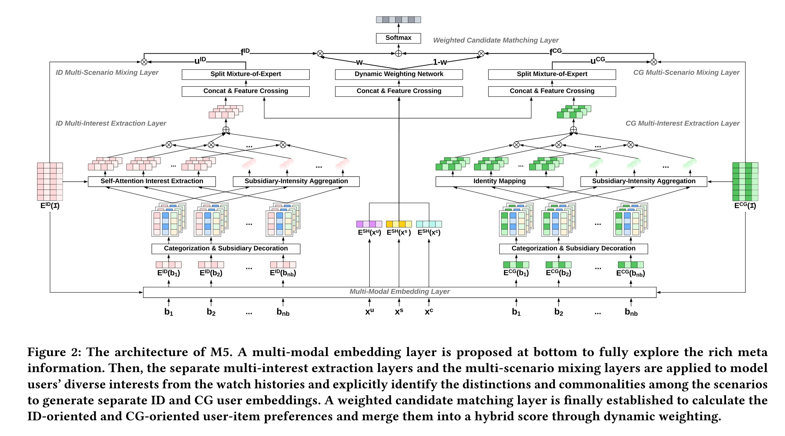
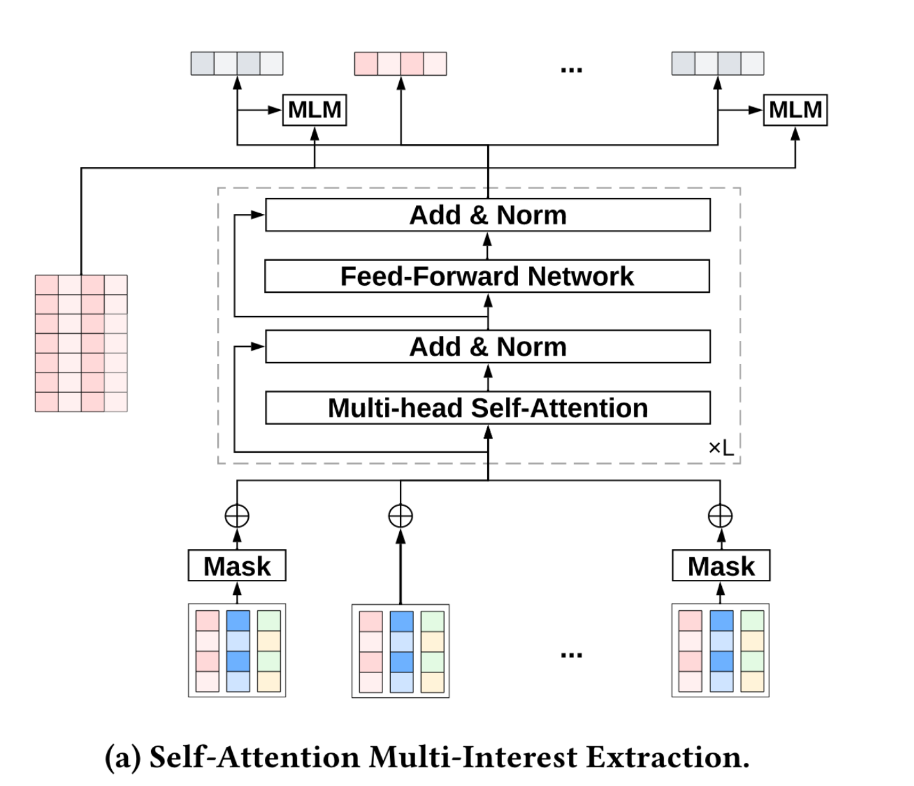
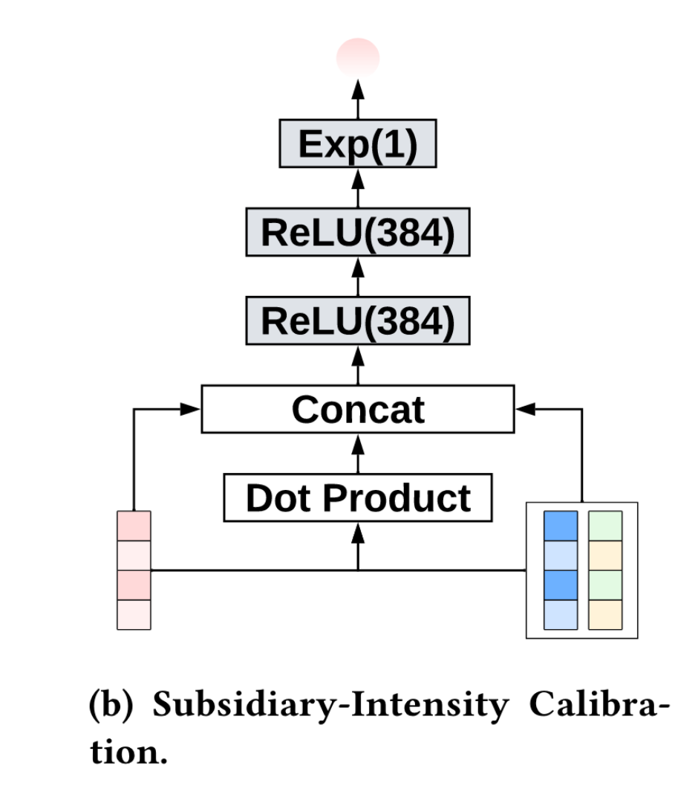
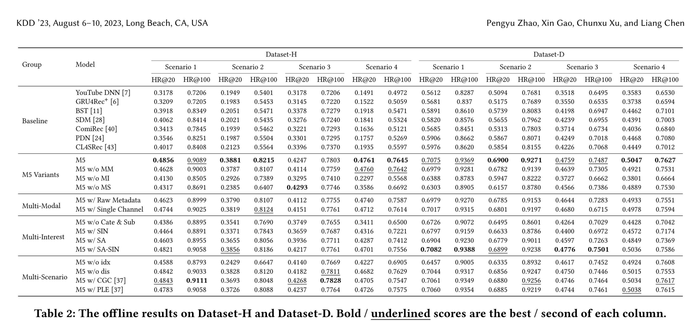

# 3.22  M5多模态
* Q：什么领域，什么问题
  * 在OTT平台上匹配订阅者偏好的节目极其重要。现有方法没有充分考虑OTT服务的特点，例如丰富的元信息、多样的用户兴趣和混合推荐场景，导致性能不佳。本文引入了多模态、多兴趣、多场景匹配（M5）框架，用于OTT推荐，以充分利用这些特性。
  
* Q：作者做了什么
  * 作者扩展了双塔架构，提出了M5框架，包括多模态嵌入层、多兴趣提取层、多场景混合层和加权候选匹配层，有效整合了OTT服务中的元信息、用户行为和场景差异，提高了推荐性能。
  
* Q：现有工作是怎么做的，有哪些欠考虑的
  * 现有工作使用协同过滤或基于深度学习的方法进行匹配阶段的推荐，未充分利用OTT服务中的丰富元信息、多样的用户兴趣和混合推荐场景。
  
* Q：所以作者为什么选择了当前框架做法
  * 作者选择当前框架做法是因为OTT平台具有丰富的元信息、多样的用户兴趣和多种推荐场景。通过引入M5框架，能更好地整合这些特性，提高推荐的效果和鲁棒性。
  
* Q：作者在实现框架过程, 遇到了什么挑战
  * 实现框架过程中遇到的挑战包括如何有效利用OTT平台的丰富元信息、如何模型化用户的多样兴趣、以及如何处理多种推荐场景下的差异性。
  
* Q：作者是怎么解决这些挑战的
  * 作者通过设计多模态嵌入层处理元信息，使用多兴趣提取层模型化用户兴趣，并通过多场景混合层处理不同推荐场景的差异，有效解决了这些挑战。
  
* Q：作者的核心贡献是
  * 作者的核心贡献包括提出一个能充分利用OTT服务特性的M5框架，并通过大规模在线和离线实验验证了其在多个真实世界OTT平台上的有效性和鲁棒性。
  
  
  
  文章部分：
  
  缺乏一些信息：
  
  ​	OTT平台中的视频通常包含多种异构的元信息，包括ID、标签特征（如类型、品牌）、演员特征（如演员、导演）、视觉特征（如艺术作品、视频）、文本特征（如标题、描述）、评分特征等。尽管现有文献提出了在推荐系统中采用多模态融合，但在OTT匹配中适当且灵活地利用多模态信息以及处理复杂的模型架构仍然是一个挑战。
  
  ​	多样化的用户兴趣。OTT服务中的节目大致可以分为点播系列、点播电影和直播广播。用户在不同类别中的行为反映了她（他）在平台上的各种粗粒度兴趣。此外，用户在同一类别内也可能表现出细粒度兴趣，例如，一位订阅者可能既看纪录片也看喜剧系列。为了更好地理解用户偏好，OTT匹配应探索用户在行为建模中的多样化兴趣。
  
  ​	混合推荐场景。OTT推荐自然面临混合场景。从订阅者的角度来看，它需要为拥有不同订阅套餐（在不同的候选池下）和不同地区的用户提供服务。从产品的角度来看，平台应该为不同的行（集合）展示与矩阵布局中的主题相符的相关项目，如图1所示。由于用户行为在各种场景中通常是多样的，采用单一的匹配模型可能会模糊场景差异，并且偏向于大流量的主要场景，而构建多个模型也可能由于忽略了跨场景知识共享而效果不佳。这个困境使得多场景匹配设计成为一个难题。
  
  
  
  挑战
  
  ​	面对这些特点和挑战，我们扩展了双塔架构并引入了M5，即多模态多兴趣多场景匹配（Multi-Modal Multi-Interest Multi-Scenario Matching），用于OTT推荐。M5的整体架构形成了高效和有效的双通道双塔建模，可以看作是工业应用中广泛传播的多通道检索的平滑扩展。在底层，我们提出了一个多模态嵌入层，将每个节目ID转换为随机初始化的ID嵌入和从元图上预训练的节点表示派生的内容图（CG）嵌入，以便通过整合个性化和上下文化以及元信息的上层灵活利用丰富的OTT元数据。
  
  
  
  贡献
  
  ​	在此基础上，引入了一个多兴趣提取层，以在特征级别和模型级别从历史行为中描述用户的多样化兴趣。具体而言，每个行为序列被划分为点播系列、点播电影和直播广播，以明确区分粗粒度类别中的用户兴趣，并跟随一个辅助装饰，将属性特征（例如，“播放时长”）追加到行为嵌入中，以捕获细粒度的用户偏好。对于ID嵌入的行为，M5在多头自注意力上引入了掩蔽语言模型（MLM）辅助损失，以便在建模用户多样化兴趣时更好地传播梯度，这大大提高了匹配性能。与此同时，为了兴趣校准，构建了一个辅助强度（SIN）模块，通过乘以行为序列上的注意力得分。对于CG嵌入的行为，M5仅在原始嵌入上应用SIN模块，不进行进一步的修正，以保留来自元图的信息和项目相似性。为了处理多场景特性，M5在多场景混合层中将特征与场景指示符交叉，以在特征级别区分场景差异，然后设计了一个由不一致损失增强的分裂专家混合（SMoE）模型，以在模型级别区分场景并生成ID、CG用户嵌入。最后建立了一个加权候选匹配层，来计算ID和CG导向的用户-物品偏好，然后通过动态加权网络将它们合并为统一的混合用户偏好。在在线服务期间，M5将生成一个混合用户嵌入，并在基于连接的物品嵌入构建的索引上执行ANN搜索。广泛的在线和离线实验，包括Hulu和Disney+，表明M5显著优于最先进的匹配模型和当前在线服务，证明了所提方法在OTT推荐中的有效性、优越性和鲁棒性。M5已在两个平台上全面部署，每天为数亿订阅者服务，为关键的“为您推荐”集合提供主要流量。
  
  
  
  
  
  问题定义：
  
  ​	OTT推荐的职责是向用户展示相关的节目，这包括点播系列、点播电影和直播广播。作为底层，匹配阶段的目标是从可用的物品集$\mathcal{I}$中为给定用户$u \in \mathcal{U}$检索出一个包含$N$个首选节目的子集，这可以表示为：
  $$
  \operatorname{ArgTop}_N f(u, i), \quad i \in \mathcal{I},
  $$
  其中$f(u, i)$​被定义为匹配算法，用于预测用户对目标物品（节目）的偏好。
  
  
  
  特征表示：
  
  ​	为了给出准确的预测，OTT服务中的匹配模型通常使用来自用户和节目的丰富特征，这些特征主要可以分为以下几个方面：
  
  - 用户特征描述了用户的属性，包括“年龄”、“性别”以及统计信息，如“用户类型TFIDF分数”和“特定标签的观看次数”。
  - 行为特征是用户画像中最重要的特征，涉及频繁的“观看”行为以及不频繁的“保存”、“喜欢”和“不喜欢”的动作，用于完整的用户兴趣建模。每个行为序列聚合到节目级别以消除同一系列的重复剧集观看（例如，“辛普森一家”和“NBA”）；否则，长范围的剧集和事件将主导行为序列。我们使用“主要”ID来表示去重后的节目ID。此外，还会将辅助特征附加到每个行为中，这将在第4.3节中进一步讨论。为简化，以下部分仅考虑观看行为，其他特征的处理方式类似。
  - 上下文特征标识了服务的上下文信息，例如，“设备类型”、“一周中的哪一天”、“一天中的哪个小时”等。我们还设计了像“距离上次行为到现在”的特征，以捕捉行为的新鲜度。
  - 物品特征描述了目标物品的信息，与行为特征中的“主要”ID相同。
  
  遵循现有方法[48]，M5将特征索引为多字段分类形式，并通过独热编码或多热编码将样本转换为高维稀疏向量。
  
  形式上，用户特征、行为特征、上下文特征和物品特征分别由$\mathbf{x}^u, \mathbf{x}^b, \mathbf{x}^c, \mathbf{x}^i$表示。虽然$\mathbf{x}^u, \mathbf{x}^c, \mathbf{x}^i$仅包含非序列特征，$\mathbf{x}^b=\left[\mathbf{b}_1, \mathbf{b}_2, \ldots, \mathbf{b}_{n_b}\right]$表示长度为$n_b$的排序（观看）行为元素。
  
  
  
  模型概括
  
  
  
  ​	如图 2 所示，M5 的整体架构形成了双通道双塔建模。为了充分挖掘 OTT 服务中丰富的元数据，M5 在底层提出了多模态嵌入层，将每个主要特征转化为 ID 和 CG 嵌入。为了高效检索相关项目，同时结合个性化和情境化的多模态语义，M5 扩展了双塔架构，根据相应的用户和项目嵌入计算 ID 和 CG 用户-项目偏好，其中用户嵌入由并行的多兴趣提取层和多场景混合层生成，考虑了用户的不同兴趣并继承了多个场景，而项目嵌入则来自于对相应嵌入表的查找。最后应用动态加权网络来融合多模态预测并生成混合用户-物品偏好。
  
  
  
  4.2 Multi-Modal Embedding Layer
  
  嵌入层将稀疏特征转换为密集向量。与之前的方法不同，M5利用OTT服务中的丰富元信息为每个节目生成内容图（CG）嵌入，作为仅从用户行为日志中训练的普通ID嵌入的补充。
  
  
  
  4.2.1 多模态嵌入。多模态嵌入应用于行为和物品特征，将每个主ID映射到ID嵌入和CG嵌入，以充分利用OTT平台中的异构元数据。ID嵌入通过在随机初始化或从之前的增量结果中的节目ID嵌入表上进行查找操作生成，类似于常见的工业方法。相反，CG嵌入是由从预训练的内容元图派生的节点嵌入初始化的，该元图包含了节目ID、标签、演员、视觉和文本信息。元图中的每个节点代表一个特定的模态，元节点与匹配的ID节点相连，以桥接相关节目。为了更好地利用视觉和文本信息，采用预训练的ResNet-50和BERT来生成视觉和文本表示。M5采用基于池化的GraphSAGE来训练节点嵌入，因为我们经验性地发现最近的进展未能带来进一步的改善。CG嵌入为ID嵌入带来补充信息，并可以推广到新加入的内容，这对于解决OTT服务中的物品冷启动问题至关重要。值得注意的是，尽管一些先前的方法也采用基于图的算法来编码多模态信息，但提取的用户/物品嵌入的使用仍与图结构耦合，这限制了模型中元数据信息的能力。与这些方法不同，M5仅在行为和目标嵌入中编码元数据信息，保持在CG嵌入上使用复杂的多兴趣和多场景模块的灵活性，以加强在OTT服务中使用元信息的能力，这使得检索结果比仅基于图训练的模型更准确、个性化和场景可区分。
  
  
  
  在本文中，我们使用$\mathrm{E}^{I D}(\cdot)$和$\mathrm{E}^{C G}(\cdot)$​来表示ID和CG嵌入函数。
  
  
  
  4.2.2 共享嵌入。共享嵌入过程$\mathrm{E}^{S H}(\cdot)$​​​处理除主ID之外的特征，并在相应的嵌入表上执行相同的查找操作。多兴趣提取层根据用户的（观看）历史产生行为表征。为了在特征级别明确描述粗粒度和细粒度偏好，将顺序行为划分为类别并用附加特征进行装饰。
  
  
  
  基于多兴趣特征，M5通过引入一个掩蔽语言模型（MLM）增强的自注意力模型对ID行为嵌入进行模型端的多兴趣提取，以挖掘用户的多样化兴趣，并采用辅助强度（SIN）聚合对ID和CG行为嵌入进行兴趣校准。
  
  
  
  4.3 Multi-Interest Extraction Layer
  
  4.3.1 行为分类和附加装饰。OTT平台通常为订阅者提供点播系列、点播电影和直播广播。根据之前的研究，我们发现用户对这些类别的兴趣完全不同，例如，一个经常观看“NCAA”或“NBA”直播赛事的用户并不表示她（他）对观看点播体育系列或电影感兴趣。因此，M5根据分类将用户行为划分为不同的桶，以明确区分用户在平台上的粗粒度兴趣。除了分桶外，M5还为每个行为装饰附加属性，以捕获用户的细粒度兴趣。
  
  具体来说，M5收集了节目级别的“剧集观看次数”、“播放时长”和“标准化播放时长”，以区分每个行为的强度，同时使用“至今的节目参与度”和“节目参与位置指数”保留时间信息，这些在现有的行为建模中用于位置编码[3]。因此，序列$\mathbf{x}^b$中的每个行为元素（以第$j$个位置为例）可以表示为$\mathbf{b}_j=\left[m_j, s_{j, 1}, s_{j, 2}, \ldots, s_{j, n_{sub}}\right]$，包括一个主ID和$n_{sub}$​​个附加特征。
  
  
  
  
  
  4.3.2 自注意力多兴趣提取。M5在ID行为上采用高级的$L$层双向Transformer编码器来提取多样化的用户兴趣，并捕获序列内的复杂关系，如图3a所示。使用每个位置（以第$j$​个为例）的主嵌入和附加嵌入之和作为输入，以区分细粒度信息。Transformer编码器的每一层包含两个多头自注意力和前馈网络块，通过联合关注来自各种潜在子空间的信息，从多个兴趣视角建模用户偏好，然后用逐点MLP融合多个兴趣。每个块都被残差连接和层归一化包围，以平滑和稳定地更新梯度。更多细节可以在[38]中找到。
  
  **掩蔽语言模型损失**：
  
  近期研究[9, 38]表明，相比于更精细的策略，扩大规模可以带来更好的性能。
  
  为了查看规模扩大对M5的影响，我们取消了CG通道，改变了自注意力模型的深度，并报告了在两个离线数据集上的平均命中率（详细内容见第5.1节）。
  
  与之前的发现不同，表1的结果表明，当$L>1$时，扩大规模并没有带来任何好处，甚至会恶化性能。此外，随着规模的增加，性能下降变得更加严重。这些异常结果也被[3]研究过，作者认为这种现象源于用户行为序列中的顺序依赖并不像自然语言处理中的句子那样复杂，因此较少的层数就足以获得良好的性能。
  
  然而，我们将提出一个不同的解释，即扩大规模失败是由于自注意力训练不足。具体来说，由于自注意力位于相对较浅的位置并拥有模型中的大部分参数，与上层相比，它无法从优化中获得足够的梯度更新，因为在通过反向传播的长距离中梯度衰减，这导致了上层和自注意力之间的收敛速率差异，因此当上层过拟合时，自注意力仍然欠拟合。随着自注意力模块变得更深，这种差异将变得更加显著，从而恶化行为建模，甚至通过增加的参数引入噪声。
  
  因此，M5引入了一种新的辅助损失$\mathcal{L}^{M L M}$，利用已证实的MLM训练[9]对行为序列进行，为自注意力模块提供更多的监督信号。具体来说，M5随机将输入序列在位置$\mathcal{M}$处替换为[MASK]嵌入，并将掩码位置的最终自注意力隐藏状态输入到一个在节目ID嵌入矩阵上的输出softmax层中，以恢复原始的主ID：
  $$
  \mathcal{L}^{M L M}=\frac{1}{|\mathcal{M}|} \sum_{j \in \mathcal{M}}-\log P_{m_j}^{M L M}(j)
  $$
  与标准的 MLM 训练不同的是，M5 没有用随机嵌入替换屏蔽显示或保持嵌入不变，因为简单的[MASK]替换已经证明足以胜任 MLM 任务，而当输入的行为序列相对较短时（这在推荐场景中很常见），随机替换将主要损害起源语义。此外，只有行为序列中的主要 ID 才会被屏蔽，而辅助特征则会被保留以用于更多的重构信息。如表 1 所示，使用 MLM 训练的自我关注模型在各种深度下都远远超过了同类模型，这意味着 MLM 损失有助于自我关注模型从无监督目标中获得更多训练信号，并更好地刻画用户行为中的内在关系。需要注意的是，MLM 训练不会对推理速度和模型大小带来任何开销，因此它可以作为一个即插即用的组件用于任何现有的自我注意力建模。
  
  
  
  4.3.3 辅助强度兴趣校准。如图3b所示，SIN利用辅助特征生成点状强度得分，并将它们乘以行为表示，以进一步校准用户对个别项目的偏好。
  
  
  
  给定行为序列$\mathbf{x}^b$，对主要字段、辅助字段及其交互的连接应用带有ReLU激活的多层感知机（MLP）来计算每个位置（以第$j$个为例）的强度得分：
  $$
  \begin{aligned}
  int_j= & \operatorname{Exp}\left(\operatorname { M L P } \left(\left[\mathrm{E}\left(m_j\right), \mathrm{E}^{S H}\left(s_{j, 1}\right), \ldots, \mathrm{E}^{S H}\left(s_{j, n_{sub}}\right),\right.\right.\right. \\
  & \left.\left.\left.\mathrm{E}\left(m_j\right) \cdot \mathrm{E}^{S H}\left(s_{j, 1}\right), \ldots, \mathrm{E}\left(m_j\right) \cdot \mathrm{E}^{S H}\left(s_{j, n_{sub}}\right)\right]\right)\right),
  \end{aligned}
  $$
  其中$\mathrm{E}(\cdot)$可以是$\mathrm{E}^{I D}(\cdot)$或$\mathrm{E}^{C G}(\cdot)$，$\cdot$表示嵌入之间的内积。
  
  
  
  M5使用指数函数进行后加权，以确保强度的非负性，这也有利于梯度传播的效率。为了减轻随机初始化的影响，最后一个MLP层的权重初始化为零，使得开始时强度得分保持不变，并逐渐抓住每个行为的重要性。给定强度得分，M5执行加权求和来计算注意力聚合。SIN层在原始$\mathbf{C G}$嵌入上采用，以保留来自元图的语义。同时，它也应用于自注意力输出以校准ID序列。
  
  4.4 多场景混合层
  
  ​	由于OTT服务天然是多场景的，M5提出场景指示器和分裂式专家混合（SMoE）来在特征和模型层面明确识别场景之间的差异和共性。还引入了分歧正则化以鼓励SMoE专家的多样性。
  
  4.4.1 场景指示器和分裂式专家混合。
  
  如第1节所述，OTT推荐本质上是多场景的。
  
  与之前的方法不同，这些方法共享所有场景的输入，
  
  
  
  M5通过附加并交叉场景指示器$\mathrm{E}^{S H}\left(\mathrm{x}^s\right)$与其他特征通过内积作为输入$\mathbf{f}_s$，在特征层面区分场景变化。
  
  
  
  为了通过模型架构进一步识别场景差异和共性，M5引入了SMoE，如图4所示，它采用$n_{\text {exp }}$个专家来促进不同子空间中跨场景的有效信息交流，并将输出与单一门网络集成，因为输入$\mathbf{f}_s$已具有区分性。然后根据场景将样本分割并送入不同的后处理塔进一步表征场景差异。场景$s$​的输出可以表示为：
  $$
  u_s=\operatorname{Post}_s\left(\sum_{k=1}^{n_{\text {exp }}} \operatorname{Expert}_k\left(\mathbf{f}_{\mathrm{s}}\right) \operatorname{Gate}_k\left(\mathbf{f}_{\mathrm{s}}\right)\right)
  $$
  4.4.2 分歧正则化。在专家混合（MoE）家族中的一个假设是，每个专家网络能够学习数据中的不同模式，并专注于潜在空间中的各种子模块。然而，没有保证专家能从输入中学习到不同的特征。因此，M5提出了分歧正则化，以明确鼓励专家多样性，该正则化最小化了每个样本的专家输出之间的绝对余弦相似度。正则化项正式表达为：
  $$
  \mathcal{L}^{D I S}=\frac{1}{n_{\text {exp }}^2} \sum_{k=1}^{n_{\text {exp }}} \sum_{l=1}^{n_{\text {exp }}} \frac{\left|\operatorname{Expert}_k(x) \cdot \operatorname{Expert}_l(x)\right|}{\left\|\operatorname{Expert}_k(x)\right\|\left\|\operatorname{Expert}_l(x)\right\|} .
  $$
  4.5加权候选匹配层
  
  ​	为了充分利用目标侧的多模态信息，M5提出了一个加权候选匹配层，该层计算用于在线检索的混合用户-物品偏好。对于用户$u$和目标物品（节目）$i \in \mathcal{I}$，
  
  
  
  M5首先通过$f^{I D}(u, i)=u^{I D} \cdot \mathrm{E}^{I D}(i)$和$f^{C G}(u, i)=u^{C G} \cdot \mathrm{E}^{C G}(i)$分别生成ID和CG的用户-物品偏好。
  
  
  
  然后，通过基于用户特征、上下文特征和场景指示器的输入计算出的权重$w$（由一个MLP跟随sigmoid激活函数计算得出）合并偏好分数：
  $$
  f(u, i)=w f^{I D}(u, i)+(1-w) f^{C G}(u, i) .
  $$
  
  ​	M5可以被视为工业推荐系统中广泛传播的多通道检索的扩展。与从不同匹配策略合并检索到的物品的原始多通道检索不同，M5通过动态加权合并了来自并行建模的多模态预测分数，并基于混合偏好检索单一候选集，这更加平滑和准确。在在线推断时候选集较大时，M5首先通过$\left[w u^{I D},(1-w) u^{C G}\right]$生成混合用户嵌入，然后对构建在连接的物品嵌入$\left[E^{I D}(\mathcal{I}), E^{C G}(\mathcal{I})\right]$上的索引执行查询。可以证明，检索到的结果与由等式6找到的顶部物品相同。
  
  4.6 损失函数
  
  ​	给定目标物品$i$，M5采用softmax交叉熵损失在（采样的）物品语料库$\mathcal{I}_{\text {sample }} \in \mathcal{I}$上作为匹配目标：
  $$
  \begin{gathered}
  \mathcal{L}^{\text {Match }}=-\log P_i^{\text {Match }} \\
  P^{\text {Match }}=\operatorname{Softmax}\left(f\left(u, \mathcal{I}_{\text {sample }}\right)\right)
  \end{gathered}
  $$
  
  结合MLM损失和分歧损失，M5最终最小化每个样本的混合损失：
  $$
  \mathcal{L}=\mathcal{L}^{\text {Match }}+\alpha \mathcal{L}^{M L M}+\beta \mathcal{L}^{D I S}
  $$

* 专家这一块是啥

  分裂式专家框架的公式通常涉及以下几个方面：

  1. **输入数据分割**：将输入数据分割成不同的子空间，每个子空间由一个专门的专家网络处理。

  2. **专家网络输出**：每个专家网络产生其对应子空间的输出。

  3. **集成**：将各个专家网络的输出集成起来，生成最终的模型输出。

  具体公式可以表示如下：

  - 输入数据分割：通常由场景指示器（Scene Indicator）或其他方法来实现，例如：
    $$\mathrm{E}^{S H}\left(\mathrm{x}^s\right)$$
    这里，$\mathrm{E}^{S H}$是用于标识场景的函数，$\mathrm{x}^s$表示属于场景$s$的输入数据。

  - 专家网络输出：每个专家网络产生对应子空间的输出，通常表示为：
    $$\operatorname{Expert}_k\left(\mathbf{f}_{\mathrm{s}}\right)$$
    这里，$\operatorname{Expert}_k$表示第$k$个专家网络，$\mathbf{f}_{\mathrm{s}}$是输入数据在场景$s$下的特征表示。

  - 集成：将各个专家网络的输出集成起来，可以采用加权平均等方法，例如：
    $$u_s=\operatorname{Post}_s\left(\sum_{k=1}^{n_{\text {exp }}} \operatorname{Expert}_k\left(\mathbf{f}_{\mathrm{s}}\right) \operatorname{Gate}_k\left(\mathbf{f}_{\mathrm{s}}\right)\right)$$
    这里，$u_s$表示场景$s$的最终输出，$\operatorname{Post}_s$表示对输出进行后处理，$\operatorname{Gate}_k$表示用于控制第$k$个专家网络输出权重的门控函数。

  分裂式专家框架的具体公式可能会根据具体的模型架构和任务而有所变化，上述公式仅作为一般示例。
