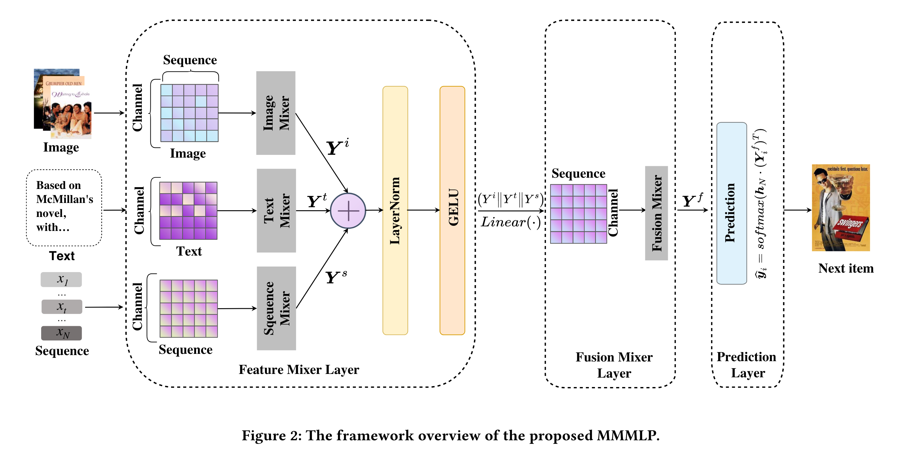
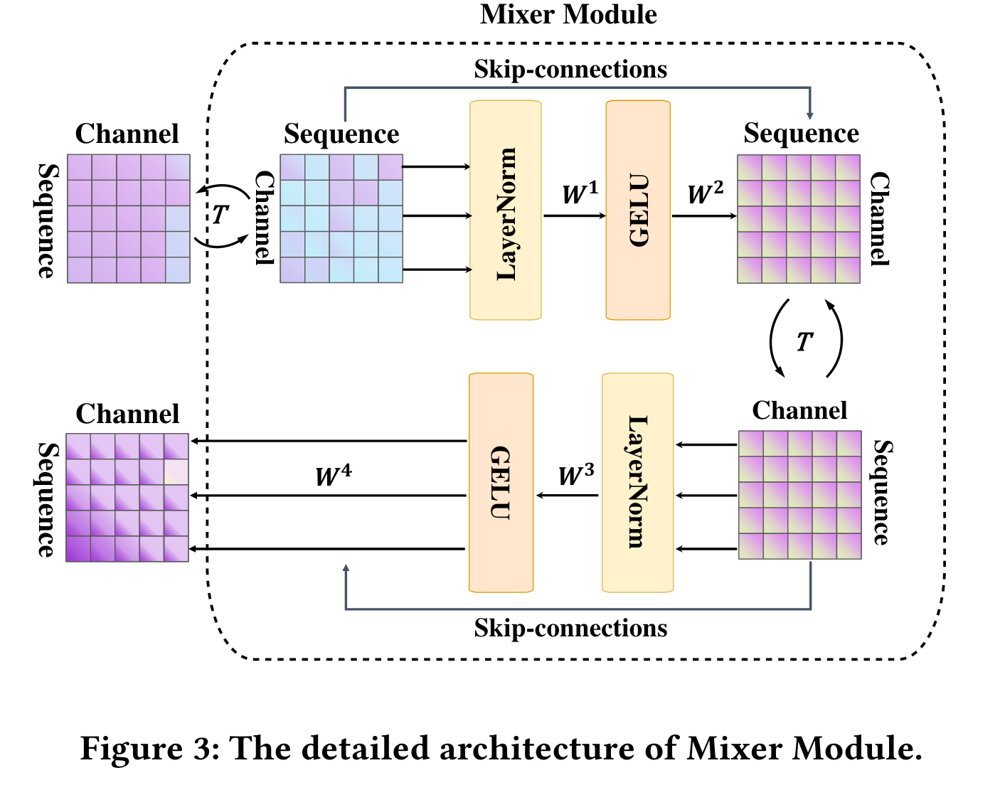
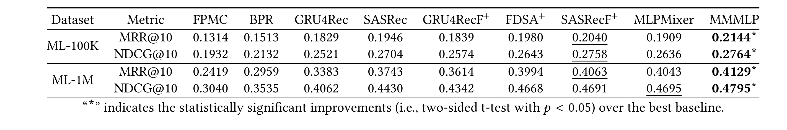

# 3.22  MMMLP多模态多层感知器用于序列推荐
* Q：什么领域，什么问题
  
  * 序列推荐旨在通过捕获用户交互项目的历史序列，为用户推荐潜在感兴趣的产品。尽管它为广泛的物理场景提供了便利，但多模态序列的序列推荐长期被忽视。描述用户历史交互行为的多模态数据无处不在，如产品图片、文字描述、交互项目序列等，从多个角度提供了全面描述用户偏好的语义信息。然而，现有的序列推荐方法要么无法直接处理多模态，要么计算复杂度过高。
  * 领域是序列推荐系统，问题是如何有效地利用多模态数据（例如产品图片、文本描述和用户与商品的交互序列）来捕捉用户的历史交互序列，从而为用户推荐可能感兴趣的产品。
  
* Q：作者做了什么
  * 作者提出了一种名为MMMLP的新型多模态多层感知机（Multi-Modal Multi-Layer Perceptron）框架，用于处理多模态序列推荐问题。MMMLP是一个完全基于MLP的架构，包含三个模块：特征混合层、融合混合层和预测层，旨在有效捕获并融合多模态信息以进行下一个推荐项的预测。

* Q：现有工作是怎么做的，有哪些欠考虑的
  * 现有的序列推荐方法要么无法直接处理多模态数据，要么会遭受高计算复杂度的问题。尽管一些工作强调使用边信息来准确模拟用户序列行为，但很少有研究探索多模态序列推荐，且用户序列行为很少被认为是多模态的。

* Q：所以作者为什么选择了当前框架做法
  * 作者选择当前的框架做法是因为MMMLP能够以线性复杂度实现多模态序列推荐，同时与现有的复杂方法相比，具有可比的性能。通过特征混合层、融合混合层和预测层的设计，MMMLP能够有效地捕获和融合多模态信息，提供精准的推荐。

* Q：作者在实现框架过程, 遇到了什么挑战
  * 实现框架过程中的挑战包括如何设计一个高效且能处理多模态信息的架构，以及如何通过该架构实现线性复杂度同时保持良好的推荐性能。

* Q：作者是怎么解决这些挑战的
  * 作者通过提出一个纯MLP基础架构的多模态序列推荐模型MMMLP来解决这些挑战，利用特征混合层独立处理图像、文本和序列信息，通过融合混合层将多模态信息融合，最后在预测层生成推荐项。

* Q：作者的核心贡献是
  * 核心贡献包括：(1) 首次尝试利用线性复杂度的MLP-based模型处理多模态序列推荐问题，实现与现有复杂方法相比的可比性能；(2) 提出了MMMLP框架，有效融合多模态信息，捕获用户的细粒度偏好；(3) 通过广泛的实验验证了所提方法的有效性，并通过兼容性研究显示出所提的特征混合层能够增强其他推荐模型。

* 文章部分如下：

  

  

  问题定义：

  给定物品集$X=\{x_1, \ldots, x_m \ldots, x_M\}$，对于每个用户，我们表示他的物品交互列表为$S_u=\{x_1, \ldots, x_t \ldots, x_N \mid x_t \in X\} \in \mathbb{R}^{N \times D_S}$，包括$s$个物品嵌入，其维度为$D_S$。考虑到多模态特征，我们将与$S_u$相对应的图像特征表示为$I_u \in \mathbb{R}^{N \times D_I}$，文本特征表示为$T_u \in \mathbb{R}^{N \times D_T}$。$D_I$和$D_T$分别是图像和文本标记的嵌入大小。为了追求简洁的描述，我们省略了用户下标，并分别将图像、文本特征和交互的物品列表表示为$I, T$和$S$。值得注意的是，我们提出的方法可以很容易地扩展到其他模态。

  序列推荐系统的目标是基于过去的交互行为来预测用户接下来会选择什么物品。因此，给定包含$N$个时间步的用户交互物品列表，我们的目标是基于物品的多模态特征，预测在时间步$N+1$用户将选择的下一个物品。

  模型预览：

  在本文中，我们提出了一种基于 MLP 的多模态推荐框架，即 MMMLP，它可以明确地从各种模态中学习信息。图 2 展示了 MMMLP 的架构，它由三层组成：特征混合层、融合混合层和预测层。我们的框架具有很强的灵活性，可以整合不同模态的数据，本文重点讨论图像和文本，它们是除项目序列外最常用的模态类型。如图 2 所示，用户与物品交互历史中的图像、文本和物品序列被用作输入，我们将特征混合器层（Feature Mixer Layer）纳入其中，包括三个混合器模块，分别用于提取和处理图像、文本和物品序列信息。特征混合层还包括层归一化和残差连接，以增强训练的稳定性。接下来，我们在融合混合器层中使用一种后融合方法，将三个混合器模块的输出$Y^i, Y^t$, and $Y^s $​连接起来，以融合多种模态表征。最后，我们在预测层中根据融合后的表征对下一个推荐进行预测。

  2.3 特征混合层

  特征混合层中有三个混合器模块用来提取图像、文本和物品序列信息。

  我们首先将多模态原始数据转换为嵌入特征矩阵。

  具体来说，我们将图像作为特征矩阵加载，

  利用预训练模型进行文本编码，

  并为物品序列设置可训练的嵌入。

  然后，来自图像、文本和物品序列的三种不同类型的嵌入输入$I, T$和$S$被混合器模块处理。如图3所示，混合器模块由一系列相同的块组成，每个块包含两个混合操作。我们以处理图像模态特征矩阵$I$为例，对文本特征$T$和物品序列$S$​的操作相同。

  

  第一个操作执行标记混合，其tokens大小为$D_I$，我们将标记混合器命名为$\boldsymbol{T} \boldsymbol{M}$。它以相同的方式作用于特征矩阵的列上，以捕捉通道内tokens之间的交互。

  然后，结果提供给通道混合器$C M$，它作用于$I$的行上，以捕捉tokens内通道之间的交互。

  

  标准的架构组件，如残差连接和层归一化被用来稳定训练过程。为简单起见，图像特征矩阵$I$上的混合器模块操作写为：
  $$
  \begin{array}{ll}
  \widehat{\boldsymbol{I}}_{*, i}=\boldsymbol{I}_{*, i}+\boldsymbol{T} \boldsymbol{M}\left(\operatorname{LayerNorm}(\boldsymbol{I})_{*, i}\right), & \text { 对于 } i=1 \ldots D_I, \\
  \widehat{\boldsymbol{I}}_{j, *}=\widehat{\boldsymbol{I}}_{j, *}+C \boldsymbol{M}\left(\operatorname{LayerNorm}(\widehat{\boldsymbol{I}})_{j, *}\right), & \text { 对于 } j=1 \ldots N
  \end{array}
  $$
  其中$I_{*, i}$表示对图像特征矩阵进行列维度操作，即交叉标记处理，而$I_{j, *}$是对行维度操作，即交叉通道处理。$\widehat{I}$代表图像模态的中间表示。通过对$T$和$S$进行相同的处理，我们可以得到文本特征矩阵$\widehat{T}$和物品序列$\widehat{S}$的中间表示。

  2.3.1 图像混合器。对于图像混合器模块，我们通过混合器模块传递图像嵌入$\widehat{I}$以提取原始图像特征。获得的视觉嵌入序列通过混合器模块传递，其中标记混合器捕获标记之间的交互，然后结果提供给通道混合器以捕获通道之间的交互。通过图像混合器，我们通过将视觉相关性融合到每个物品的表示中，从而实现了每个序列的视觉表示。

  图像混合器的结果如下：
  $$
  \begin{array}{lr}
  \widehat{\boldsymbol{I}}_{*, i}=\widehat{\boldsymbol{I}}_{*, i}+\boldsymbol{W}^2 \sigma\left(\boldsymbol{W}^1 \text { LayerNorm }(\widehat{\boldsymbol{I}})_{*, i}\right), & \text { 对于 } i=1 \ldots D_I, \\
  Y_{j, *}^i=\widehat{\boldsymbol{I}}_{j, *}+\boldsymbol{W}^4 \sigma\left(\boldsymbol{W}^3 \operatorname{LayerNorm}(\widehat{\boldsymbol{I}})_{j, *}\right), & \text { 对于 } j=1 \ldots N
  \end{array}
  $$
  其中$\sigma$是GELU激活函数[9]。$\widehat{\boldsymbol{I}}_{*, i}$表示对图像特征矩阵进行列维度操作，即交叉标记处理，而$\widehat{\boldsymbol{I}}_{j, *}$是对行维度操作，即交叉通道处理。$W^1 \in \mathbb{R}^{r_N \times N}$和$W^2 \in \mathbb{R}^{N \times r_N}$表示图像混合器中第一层的可学习权重。$W^3 \in \mathbb{R}^{r_D \times D_I}$和$W^4 \in \mathbb{R}^{D_I \times r_D}$是图像混合器中第二层的可学习权重。$r_N$和$r_D$是特征混合器中的隐藏大小。$Y^i$​是图像模态的学习表示。

  

  

  2.3.2
  $$
  \begin{array}{lc}
  \widehat{T}_{*, i}=\widehat{T}_{*, i}+W^6 \sigma\left(W^5 \text { LayerNorm }(\widehat{T})_{*, i}\right), & \text { for } i=1 \ldots D_T \\
  Y_{j, *}^t=\widehat{T}_{j, *}+W^8 \sigma\left(W^7 \text { LayerNorm }(\widehat{T})_{j, *}\right), & \text { for } j=1 \ldots N
  \end{array}
  $$
  

  

  2.3.3 序列混合器。使用物品ID嵌入作为序列混合器模块中的输入特征，我们可以生成一个与输入特征对于所有行都具有相同维度的嵌入表，该表应用于转置的嵌入表。通过这一过程，每个输出序列内的所有序列依赖性都被合并到一个输出表中。序列混合器对交互物品的序列顺序敏感，因为它们之间的关联是顺序的，这展示了他们兴趣随时间的演变。

  序列混合器的结果如下：
  $$
  \begin{aligned}
  & \widehat{S}_{*, i}=\widehat{S}_{*, i}+W^{10} \sigma\left(W^9 \text { LayerNorm }(\widehat{S})_{*, i}\right), \quad \text { 对于 } i=1 \ldots D_S, \\
  & Y_{j, *}^s=\widehat{S}_{j, *}+W^{12} \sigma\left(W^{11} \text { LayerNorm }(\widehat{S})_{j, *}\right), \quad \text { 对于 } j=1 \ldots N
  \end{aligned}
  $$
  其中$\boldsymbol{W}^9 \in \mathbb{R}^{r_N \times N}$和$\boldsymbol{W}^{10} \in \mathbb{R}^{N \times r_N}$表示序列混合器中第一层的可学习权重。$W^{11} \in \mathbb{R}^{r_D \times D}$和$W^{12} \in \mathbb{R}^{D \times r_D}$是序列混合器中第二层的可学习权重。$Y^s$​​是物品序列的表示。

  

  2.4 融合混合器层

  我们提出融合混合器层，以融合多种模态的表示。使用后融合方法将所有混合器模块的输出，即$Y^i, Y^t, Y^s$，连接到包含混合器模块的混合器层中。这种方法也被称为单流方法，与双流方法相比更为有效[1]。使用融合混合器层，我们可以通过融合多模态表示，接近用户交互物品序列的综合表示。

  融合混合器层的结果如下：
  $$
  \begin{array}{ll}
  \widehat{Y}_{*, i}=\widehat{Y}_{*, i}+W^{14} \sigma\left(W^{13} \operatorname{LayerNorm}(\widehat{Y})_{*, i}\right), & \text { 对于 } i=1 \ldots D \\
  Y_{j, *}^f=\widehat{Y}_{j, *}+W^{16} \sigma\left(W^{15} \operatorname{LayerNorm}(\widehat{Y})_{j, *}\right), & \text { 对于 } j=1 \ldots N
  \end{array}
  $$
  其中$\widehat{Y}=\operatorname{Linear}\left(Y^i\|Y^t\| Y^s\right)$，$\|$是连接操作，所以$D=D_I+D_T+D_S$。$Y^f$是块的输出，是考虑多种模态的综合表示。$W^{13} \in \mathbb{R}^{r_N \times N}$和$W^{14} \in \mathbb{R}^{N \times r_N}$表示混合器中第一层的可学习权重。$\boldsymbol{W}^{15} \in \mathbb{R}^{r_D \times D}$和$\boldsymbol{W}^{16} \in \mathbb{R}^{D \times r_D}$是混合器中第二层的可学习权重。

  

尽管现有研究[11, 17, 33, 36]强调利用侧面信息来准确模拟用户的顺序行为，但很少有研究探讨多模态顺序推荐，而且用户的顺序行为也很少被认为是多模态的。然而，在推荐系统领域，多模态数据越来越受到关注，因为这些数据从多个角度提供了用户交互的语义信息。例如，普通的顺序推荐系统可能无法捕捉到商品图片或文字描述中的语义信息，而这些信息对于对某种颜色的汽车感兴趣的用户来说至关重要。要解决这个问题，必须从物品的不同表征中推导出潜在嵌入。

一个典型的多模式顺序推荐系统如图 1 所示，其中的交互历史和顺序信息都显示了用户的短期和长期偏好。多模态顺序推荐系统利用这些信息并研究用户的偏好来推荐相关项目。项目 ID 只揭示了序列模式的一部分，而多模态特征序列则不同，它能更全面地揭示基本模式。因此，为了将多模态特征用于顺序推荐，基于 RNN 和基于自我关注的模型越来越普遍地集成了商品特征 [11，36]。然而，RNN 无法维持长期依赖关系，而注意力的计算成本很高。

