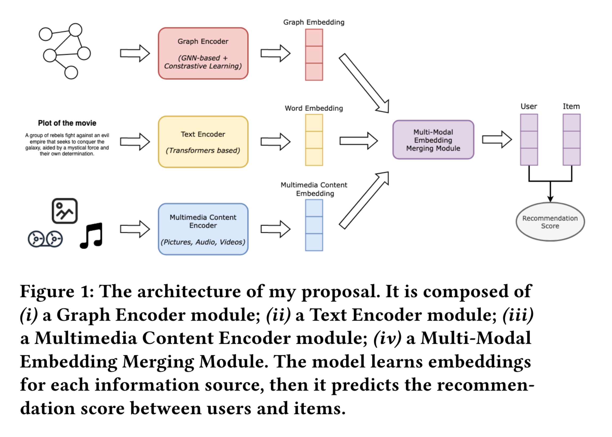
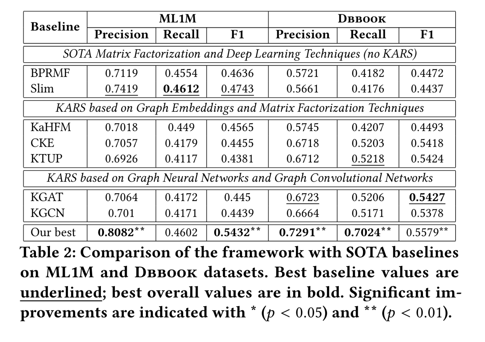

# 3.22  多模态短文
最近几年，人们对知识感知推荐系统( Knowledge-Aware Recommender Systems，KARSs )的设计和开发表现出越来越大的兴趣。这主要是由于它们能够编码和利用多个数据源，包括结构化的(如知识图谱)和非结构化的(如纯文本)。目前，KARSs中很多处于领先地位的模型使用了深度学习，使其能够利用大量的信息，包括知识图谱( KGs )、用户评论、纯文本和多媒体内容(图片、音频、视频)。

Figure 1 shows the main components of the model: a Graph Encoder, a Text Encoder, a Multimedia Content Encoder, and an Embedding Merging Module, which will be described in this section.

Abstract: 利用从多模态信息源中学习到的表示设计KARS，以便为用户提供公平、准确和可解释的推荐。

图编码器( Graph Encoder )：该模块的目的是学习用户和物品在KGs中的精确向量表示(嵌入)；对于该模块，我将在2.1节讨论的SOTA中的模型的启发下实现一个GNN模型，如CompGCN [ 42 ]和LightGCN [ 19 ]。简而言之，GNN将从邻居收集到的信息聚合到第k跳，其中k是GNN模型的层数，以更精确地表示节点。我将考虑几种聚合策略，包括与CompGCN和LightGCN相关的聚合策略，或者注意力机制。此外，我将考虑KG的不同观点，如局部观点( CF信号)和全局观点( CF +知识三元组)，以便应用CL技术，受第2.1节讨论的这方面工作的启发，进一步改进最终的图嵌入。此外，由于嵌入学习过程会由于其端到端的性质而成为整个推荐模型的一部分，所以最终的损失函数也会考虑到这一步，通过误差的反向传播来优化图嵌入学习过程以适用于推荐任务。

文本编码器：该模块的目的是从纯文本(例如,用户评论,电影的情节,歌曲的歌词等。)开始学习精确的词嵌入，利用其丰富的语义；在这一步中，受BERT [ 14 ]和SBert [ 35 ]的启发，我将实现一个基于变压器的模型。与前一个模块类似，由于该架构是端到端的，并且该模块是它的一部分，因此产生的词嵌入也将通过反向传播为推荐任务进行优化。

多媒体内容编码器：与前面两个模块类似，该模块的目的是学习来自最后一个多模态信息源，即多媒体内容：图像(画册封面、电影海报等。)、音频(电影的配乐、专辑的曲目等。)和视频(电影的预告片、视频短片等。)的表示。在第2.3节( ResNet152  , VGGish 和R ( 2 + 1 ))D [ 40 ]中讨论的模型是以预训练的形式存在的，因此它们可以在这一步开发，或者从头开始训练。无论如何，对于前面的两个模块，嵌入都会通过反向传播对推荐任务进行微调。

多模态嵌入合并模块：该模块的目标是从前面模块学习到的不同嵌入开始，获得一个实体(用户或项目)的唯一表示。将评估几种选项，包括级联，这已经证明了积极的结果[ 34 ]，以及交叉注意力和自我注意力[ 43 ]。此外，还将考虑对比学习( CL )通过增加与相同实体相关的嵌入之间的相似度和减少不同实体的嵌入之间的相似度来增强嵌入。该模块的输出将通过对用户和项目的单一且较为准确的嵌入来表示。得到的嵌入将用于训练一个深度推荐系统( Recommender System，RS )，该系统将用于预测用户偏好；RS将使用基于二元交叉熵的损失函数，既细化模型权重，又执行误差反向传播步骤，这将影响和改善所有的嵌入学习过程。

综上所述，我旨在设计一个端到端的架构，能够从多模态信息源中学习嵌入，并将其用于推荐任务。正如第2节所讨论的那样，与SOTA的大多数工作不同的是，只使用了一个或两个信息源(例如, KGs和/或文本,或者只有多媒体内容)，我将所有这些信息组合在一起。相应地，我的建议的主要贡献是使用了三个或三个以上的多模态知识源( KGs、文本、图像、音频、视频)。此外，该模型的端到端性质使嵌入学习过程适应于推荐任务，而不是使用针对另一个任务(例如,为链接预测或图分类预训练的图嵌入)优化的预训练嵌入。最后，模型的可解释性和生成的推荐列表的公平性将被解决，因为这些都是推荐领域的热门话题。

KGs是由编码项描述属性的三元组组成的结构化知识库，它们代表了KARSs最流行的数据源之一。处理KGs的常用方法是利用KGE技术，正如第一节所讨论的那样

TransE [5] 是最受欢迎的知识图谱嵌入（KGE）技术之一，它有许多变体，如 TransH [48] 或 TransR [27]。这些模型被称为几何模型 [46]，因为它们将三元组的关系视为将头实体转换为尾实体的方式。最近，随着深度学习和神经网络的普及，基于图神经网络（GNNs）[46] 的KGE技术已经取得了重要地位：GNNs背后的核心直觉是它们通过以迭代方式传播邻居信息来学习节点嵌入，直到过程达到稳定的固定点[50]；特别地，一种流行的GNN类别是由图卷积网络（GCNs）[20]代表，它们采用卷积滤波器对从邻居收集的信息进行操作，以获得一组新的特征。GCNs的最新技术状态（SOTA）由像CompGCN [42] 和 LightGCN [19] 这样的模型代表；这两个模型都从邻居那里聚合信息，但也存在一些差异：前者使用针对知识图谱中每个关系的特定权重矩阵，并通过将之前嵌入与关系权重矩阵的点积来更新节点嵌入；后者仅将邻居的嵌入添加到节点的嵌入中，不执行任何其他操作，从而使模型更高效。鉴于这些模型的有效性，我将在我的博士研究中设计一个受这些方法启发的GNN。

关于基于KGs的知识感知推荐系统（KARSs），KGAT [47] 和 KGCN [45] 是两个知名模型，代表了SOTA。KGAT 能够通过利用图注意力网络 [44] 捕获用户和项目之间的高阶关系，通过权重化节点的邻居的贡献来识别最具信息量的邻居；KGCN 利用GCN滤波器捕获节点之间的全局（知识三元组）和局部（协同三元组）依赖关系。这两个模型在这一领域取得了良好的性能，因此它们将被用作我博士研究的基准。在过去几年中，对知识图谱应用对比学习（CL）以进行推荐任务的研究引起了人们的兴趣 [51]。一般来说，CL的主要思想在于从图的不同视角表示相同的节点，每个视角可以通过随机删除一些节点或边获得；这样，对于每个节点，可以获得正负对，从而增加前者之间的相似性，同时减少后者之间的相似性。几项工作已经将CL应用于推荐领域，其中之一，MCCLK [52]，在多个级别上以及对同一图的不同视图上应用了CL。它考虑了三种不同的视图：局部视图（协同三元组）、语义视图（项目-项目三元组）和全局视图（协同和知识三元组）；LightGCN 被应用于每个视图以获得节点嵌入，这些嵌入随后在不同的视图之间进行对比，以获得更精确的节点嵌入，最终这些嵌入被用于提供推荐。
