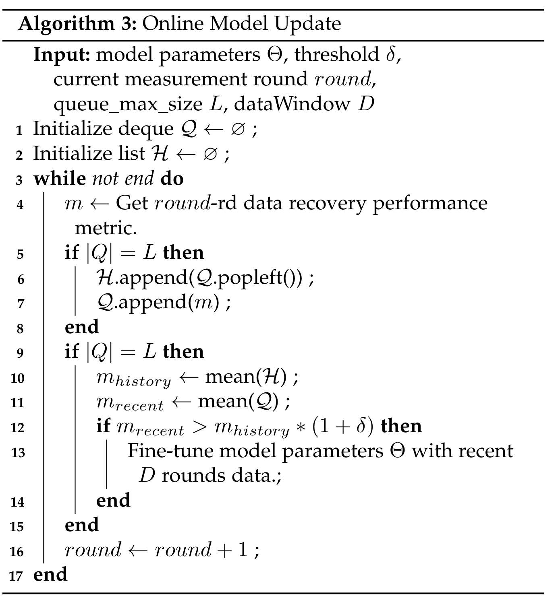

# 3.3 EventMon 论文阅读

* Q：为什么而做

  * 为了更好地动态捕获网络，快速响应网络故障，网络监控系统采取更细的时间粒度来收集数据，形成网络的实时视图。遗憾的是，目前面向网络监测的数据恢复依赖于矩阵和张量补全算法，无法满足实时恢复的要求。

* Q：提出了什么

  * 针对这一问题，本文提出了基于实时事件的流式网络监控数据恢复( Event Mon )，实现了网络测量数据流中超低延迟的数据恢复。具体来说，
    * 我们利用离线和在线的混合架构，离线组件学习以捕获历史时空相关性，而在线组件是一个增量更新因子矩阵的新型流编码器。
    * 为了使我们的事件级流处理模块能够进行训练，我们设计了一种新颖的stream2batch算法来实现小批量的风格训练，并确保编码器产生与逐个流处理相同的结果。

* Q：现有方法是怎么做的，有何问题

  * 第一个问题是completion的常见故事
  * 第二个，矩阵/张量补全（现有）主要是离线和面向历史数据的方法，这意味着当新的监测结果到来时，训练好的低秩分解模型几乎无法更新。因此，目前的方案不太可能处理具有(接近)实时数据恢复的连续网络监测过程，即使加入了在线学习[ 19 ]，[ 20 ]。
  * 事实上，网络监测数据是以事件的形式连续到达的[ 21 ]。每个事件可以看作是一个元组，该元组携带了源节点和目的节点之间的测量结果，并带有一个时间戳，表示何时进行测量。在连续网络监测的背景下，先前的方法与我们的方法不同，因为它们通常将一批事件转换成稀疏矩阵，并假设矩阵中的观测项同时到达。然后，他们应用矩阵填充或张量填充，通过堆叠一系列稀疏矩阵来恢复缺失数据。这些方法称为基于批次的数据恢复算法，将一个时间间隔内的事件作为一个批次进行收集，忽略了事件数据的流式性质。然而，基于批处理的方法可能并不理想，因为它们会引入延迟。
  * 由于基于批次的方法产生的延迟不仅包括处理时间，还包括累积一个完整批次所需的等待时间，因此总体延迟可以显著延长。当发生安全漏洞或攻击时，扩展的延迟可能会造成更大的损失，并使漏洞更难以纠正。对于故障定位，这可能会影响网络可用性，导致停机时间增加。
  * **与这些基于批处理的方法在问题制定中不考虑新到达的事件不同**

* Q：解决问题的时候遇到的挑战

  * 现有流式数据恢复方法的不足。以往的研究往往忽略了网络监测结果的连续性和流式性。他们通常将数据组织为固定形状的多维数组，忽略了新到达数据的包含。因此，当前的流数据恢复方法效率低下，因为它们通常需要迭代的数值优化来获得解决方案。这在处理实时流的事件级数据时是有问题的，因为这些方法并不是针对流数据的动态和快节奏的性质而设计的。为了满足实时数据恢复的需求，需要精心设计模型算法。
  * 使用深度学习框架训练流模型的困难。当前的状态很深学习框架不足以支持模型在流式数据上的训练。一种直接的方法是在训练过程中逐个事件将数据输入到模型中。然而，这种方法非常缓慢，使得训练过程变得不切实际。如果不能快速地训练流模型，流模型的价值就会大大降低。这一问题的加剧是由于这些框架通常依赖于小批量的训练方法，不能很好地适应流数据的持续和快速特征。这是一个重大的挑战，因为它影响了模型的真实世界效用，考虑到在训练期间可能出现的困难。因此，精心设计一种能够捕捉实时、连续本质的小批量训练算法

* Q：作者是如何解决这些挑战的

  * 解决上述挑战需要一种新的建模方法来恢复网络监测数据。为了应对这些挑战，并在测量事件到达时实时提供网络监控测量( NMM )的准确恢复，我们提出了实时基于事件的流网络监控数据恢复( Event Mon )。
  * 具体来说，为了避免耗时的迭代优化，我们引入了一种基于深度学习的混合架构，该架构具有离线和在线处理组件。
  * 离线组件在后台线程中添加历史模式，而在线组件以流的方式处理事件并更新状态。一旦离线组件完成特征提取，我们的模型就可以使用在线组件的中间状态支持任何时间的推断。
  * 针对训练困难的问题，本文提出了一种小批量兼容的Stream2Batch转换算法。通过适当地重新排列事件的顺序，我们可以在一个模型更新步骤中最大化非冲突节点的数量，使得模型在训练和推理阶段都能高效地处理海量事件。

* Q：作者贡献：

  * 我们引入了一种新颖的基于事件流的问题设置来制定实时数据恢复。在此基础上，我们提出了一种新的事件处理范式Event Mon，利用离线和在线混合的架构设计来提高实时数据恢复性能。
  * 为了以小批量的方式模拟流处理，对齐所提出的事件处理设计的训练和测试任务，我们推导了一种算法-模型协同设计。我们保证了流事件编码器对事件处理顺序的不敏感性。然后，利用这些特性，我们引入了Stream2Batch的扩展mini - batch Stream2Batch，将流式处理转化为一系列事件批次。这样的转换显著地加速了训练，并保证了编码后的状态与逐个处理事件的状态相同。当模型进入服务阶段时，精简版的小批量Stream2Batch (简称Stream2Batch )也可以帮助模型提高事件处理的吞吐量。
  * 实验第三个结论：EventMon支持任意时间的灵活推理，并且随着事件处理次数的增加，推理的准确性也随之提高。我们相信这些优势可以为一些实时网络管理应用的设计提供支持。

* Q：深层次的挑战是什么

  * 离线模型的问题
    * 然而，它们专注于提供离线的高精度解决方案，而忽略了高效的更新机制。事实上，与从头开始重新训练相比，他们可以应用在线学习技术来实现更有效的模型更新。将其转为在线补全也可能会引起其他方面的问题，这将在后文进行讨论。
    * 由于它专注于较小的滑动窗口，并应用元学习来补偿长期信息损失，同时加速模型更新。尽管如此，由于LightNestle以批处理方式处理网络监测数据，其实时推理能力有限。
  * 在线模型的问题
    * 尽管提供了事件级的更新，但它们仍然存在吞吐量不足的问题。一方面，如果它们逐一处理新的数据项(事件)，系统可能需要等到前一个事件被送入后才收敛。另一方面，如果它们以批处理模式处理事件，仍然可以花费一些时间，因为在线梯度下降可能以迭代的方式缓慢收敛。为了证实我们的主张，我们提供了准确性和延迟评估，以验证离线低秩补全在实时数据恢复场景中的无能为力。
  * 讨论
    * 高数据恢复延迟是有害的，可能导致重大的现实后果。例如，在网络安全背景下，对入侵的延迟检测可能会导致安全漏洞的传播，从而导致大量的数据丢失或服务中断。在故障定位的背景下，识别和纠正网络问题的延迟会导致停机时间增加，这直接影响了网络可用性、体验质量和潜在的业务损失。因此，迫切需要提出一种原生流数据恢复模型。
    * 基于当前离线和在线网络数据恢复方法不足以满足高吞吐量和实时性需求的局限性，我们提出了一种新的方法EventMon，它不同于传统的低秩近似策略来解决这些挑战。EventMon的核心思想是将新到达的数据项作为事件进行处理，更新因子矩阵中相应的嵌入，利用训练好的神经网络良好的泛化能力。学习到的更新方案代替了在线学习的迭代过程，因此我们的模型可以在没有迭代学习过程的情况下立即做出反应。此外，还提出了基于Stream2Batch算法的流式事件编码器设计，以最大化事件处理

* Q：作者在写作上更加完善了整个故事的内容，补充了什么细节

  * 值得注意的是，预定的测量命令的数量可能略大于我们想要获得的预期测量结果的数量。过采样背后的原因是潜在的丢包和避免等待一些过慢的结果。
  * 值得注意的是，上传延迟不能被忽略，因为上传通道可能过载，并可能发生意想不到的传输错误。

* Q：然后作者提到了最关键的内容，也就是本文的核心动机！

  * **如果某些条件被触发(也就是说,这一轮的测量时间超过了一个阈值,采集了一定量的数据)，则测量轮将被终止并转到下一轮。如前所述，测量所有端到端对需要出乎意料的高成本，因此，只有部分状态将被测量，而数据恢复模型将估计缺失的状态。**

* Q：所以作者本质想解决的问题是什么

  * 不是补缺技术
  * 不是在线学习
  * 而是流式问题

* Q：问题定义是什么

  ​	为了便于理解问题，我们在图3中展示了涉及的关键概念和符号。在基于事件的网络监控中，中央服务器订阅事件流 $\mathbf{E}$ 来接收由测量结果的汇聚节点从网络系统的 $N$ 个节点发送的上传结果。测量事件由一个元组 $e=(s, d, t, v)$ 组成，表示在时间戳 $t$ 时从 $s$ 到 $d$ 的一次测量，$v$ 代表测量值（例如，延迟、吞吐量和数据包丢失率）。为了捕获时间演变的网络监控数据，我们根据它们的时间戳将接收到的事件分成不同的测量轮次。例如，图3显示每个测量轮次持续100个时间单位。对于每个测量轮次 $T$，我们有一组收集的事件，表示为 $\mathbf{E}^{(T)}=\{e \mid e . t \in[$ T.start,T.end $) \wedge e \in \mathbf{E}\}$。然后，我们可以根据相应的事件批次 $\mathbf{E}^{(T)}$ 构造矩阵 $\mathbf{X}^{(T)}$。

  ​	以前的离线矩阵/张量补全方法只会在测量轮次结束后才开始训练过程，以确保数据的完整性（即接收到所有事件）。因此，处理的粒度是一个测量轮次。考虑到一个测量轮次包含一批事件，我们称之为“批次”-基于方法。相比之下，在我们的 EventMon 过程中，一旦接收到事件并且持续运行，我们称之为“流”-基于方法。注意，这只表示模型更新频率的差异，而处理的数据量是相同的。

  ​	本文研究的是实时 NMM 恢复问题，定义如下：我们能否在当前测量的持续事件流 $\mathbf{E}^{(T)}$ 和由分割事件流 $\left\{\mathbf{E}^{(T-k)}, \ldots, \mathbf{E}^{(T-2)}, \mathbf{E}^{(T-1)}\right\}$ 生成的矩阵序列 $\left\{\mathbf{X}^{(T-k)}, \ldots, \mathbf{X}^{(T-2)}, \mathbf{X}^{(T-1)}\right\}$ 的情况下，以实时方式恢复矩阵 $\mathbf{X}^{(T)}$​？如第一节所讨论的，实现实时且准确的 NMM 恢复是非常重要的，需要提出一种新的范式。

* Q：文章的核心部分，总体分为什么

  * 为了满足设计目标，EventMon维护了两个可独立运行的组件，而离线部分学习捕获历史模式，以支持在线部分更好的数据恢复精度。
  * 在这一部分，我们将详细介绍离线部分，其次是在线部分，
  * 并提出Stream2Batch来优化训练和服务吞吐量。
  * 最后，对模型复杂度进行了分析。

* Q：离线部分怎么做的

  * 我们根据测量轮的概念将事件序列的建模解耦为历史事件序列和当前事件序列，以实现实时处理。Event Mon的输入包含两个部分。第一部分是利用历史测量结果对网络环境的时空上下文进行提取和理解。第二部分仍然保留在流式格式中，将在后面讨论。

  * 正如[12]、[13]所指出的，网络测量数据固有地展现出时空相关性。有效捕捉这些模式可以大大提高数据恢复的准确性。然而，从一系列稀疏矩阵中提取时空相关性构成了一个重大挑战。一个直观的方法是使用卷积神经网络（CNNs）和递归神经网络（RNNs）来完成这项任务。然而，直接将CNNs应用于稀疏矩阵可能会导致性能受损，因为CNNs通常对高缺失率敏感[32]、[33]。此外，CNNs的归纳偏见，如局部性和平移不变性，可能不适用于网络监控矩阵。另一种选择是将历史数据组织成一个张量，并执行张量补全来获取张量因子矩阵作为历史数据的表示。不幸的是，张量补全需要迭代收敛，使其不适合于实时应用，例如，在10ms内必须完成补全。

  * 为了应对这些挑战并满足实时处理的要求，我们提出了一种基于图学习的解决方案。受到稀疏矩阵与二分图之间密切关系的启发，以及在金融欺诈检测中使用的基于快照的动态图建模方法[34]、[35]，我们采用了一种不同的方法。我们将历史序列中的每个稀疏矩阵视为网络状态的一个损坏快照，并利用一个时序相关性学习模块，如递归神经网络（RNNs），来捕捉底层的时序依赖性。

    为了实现它，我们首先回顾过去$k$轮的历史测量事件，并将它们组织为一个长度为$k$的稀疏矩阵序列，然后将这些矩阵序列转换为相应的二分图序列。为了构建每个二分图，我们创建两个顶点集$\mathcal{A}=\left\{a_1, a_2, \ldots, a_N\right\}$和$\mathcal{B}=\left\{b_1, b_2, \ldots, b_N\right\}$来表示源点和目的地。如果矩阵中的条目$(i, j)$不为空，则我们添加一条从顶点$a_i$到顶点$b_j$的边，其属性为测量结果$\mathbf{X}_{ij}$。

    构建好二分图后，我们现在应用图神经网络来计算源节点和目的节点的节点特征。遵循图神经网络的一般形式，可以通过两步过程实现——消息构建和消息聚合，我们展示了如何获得节点嵌入。

    在消息构建中，对于二分图中的一条边$(s, d)$，我们定义从$s$到$d$的消息为：
    $$
    \mathbf{m}_{s \rightarrow d}=f\left(\mathbf{s}, \mathbf{d}, e_{sd}\right),
    $$
    其中$\mathbf{m}_{s \rightarrow d}$表示要传播的消息。$f(\cdot)$是消息编码函数，它以嵌入$\mathbf{s}$、$\mathbf{d}$和测量结果$e_{sd}$作为输入。在这项工作中，我们实现$f(\cdot)$为：
    $$
    \mathbf{m}_{s \rightarrow d}=\left(\mathbf{W}\left[\mathbf{s} ; \mathbf{d} ; e_{sd}\right]+\mathbf{b}\right),
    $$
    其中$\mathbf{W}, \mathbf{b}$是可训练的权重，$[\cdot ; \cdot]$表示连接操作。按照上述规则，消息被构建并沿着边传播，而一个节点可能会接收许多消息，这些消息存储在“邮箱”中。

    在消息聚合中，一个节点打开它的“邮箱”来处理它接收到的所有消息，并减少它们以完善其表示。具体来说，消息聚合操作计算：
    $$
    \mathbf{d}^{(1)}=\mathbf{d}^{(0)}+g\left(\sum_{u \in \mathcal{N}_d} \mathbf{m}_{u \rightarrow d}\right) .
    $$
    上述消息构建和消息聚合过程准确展示了一轮消息传播。在二分图中，一阶信息对应于从与给定源节点连接的目的节点编码的信息。二阶信息在此概念上扩展，不仅包括链接的目的节点，还包括与这些目的节点连接的源节点。这个概念可以类比于在推荐系统的用户-项目二分图中编码用户兴趣。通过在二分图内进行更深层次的传播，节点可以编码更多的数据。在从稀疏矩阵派生的二分图的上下文中，执行多轮消息传播使我们能够更准确地捕捉时空相关性，从而可能提高数据恢复的准确性。然而，重要的是要注意，这种增加的准确性可能以额外的处理时间为代价。具体地，让上标L表示L轮传播后的节点嵌入，我们有：

    $$
    \mathbf{d}^{(L)}=\mathbf{d}^{(L-1)}+g\left(\sum_{u \in \mathcal{N}_u} \mathbf{m}_{u \rightarrow d}^{(L-1)}\right),
    $$
    其中$\mathbf{d}_j^{(L-1)}$和$\mathbf{m}_{s \rightarrow d}^{(L-1)}$分别表示$(L-1)$轮传播后接收到的$\mathbf{d}_j$节点嵌入和消息。$g(\cdot)$表示一个可训练的线性变换。具体来说，源节点和目的节点的初始节点嵌入分别为$\mathbf{S}^{(0)}=\tilde{S} \in \mathbb{R}^{|S| \times \operatorname{dim}}$和$\mathbf{D}^{(0)}=\tilde{D} \in \mathbb{R}^{|D| \times \operatorname{dim}}$​。

    为了利用图神经网络的输出学习节点级别的时间演化，我们采用了门控循环单元（GRU [37]）因为相比长短期记忆（LSTM [38]），它具有更少的参数和更容易训练的特性。给定历史网络测量矩阵（NMMs）$\left\{\mathbf{X}^{(T-k)}, \mathbf{X}^{(T-k+1)}, \ldots, \mathbf{X}^{(T-2)}, \mathbf{X}^{(T-1)}\right\}$，为了模拟节点级别演化的网络模式，我们应用图神经网络将二分图编码为两个节点嵌入矩阵序列：$\left\{\mathbf{S}^{(T-k)}, \mathbf{S}^{(T-k+1)}, \ldots, \mathbf{S}^{(T-2)}, \mathbf{S}^{(T-1)}\right\}$和$\left\{\mathbf{D}^{(T-k)}, \mathbf{D}^{(T-k+1)}, \ldots, \mathbf{D}^{(T-2)}, \mathbf{D}^{(T-1)}\right\}$。

    接下来，通过将它们输入GRU：
    $$
    \begin{aligned}
    & \mathbf{A}_{c t x}=\operatorname{GRU}\left(\left\{\mathbf{S}^{(T-k)}, \mathbf{S}^{(T-k+1)}, \ldots, \mathbf{S}^{(T-1)}\right\}\right), \\
    & \mathbf{B}_{c t x}=\operatorname{GRU}\left(\left\{\mathbf{D}^{(T-k)}, \mathbf{D}^{(T-k+1)}, \ldots, \mathbf{D}^{(T-1)}\right\}\right),
    \end{aligned}
    $$
    我们可以分别获得源节点和目的节点的历史上下文。

* Q：在线部分是怎么处理的（类似于lightnestle思想）

  * 处理连续到达的事件。一些先前的工作[39]-[41]在在线推荐系统中聚焦于时间图方法以实现流处理能力。虽然它们中的大多数使用RNNs来更新状态，因为事件时间戳中携带的信息很重要，但我们采用了基于集合神经网络[42]的无状态实现，并提出了我们的流事件编码器，如图5所示。基于集合的事件编码器提供了几个优势。

  * 首先，集合没有特定的顺序，这允许我们以无序的方式模拟事件的到来，类似于实时事件流。其次，集合的排列不变性在设计一个可以在训练期间模拟流处理的策略时带来了便利。通过忽视集合内元素的顺序，我们可以有效地模仿我们的训练过程中事件到达的非顺序性质。

    工作过程如下介绍。当一个新的测量轮开始时，我们将源节点内存和目的节点内存$\mathbf{M}^{\mathbf{S}}$和$\mathbf{M}^{\mathbf{D}}$重置为零。一旦我们接收到一个事件$e=(s, d, t, v)$，我们首先读取节点$s$和目的地$d$的嵌入。设$\mathbf{s}$是嵌入矩阵$\hat{\mathbf{S}}$的第$s$行，$\mathbf{d}$也是如此。然后，我们将事件编码为：
    $$
    \mathbf{h}=\text{ concatenate }([\mathbf{s} ; \mathbf{d} ; v]) .
    $$

    然后，通过以下方式更新$s$和$d$的节点内存：
    $$
    \begin{aligned}
    & \mathbf{M}_s=\mathbf{M}_s+\operatorname{Updater}_{\mathcal{S}}(\mathbf{h}), \\
    & \mathbf{M}_d=\mathbf{M}_d+\operatorname{Updater}_{\mathcal{D}}(\mathbf{h}),
    \end{aligned}
    $$
    其中$\operatorname{Updater}(\cdot)$是一个简单的单层网络：$\operatorname{Updater}(x)=\operatorname{ReLU}(Wx+b)$。为了捕获当前测量轮次中的跨节点特征，我们还通过在两个节点内存上执行最大池化来维护一个全局视图的内存：
    $$
    \begin{aligned}
    & \mathbf{g}_s=\operatorname{MaxPooling}\left(\mathbf{M}_s\right), \\
    & \mathbf{g}_d=\operatorname{MaxPooling}\left(\mathbf{M}_d\right) .
    \end{aligned}
    $$

    有了节点级嵌入和全局特征，我们可以计算当前节点状态为：
    $$
    \begin{aligned}
    & \mathbf{A}_{\text {curr }}=\mathbf{M}_s+\mathbf{g}_u \\
    & \mathbf{B}_{\text {curr }}=\mathbf{M}_d+\mathbf{g}_v .
    \end{aligned}
    $$

* Q：如何恢复数据，final_layers部分。
  $$
  \begin{aligned}
  \mathbf{A}^* & =\operatorname{MLP}\left(\left[\mathbf{A}_{c t x} ; \mathbf{A}_{c u r r}\right]\right), \\
  \mathbf{B}^* & =\operatorname{MLP}\left(\left[\mathbf{B}_{c t x} ; \mathbf{B}_{c u r r}\right]\right), \\
  \hat{\mathbf{X}} & =\mathbf{A}^{* \top} \mathbf{B}^*,
  \end{aligned}
  $$

* Q：Stream2Batch for Streaming Event Encoder，这个最关键的部分

  * 在上述提到的流事件编码器模块中，更新其状态的一个直接方法是逐个事件处理。我们注意到，如果我们逐个处理事件，可能无法满足实时要求，因为这可能在事件快速到来时导致事件积压。此外，在训练中对每个流逐个处理事件效率低下，这与广泛使用的小批量训练不兼容。

    为了克服这个限制，我们提出了一个统一的解决方案来解决它们。根据图5，我们注意到，如果一组事件有不同的源节点状态要写入，并且目的节点状态要写入的也不重叠，那么这样一批事件可以同时处理。通过这样做，事件处理的吞吐量可以大大提高。借鉴当前流计算图和流处理与批处理之间的关系的思想，我们提出了“流事件到事件批处理”（Stream2Batch）算法。我们算法背后的关键思想是在避免写-写冲突的同时，最大化单次更新的事件大小。Python风格的伪代码如算法1所给出。

    Stream2Batch以其当前形式只关注单一事件流，这是服务阶段下的情况。然而，当前的深度学习模型是以小批量风格训练的。为了实现流事件编码器的小批量训练，我们将Stream2Batch扩展到mini-Batch Stream2Batch，如算法2所示。

    mini-Batch Stream2Batch算法背后的基本思想是将不同流中的相同节点映射到不同节点，并将小批量中的所有流合并成一个唯一的流。通过这种方式，小批量训练可以模拟多个流的事件处理，相当于可以并行训练流式模型。当小批量大小为一时，Stream2Batch等同于mini-Batch Stream2Batch算法。因此，我们得出结论，mini-Batch Stream2Batch推广了Stream2Batch。

    图7提供了一个比较不同更新方法的示意图。对于逐个事件更新，它需要最大数量的更新，Stream2Batch由于我们在每次更新中对独立节点进行分组以避免写-写冲突，因此需要较少的更新，但它仍然关注单一流，因此，可能更适合推理阶段。Mini-batch Stream2Batch扩展了其原始版本以符合小批量训练协议。没有开发一种工具将数据流转换为适合在深度学习框架内处理的格式，EventMon无疑会缺乏有意义的实用性。

* Q：在线更新机制
  * 顺序收集的网络监测数据容易发生概念漂移，导致性能显著下降。为了解决这个问题，我们引入了一个简单而有效的机制来监控最近的性能变化，并选择最佳的时间来使用最新的数据来微调模型。

​			

*****

头脑风暴环节

* Q：凝练这篇文章要做什么

  * 超级大背景：网络监控系统采取**更细的时间粒度**来收集数据。需要实时恢复数据，现有离线模型不行，要么纯离线，要么就是在线做的不够“细”

  * 故事是如何导向我们面临的问题：

    * 第一点：completion，能够缓解测量压力
    * 第二点：训练好的模型面对新到来的数据几乎无法更新
    * 第三点：数据是连续到达的。先前的方法通常将一批事件转换成稀疏矩阵，并假设矩阵中的观测项同时到达。然后，他们应用矩阵填充或张量填充，通过堆叠一系列稀疏矩阵来恢复缺失数据。这些方法称为基于批次的数据恢复算法，将一个时间间隔内的事件作为一个批次进行收集，忽略了事件数据的流式性质。
    * 第四点：然而，基于批处理的方法可能并不理想，因为它们会引入延迟。由于基于批次的方法产生的延迟不仅包括处理时间，还包括累积一个完整批次所需的等待时间，因此总体延迟可以显著延长。（我简单理解为，我做这件事情就是有意义的！所以加这个内容）

  * 核心问题产生（挑战）：

    * 我们要选择流式解决如上问题，就要承担相应的代价，产生如下问题
    * 有流式数据恢复方法的不足。以往的研究往往忽略了网络监测结果的连续性和流式性。他们通常将数据组织为固定形状的多维数组，忽略了新到达数据的包含。因此，当前的流数据恢复方法效率低下，因为它们通常需要迭代的数值优化来获得解决方案。这在处理实时流的事件级数据时是有问题的，因为这些方法并不是针对流数据的动态和快节奏的性质而设计的。为了满足实时数据恢复的需求，需要精心设计模型算法。
    * 使用深度学习框架训练流模型的困难。当前的状态很深学习框架不足以支持模型在流式数据上的训练。一种直接的方法是在训练过程中逐个事件将数据输入到模型中。然而，这种方法非常缓慢，使得训练过程变得不切实际。如果不能快速地训练流模型，流模型的价值就会大大降低。这一问题的加剧是由于这些框架通常依赖于小批量的训练方法，不能很好地适应流数据的持续和快速特征。这是一个重大的挑战，因为它影响了模型的真实世界效用，考虑到在训练期间可能出现的困难。因此，精心设计一种能够捕捉实时、连续本质的小批量训练算法

  * **因此，精心设计一种能够捕捉实时、连续本质的小批量训练算法**

  * 引经据典（related works）

    * 离线模型：忽略高效更新机制。lightnestle滑动窗口存在延迟，实时推理做不到。
    * 在线模型：一方面，如果它们逐个处理新的数据条目（事件），系统可能需要等到前一个事件被提供后收敛。另一方面，如果它们以批处理模式处理事件，由于在线梯度下降可能以迭代方式缓慢收敛，仍可能需要一些时间。
    * 强调：安全性出发点名在线学习重要性，并且做到，我们的模型可以在没有迭代学习过程的情况下立即做出反应。

  * 加强透彻理解（强化我们的支撑）：

    * 预定的测量命令的数量可能略大于我们想要获得的预期测量结果的数量。过采样背后的原因是潜在的丢包和避免等待一些过慢的结果。
    * 上传延迟不能被忽略，因为上传通道可能过载，并可能发生意想不到的传输错误。
    * **如果某些条件被触发(也就是说,这一轮的测量时间超过了一个阈值,采集了一定量的数据)，则测量轮将被终止并转到下一轮。如前所述，测量所有端到端对需要出乎意料的高成本，因此，只有部分状态将被测量，而数据恢复模型将估计缺失的状态。**

  * 具体怎么做（solution）：

    * 解藕在线与离线部分
    * 离线部分：
      * 不用CNNs，不用RNNs。利用图神经网络。
      * N阶GNN后，获得所有节点交流后的信息
      * 不用LTSMs，利用GRU对节点信息历史时间序处理，将交流后的信息做时序处理。
    * 在线部分：
      * 将新到来的事件进行流事件编码，利用其进行更新全局特征
      * 然后还保存了当前时间下的全局视图特征
      * 利用全局视图和更新视图，来表征当下特征
    * Recovery部分
      * 当下特征与上下文图神经时序增强信息融合，做简单FFN

    $$
    \begin{aligned}
    \mathbf{A}^* & =\operatorname{MLP}\left(\left[\mathbf{A}_{c t x} ; \mathbf{A}_{c u r r}\right]\right), \\
    \mathbf{B}^* & =\operatorname{MLP}\left(\left[\mathbf{B}_{c t x} ; \mathbf{B}_{c u r r}\right]\right), \\
    \hat{\mathbf{X}} & =\mathbf{A}^{* \top} \mathbf{B}^*,
    \end{aligned}
    $$

    * Stream2Batch（这里似乎是文章的绝对重点，但是一时半会没太理解）
      * GPT总结：Stream2Batch 算法是为了高效处理实时应用中的流数据而设计的，比如在EventMon系统中用于网络监控数据恢复。它通过将流数据转换成可以并行处理的批次来解决流数据处理的挑战，从而提高吞吐量并减少延迟。这种方法允许同时处理具有非重叠源和目的节点的事件，避免了写写冲突。通过将事件分组到批次中，Stream2Batch显著提高了事件处理效率，在训练和推理阶段都能有效处理高速数据流。
      * 我们注意到，如果我们逐个处理事件，可能无法满足实时要求，因为这可能在事件快速到来时导致事件积压。此外，在训练中对每个流逐个处理事件效率低下，这与广泛使用的小批量训练不兼容。（如果一个一个搞，客流量大了直接爆炸）
      * 提出steam2batch
        * Stream2Batch以其当前形式只关注单一事件流，这是服务阶段下的情况。然而，当前的深度学习模型是以小批量风格训练的。
      * 提出mini—-batch stream2batch
        * mini-Batch Stream2Batch算法背后的基本思想是将不同流中的相同节点映射到不同节点，并将小批量中的所有流合并成一个唯一的流。通过这种方式，小批量训练可以模拟多个流的事件处理，相当于可以并行训练流式模型。

