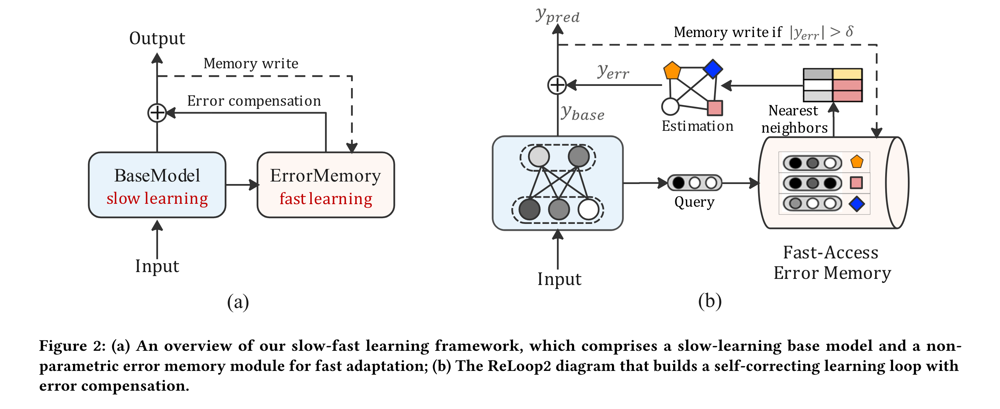

# 3.7 ReLoop2通过响应式误差补偿环

* Q：处理什么问题
  * 工业推荐系统面临着在非平稳环境中运行的挑战，其中数据分布的变化源于用户行为随时间的演变。
  * 为了应对这一挑战，一种常见的方法是利用新观测到的数据定期重新训练或增量更新已部署的深度模型，从而产生一个持续的学习过程。
  * 然而，神经网络的传统学习范式依赖于基于梯度的迭代更新，学习速率较小，使得其对大型推荐模型的适应速度较慢。
* Q：如何解决问题
  * 在本文中，我们引入了ReLoop2，一个自我修正的学习循环，通过响应式误差补偿来促进在线推荐系统中的快速模型适应。
  * 受人类大脑中观察到的慢-快互补学习系统的启发，我们提出了一个错误记忆模块，直接从输入数据流中存储错误样本。这些存储的样本随后被用来补偿测试过程中的模型预测误差，特别是在分布偏移的情况下。
  * 误差存储模块设计具有快速访问能力，并在模型服务阶段随着新观察到的数据样本进行持续刷新，以支持快速的模型自适应。
* Q：存在的问题
  * 然而，工业推荐系统往往运行在非平稳的环境中，数据分布的变化[ 36 ]是用户行为随时间演变的结果。这会导致训练好的推荐模型在在线服务过程中性能下降，从而对模型在分布变化下的快速适应提出了挑战。
  * 目标是预测用户是否会点击下一个项目。小样本学习能够在仅有少量观测样本的情况下对新用户进行快速适应
  * 然而，学习神经网络的参数依赖于基于梯度的迭代更新，以较小的学习率逐步将监督信息纳入模型权重。这使得大型参数化推荐模型实现对分布偏移的快速适应具有挑战性。这个挑战，在增量学习中通常被称为稳定性–可塑性两难问题[ 37 ]，源于需要平衡现有知识的稳定性和高效地纳入新信息所需的可塑性。
* Q：如何解决的问题
  * 一个基础模型作为慢学习模块，通过梯度反向传播进行更新，另一个快速学习模块配备一个非参数误差存储器。
  * 与传统的基于梯度的训练不同，快速学习模块是免训练的，因此能够快速适应新的数据分布。
  * 具体来说，考虑学生的学习过程，他们经常组织和回顾自己过去不正确的问题，以反思自己的错误，并在随后的考试中提高自己的成绩。受此启发，我们提出将来自输入数据流的最近错误样本存储在错误存储器中。这些误差样本反映了模型性能下降的情况，特别是在分布偏移期间。作为回应，
* Q：在自己解决问题的过程，存在什么挑战
  * 涉及到在不依赖反向传播的情况下对输出补偿的误差进行估计。
  * 为了解决这个问题，我们提出了一种非参数方法，该方法利用错误记忆来检索相似的样本，从而使我们能够有效地近似错误。
  * 第二个挑战在于错误记忆的时间和空间高效设计。考虑到数据流的海量性和高速性，我们提出了一种基于局部敏感哈希( LSH )的草图绘制方法。该方法在保持恒定的内存占用的同时，保证了高效的O ( 1 )时间的内存读写操作。
* Q：作者对贡献：
  * ReLoop2框架通过在模型部署后使用新观察到的错误样本不断刷新错误内存来建立连续的模型适应过程。当面临数据分布偏移时，它具有显著增强模型性能的潜力。重要的是，该框架与现有的增量学习技术正交，并与推荐系统中使用的各种模型兼容。
    * 我们确定了在线推荐的快速模型自适应的挑战性问题，并提出了一种基于人脑中观察到的互补学习系统的慢-快学习范式。
    * 我们引入时间和空间有效的非参数误差记忆，并利用它构建响应式误差补偿回路，以实现快速的模型自适应。

有一说一，我现在对论文的把控能力还差关键的一步

我还需要一个具体的学习框架，迅速抓捕整个论文

* Q：想解决的一个本质问题是什么
  * 基于深度学习的推荐模型，点击率预测模型，通常在经验风险最小化（ERM）框架内使用反向传播算法进行优化。这些模型假定数据分布是静态的（即训练数据和测试数据来自同一分布），需要较小的学习率来逐渐将信息纳入模型权重。然而，在现实世界的在线推荐场景中，新用户和新项目的快速涌现，以及用户行为随着时间推移可能发生的变化，都会带来分布变化的挑战。
* Q：作者为了做什么
  * 训练有素的模型在部署后可能会逐渐退化。为了应对这一挑战，
  * 提出了快速适应模型，为什么叫快速适应，存疑
* Q：框架总览，能看出什么
  * 我们的框架采用了慢-快学习范式，其中基础模型进行缓慢的梯度更新，同时引入了一个不需要反向传播的情景记忆模块，以促进新知识的快速获取。
  * 基模型是一个标准的参数化神经网络，通过逐渐的梯度更新来学习共同的知识。相比之下，记忆模块是一个非参数组件，它存储最近观察到的样本，并能够从这些样本中快速学习和适应。这种慢-快学习范式与人脑中的互补学习系统( complementary learning systems，CLS )理论相一致。
* Q：
  * 具体来说，我们将存储模块称为错误存储器，它将基模型产生的最近的错误样本存储在传入的数据流上。这些误差样本为模型做出错误预测的情况提供了洞见，特别是在存在分布偏移的情况下。通过直接捕获和记忆这些误差样本，我们可以采用非参数化的方式估计a中的误差，通过误差补偿对模型输出进行修正。这就为模型在非平稳数据分布的动态演化中建立了一个连续的快速适应过程。模型部署过程中观测到的新的误差样本被不断写回到误差存储器中，从而能够跟踪在线数据中的变化动态。

$$

$$

$$

$$

$$

$$

$$

$$

$$

$$

* Solution正文部分

* 

  3.1 overview

  ​	深度学习基础的推荐模型，比如在2.1节讨论的点击通过率（CTR）预测模型，通常在经验风险最小化（ERM）框架内通过反向传播算法进行优化。这些模型假设数据分布是静态的（即，训练和测试数据来自同一分布），并且需要一个小的学习率来逐渐将信息融入模型权重。然而，在真实世界的在线推荐场景中，新用户和新项目的快速出现，以及用户行为随时间的潜在变化，导致了分布偏移的挑战。因此，一旦部署，一个训练有素的模型可能会逐渐退化。为了应对这一挑战，我们提出了ReLoop2框架，以实现快速模型适应，如图2所示。

  ​	我们的框架采用了慢速-快速学习范式，其中基础模型经历慢速梯度更新，同时引入了一个免于反向传播的情景记忆模块，以促进新知识的快速获取。基础模型是一个标准的参数化神经网络，通过渐进的梯度更新学习通用知识。与之相反，记忆模块是一个非参数组件，它存储最近观察到的样本，并使得从这些样本中进行快速学习和适应成为可能。这种慢速-快速学习范式与人脑中的互补学习系统（CLS）理论相一致。

  ​	具体来说，我们将记忆模块称为错误记忆，它存储了基础模型在接收到的数据流上产生的最近错误样本。这些错误样本提供了模型在分布偏移存在时做出错误预测的情况下的洞察。通过直接捕捉和记住这些错误样本，我们可以以非参数的方式估计错误，随后通过错误补偿来纠正模型输出。这建立了一个在非静态数据分布的不断演变中，模型持续快速适应的过程。在模型部署期间观察到的新错误样本不断地被回写到错误记忆中，使得在线数据中变化动态的跟踪成为可能。

  3.2

  
  
  图2(b)展示了我们的错误补偿循环，用于快速模型适应，包括三个关键组成部分：基础模型$\phi$、快速访问错误记忆$M$以及错误估计模块$\mathcal{E}$。我们的学习框架是通用的，与用于CTR预测的各种基础模型兼容。我们如下定义基础模型：
  $$
  y_{\text {base }}=\phi(e)
  $$
  其中$e$代表数据实例的特征嵌入。$y_{\text {base }} \in[0,1]$表示基础模型预测的点击概率。我们在2.1节中简要概述了特征嵌入和CTR建模方法。值得注意的是，模型函数$\phi$可以使用任何现有的CTR预测模型来实现，如DeepFM [12]、DCN [58]和DIN [67]。基础模型通过最小化$y$与$y_{\text {base }}$之间的误差，在经验风险最小化框架内近似真实标签$y$：
  $$
  \min \epsilon^2 \text {，其中 } \epsilon=y-y_{\text {base }}
  $$

  理想情况下，在独立同分布(i.i.d.)数据的假设下，误差$\epsilon$应该是一个经过模型训练后接近零的小随机变量。然而，当基础模型面对分布偏移时，会退化，导致在模型服务期间误差$\epsilon$增大。
  
  ​	为了解决这个问题，我们提出了一种主动估计模型预测误差并相应校正模型输出的方法。然而，直接从方程7获取$\epsilon$是不可行的，因为在预测时未知标签$y$。因此，我们提出使用存储在错误记忆模块$M$中的最近观察到的样本来估计它。正式地，我们使用以下公式进行错误估计：
  $$
  y_{\text {err }}=\mathcal{E}\left(h_q, M\right)
  $$
  其中$h_q$表示输入样本$q$的隐藏表示，可以从基础模型$\phi$的任何隐藏层（例如，最后一个隐藏层）选择。有了估计的误差$y_{\text {err}}$，我们可以对模型输出进行补偿，以纠正其预测：
  $$
  y_{\text {pred }}=y_{\text {base }}+\lambda \cdot y_{\text {err }}
  $$
  其中$y_{\text {pred }}$表示带有模型适应的最终输出。补偿权重$\lambda$调整误差补偿的比例。重要的是要注意，误差补偿后$y_{\text {pred }}$的值可能超出范围$[0,1]$。在这种情况下，我们将值限制在范围内。

  在接下来的章节中，我们将描述我们对错误估计模块$\mathcal{E}$和错误记忆模块$M$的设计。

  3.2.1

  ​	鉴于错误记忆保留了最近观察到的数据样本，我们的目标是基于与新输入𝑞相似的样本来估计预测误差。形式上，我们旨在从记忆中检索一组最相似的前k个样本，如下所述：其中$s_i=\operatorname{sim}\left(h_q, h_i\right)$表示查询样本$x$的隐藏向量与记忆实例$i$的相似度。此外，$y_i$和$y_{\text {base}}i$分别代表真实标签和基础模型的预测值。相似样本$\mathcal{K}$的推导在3.2.2节提供。
  
  受到内容寻址记忆网络[63]中使用的注意力机制的启发，我们可以如下估计注意力加权的真实值$\bar{y}$和预测值$\bar{y}_{\text {base}}$。
  $$
  \bar{y}=\sum_{i \in \mathcal{K}} a_i \cdot y_i, \quad \bar{y}_{\text {base }}=\sum_{i \in \mathcal{K}} a_i \cdot y_{\text {base}_{-} i}
  $$
  注意力权重$a_i$使用以下方程计算：
  $$
  a_i=\frac{\exp \left(s_i / \tau\right)}{\sum_{i \in \mathcal{K}} \exp \left(s_i / \tau\right)}
  $$

  这里，$\tau$是一个温度参数，用于调整softmax的平滑度。$\tau$的值可以与基础模型一起学习，或作为超参数手动调整（例如，0.1）。
  
  接下来，我们将预测误差估计为两种误差测量的加权组合：
  $$
  \begin{aligned}
  y_{\text {err }} & =\gamma \cdot\left(\bar{y}-y_{\text {base }}\right)+(1-\gamma) \cdot\left(\bar{y}_{\text {base }}-y_{\text {base }}\right) \\
  & =\gamma \cdot \bar{y}+(1-\gamma) \cdot \bar{y}_{\text {base }}-y_{\text {base }}
  \end{aligned}
  $$
  其中$\gamma$是平衡两种误差测量的权重。值得注意的是，当$\gamma=0$时，误差是根据相似样本上的模型预测估计的。当$\gamma=1$时，误差是根据相似样本的真实标签计算的。在后一种情况下，我们将$y_{\text {err }}$代入方程9，可以得到如下的校正模型预测与误差补偿：
  $$
  \begin{aligned} y_{\text {pred }} & =y_{\text {base }}+\lambda \cdot\left(\bar{y}-y_{\text {base }}\right) \\ & =(1-\lambda) \cdot y_{\text {base }}+\lambda \cdot \bar{y}\end{aligned}
  $$
  这可以被看作是基础模型输出$y_{\text {base}}$和来自k近邻（KNN）估计$\bar{y}$的加权组合。为简便起见，在我们的实验中使用$\gamma=1$​。

  3.2.2快速访问错误记忆
  
  ​	在这一节中，我们专注于我们框架的关键组成部分，即错误记忆$M$。在在线推荐系统中，数据随时间顺序获取，模型基于接收到的样本生成点击预测。当用户与推荐项目交互时，真实标签会被接收。在这个过程中，我们可以轻松地从基础模型的一个特定隐藏层（与$h_q$相同）获取隐藏表示$h_i$、基础模型输出$y_{\text {base\_}}$以及真实标签$y_i$。为了能够快速适应分布变化，我们利用记忆来存储这些最近观察到的样本。理想情况下，我们的记忆由一组键值对组成，如下所述：
  $$
  M=\left\{\left(h_i, y_i, y_{\text{base}_i}\right)\right\}
  $$
  其中$h_i \in \mathbb{R}^d$代表记忆槽$i$的$d$维键向量，而$y_i$和$y_{\text {base\_i}}$作为记忆值。我们定义一个记忆读取函数$R$，它根据查询$h_q$从记忆中检索一组相似样本$\mathcal{K}$：
  $$
  \mathcal{K}=R\left(h_q, M\right)
  $$

  然而，在现实世界的推荐系统中，设计记忆面临两个主要挑战，由于点击数据量大：

  ​	快速访问。对于实时在线的CTR预测，模型推理必须满足严格的延迟要求。因此，实现对错误内存的快速访问是至关重要的。然而，保留大量最近观察到的数据样本进行自适应使得内存大小过大，无法在记忆网络中使用传统的基于注意力的内容寻址机制[ 63 ]，需要为每个查询读取所有的记忆槽。

  ​	记忆大小。存储模块需要相当大的内存大小以存储足够数量的数据样本。在我们的生产系统中，在10分钟的时间范围内，样本的数量可以很容易地达到数百万。存储如此大量的数据样本需要耗费大量的计算资源(例如, RAM)用于模型服务。因此，最小化错误内存的内存资源消耗是非常必要的。

  ​	为了解决这些挑战，我们探索了两种潜在的解决方案：近似最近邻( ANN )搜索和基于LSH的草图绘制。ANN搜索技术在工业上被广泛用于在次线性时间内高效地检索前k个最近向量。这些技术已经在各种检索增强的机器学习任务(例如,语言建模、机器翻译)中取得成功。此外，它们都有成熟的工具和库支持，包括Faiss [ 23 ]，ScaNN [ 13 ]和Milvus [ 56 ]。然而，在Faiss [ 23 ]中构造流行的ANN指标，如HNSW [ 42 ]和IVFPQ，涉及耗时的步骤(例如, k-means)，并且需要大量的内存(Gbps的RAM)。为了减少内存消耗，我们提出基于模型误差对数据样本进行过滤。具体来说，我们只存储误差相对较大的样本(大于某一阈值σ)，因为它们在基础模型中显示出显著的退化。尽管应用了错误过滤并且随机降采样，存储这些原始数据样本仍然会给内存带来相当大的负担。因此，对于计算资源有限的在线推荐任务，ANN搜索可能不是最优的选择。
  
  ​	理想情况下，我们的目标是设计一个轻量级和快速访问的存储器，避免将海量数据点直接存储在RAM中，消除类似kmeans的迭代和不按能力分班过程的需要，避免构建复杂的索引结构，如图，这些索引结构要么耗时，要么难以并行化。为了实现这些目标，我们提出了一种在流式数据上使用基于LSH的数据草图算法的错误存储器的替代设计[ 8 ]。LSH如2.3节所述，利用固定的哈希函数，可以在恒定的时间内对每个数据点进行高效的分桶操作。数据草图支持构造一个紧凑的草图，该草图概括了流式数据。草图算法将一组高维向量压缩成整数计数器的小数组，这足以估计方程16中相似样本的相似度si。
  
  ​	我们正式定义内存为由$K$个重复数组组成的草图，表示为$M_k$，其中$k \in[0, K-1]$。每个数组$M_k$通过$L$个独立哈希函数$H_L(x)=\left\{h_w(x) \mid w\right\}$索引，其中$h_w(x) \mapsto[0,1]$是方程4中描述的一种有符号随机投影。因此，一个输入$x$可以被哈希到$2^L$个桶中的一个索引：$H_L(x) \mapsto\left[0,2^L-1\right]$。例如，设置$L=16$可以得到大约65,536个桶。虽然这个草图最初是为了使用整数计数器进行核密度估计而设计的[8]，但在我们的设计中，我们在数组$M_k$的桶$b$处存储了一个元组，表示为$M_k[b]=($ sum_x $[b]$, sum_y $[b]$, sum_ybase $[b])$为了确保更稳定的估计，使用$K$套不同的哈希函数$\left\{H_L^k(x) \mid k \in\right.$ $[0, K-1]\}$重复相同的过程$K$次。总之，内存可以被视为一个大小为$2^L \times K \times 3$的连接数组。更具体地说，我们如下制定了内存写入和读取过程：
  
  ​	内存写入。对于数据流中观察到的每个样本$i$，我们获取$\left(h_i, y_i, y_{\text{base}} i\right)$。我们不是直接按照方程15将原始样本存储在内存中，而是应用每组哈希函数$H_L^k$将键向量$h_i$映射到相应的桶$b$，并按如下方式更新草图数组$M_k[b]$。

$$
\text { sum\_x }[b]+=1 \\
\text { sum\_y }[b]+=y_i \\
\text { sum\_y}_{base}[b]+=y_{base\_i}
$$

注意，$M_k[b]$中的值最初被设置为零，并且可以定期或当基础模型已更新以刷新内存时重置。所有$K$个内存数组的更新可以并行执行。

内存读取。给定一个查询样本向量$h_q$，我们可以应用相同的一组哈希函数将查询映射到桶$b$。然后，我们从每个草图数组$M_k[b]$获取总和值，并通过对所有桶的平均计算读出值如下：
$$
s_i & =\operatorname{sum}_{-} x[b] / \sum_b \operatorname{sum}_{-} x[b] \\
y_i & =\operatorname{sum}_{-} y[b] / \sum_b \operatorname{sum}_{-} x[b] \\
y_{\text {base}_{-} i} & =\text { sum }_{-} y_{b a s e}[b] / \sum_b \operatorname{sum}_{-} x[b]
$$
在并行从$K$个草图数组中读取后，我们得到了类似样本的$K$个读出结果$\mathcal{K}=\left\{\left(s_i, y_i, y_{\text{base\_}} i\right) \mid i \in[0, K-1]\right\}$，然后可以在方程10中用于误差估计。

​	与存储原始样本的传统内存相比，我们基于LSH的草图内存提供了几个优势。它使得构建时间快（每个样本的写入时间为$\mathrm{O}(1)$），内存需求低（常数内存大小为$2^L \times K \times 3$），并且消除了查询时距离计算的需要（每个查询的读取时间为$\mathrm{O}(1)$）。值得注意的是，我们的草图内存不仅易于实现，而且享有强大的理论保证[8]。

​	通过这种方式，错误内存模块有助于基于观察到的类似数据样本估计基础模型的潜在错误，为错误补偿循环贡献力量，该循环不断地和适应性地纠正模型输出。这结果在一个慢-快联合学习框架中，用于快速模型适应。

代码日志：

3月12日15:00开始下载源代码，

3月12日15:30跑起来

3月12日18:00看懂全部代码