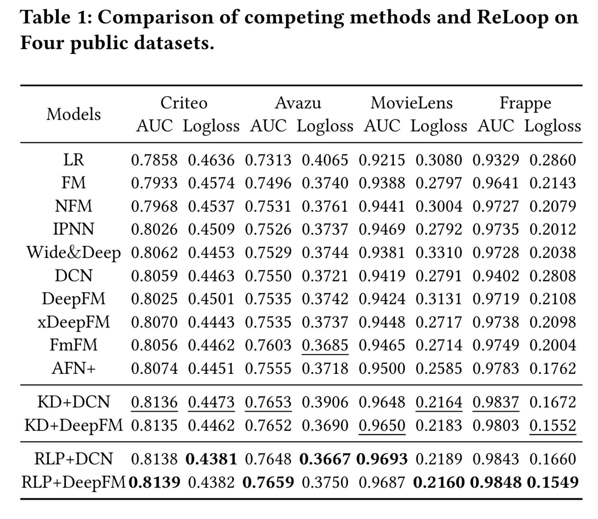

# 4.03  ReLoop 朱杰明老师 推荐系统

#### ReLoop: A Self-Correction Continual Learning Loop for Recommender Systems

* Q：什么领域，什么问题
  * 推荐系统
  * 通常，部署的模型需要进行频繁的再训练，以从新收集的交互日志中捕获用户的动态行为。然而，目前的模型训练过程只获取了用户的反馈作为标签，而没有考虑到之前的推荐中所犯的错误
  
* Q：作者做了什么
  * 受人类通常从错误中反思和学习的直觉启发，在本文中，我们试图为推荐系统构建一个自我修正的学习循环(称为ReLoop )。
  * 特别地，使用一个新的自定义损失来鼓励每个新的模型版本，以减少训练过程中的预测误差。
  * 我们的ReLoop学习框架能够在长期内进行持续的自我修正过程，因此有望获得比现有训练策略更好的性能。
  
* Q：现有工作是怎么做的，有哪些欠考虑的
  * 工业推荐系统中的模型部署通常包括两个交错的过程：离线(增量)训练和在线推理。部署的模型需要进行频繁的再训练，以从新收集的交互日志中捕获时变的用户行为。这就形成了常规的学习循环：模型训练→在线推理→反馈数据→模型训练→· · ·。
  * 首先，离线训练后，在线部署模型，服务用户请求。然后，收集新的反馈数据作为下一轮模型训练的输入(例如,点击的用户-项目对作为正样本,未点击的用户-项目对作为负样本)，进而交付新的模型版本进行在线推理。这样的训练过程只获取了用户的反馈(例如,点击)作为监督信号，而没有考虑到之前模型版本中所犯的错误。这就浪费了从过去的推荐经验中积累知识进行自我修正的机会。
  
* Q：所以作者为什么选择了当前框架做法
  * 在这项工作中，我们提出了一个名为Re Loop的新颖的学习框架，其目标是为推荐系统构建一个自校正学习循环。例如，使用推荐列表的样本级测试错误、列表级排序错误，甚至在线业务度量(例如,点击量、收入)作为误差度量。
  
* Q：作者在实现框架过程, 遇到了什么挑战
  * 作为这项工作的初步尝试，我们选择了一个简单而有效的设计选择，并展示了它在点击率中的预测任务。在推荐系统的训练循环中，从部署的模型中不断地在线收集数据样本，从而可以从先前的模型中获得用户的点击标签和相应的预测误差。我们的关键见解是，一个新的模型应该被迫在相同的数据样本上做出比之前的模型版本更小的预测误差，从而实现自我修正的能力。基于这个观点，我们选择样本预测误差(即,预测分数和真实值之间的差距)作为误差度量，并进一步提出了一个定制的损失函数，以迫使每个新的模型版本在训练期间比以前的模型版本减少预测误差。我们的ReLoop框架能够实现持续的自我更新。
  
* Q：作者是怎么解决这些挑战的
  * 相邻重新训练过程之间的联系非常松散，因为每个训练过程都独立地训练自己的模型。也就是说，当前的训练过程没有充分利用先前过程中的信息，忽略了先前预测中的错误。为了缓解这个问题，我们引入了一个新颖的自我修正模块来从之前的错误中吸取教训。
  
* Q：作者的核心贡献是

  

$$
y-\hat{y} \leq y-\widetilde{y}_{\text {last }} \quad \Leftrightarrow \quad \tilde{y}_{\text {last }}-\hat{y} \leq 0
$$

$$
\mathcal{L}_{s c}=y \max \left(\tilde{y}_{\text {last }}-\hat{y}, 0\right)+(1-y) \max \left(\hat{y}-\tilde{y}_{\text {last }}, 0\right)
$$

$$
\mathcal{L}_{c e}=-y \log \hat{y}-(1-y) \log (1-\hat{y})
$$

$$
\mathcal{L}=\alpha \mathcal{L}_{s c}+(1-\alpha) \mathcal{L}_{c e}
$$

利用人类纠错概念，学习上一次的错误和当前的标签。

由错误的概念，转换数学公式，推导出新的损失函数：约束正负样本的预测值在前后两次训练中的关系

正常的推荐模型训练采用交叉熵损失，

损失采用交叉熵和过去

类似于知识蒸馏：
$$
\mathcal{L}_{k d}=-\widetilde{y}_{\text {last }} \log \hat{y}-\left(1-\widetilde{y}_{\text {last }}\right) \log (1-\hat{y})
$$
将前一次的预测作为这一次的标签，可以使得当前轮次的训练至少要达到上一轮的效果。

公式的左边部分解释如下：

- $y \max (\tilde{y}_{\text{last}}-\hat{y}, 0)$: 当实际标签$y=1$（即用户对推荐的项目感兴趣）时，如果上一轮的预测值$(\tilde{y}_{\text{last}})$大于当前模型的预测值$\hat{y}$，这意味着当前模型在预测用户对此项目的兴趣时表现得不如上一轮。在这种情况下，我们想要“惩罚”这个差异，以鼓励模型减少这种类型的预测误差。如果$\hat{y}$大于$\tilde{y}_{\text{last}}$，即当前预测值比上一轮的预测值更高，表明模型在某种程度上进行了自我修正，这种情况下不会应用额外的惩罚（因为$max$函数的结果为0）。

- $(1-y) \max (\hat{y}-\tilde{y}_{\text{last}}, 0)$ 当实际标签$y=0$（即用户对推荐的项目不感兴趣）时，如果当前模型的预测值$\hat{y}$大于上一轮的预测值$\tilde{y}_{\text{last}}$，这意味着模型过高估计了用户对此项目的兴趣。因此，这部分损失函数旨在“惩罚”模型对不感兴趣的项目给出过高的兴趣预测。

整体来看，这个自我修正损失函数通过对比当前预测和上一轮预测的差异，促进模型在新的训练轮次中减少这种差异，从而在一定程度上模拟了从错误中学习的过程。这种方法的目的是使模型能够不断自我优化，逐步减少预测错误，提高推荐系统的准确性和用户满意度。

