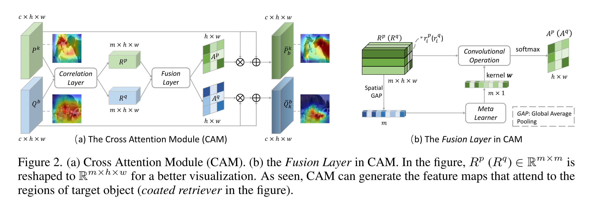
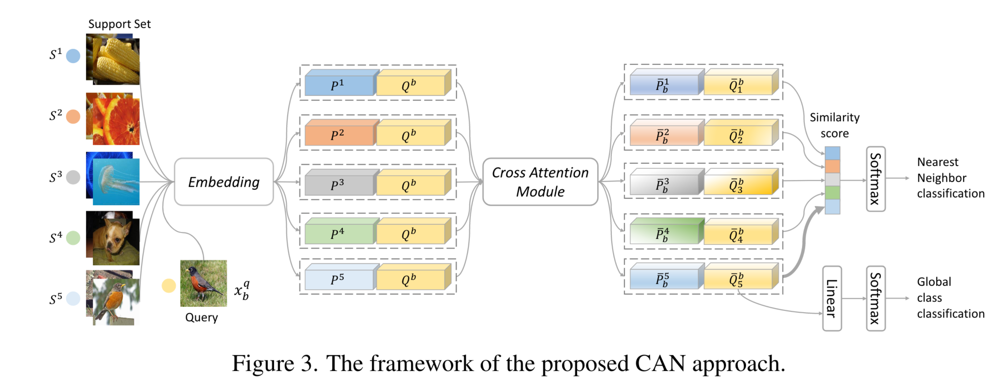

# 4.09  Cross Attention实战案例
### Cross Attention Network for Few-shot Classification

* Q：什么领域，什么问题
  * Few-shot classification aims to recognize unlabeled samples from unseen classes given only few labeled samples. 
  * The unseen classes and low-data problem make few-shot classification very challenging. 
  * Many existing approaches extracted features from labeled and unlabeled samples independently, as a result, the features are not discriminative enough.
  
* Q：作者做了什么
  * In this work, we propose a novel Cross Attention Network to address the challenging problems in few-shot classification. 
    * Firstly, Cross Attention Module is introduced to deal with the problem of unseen classes. The module generates cross attention maps for each pair of class feature and query sample feature so as to highlight the target object regions, **making the extracted feature more discriminative.** 
    * Secondly, a transductive inference algorithm is proposed to alleviate the low-data problem, which iteratively utilizes the unlabeled query set to augment the support set, thereby making the class features more representative.
  
* Q：现有工作是怎么做的，有哪些欠考虑的
  * A straightforward approach is fine-tuning a pretrained model using the few labeled samples from the unseen classes. However, it may cause severe overfitting. 
  * Regularization and data augmentation can alleviate but cannot fully solve the overfitting problem. Recently, meta-learning paradigm [38, 39, 22] is widely used for few-shot learning. 
  * In meta-learning, the transferable meta-knowledge, which can be an optimization strategy [31, 1], a good initial condition [7, 16, 24], or a metric space [35, 40, 37], is extracted from a set of training tasks and generalizes to new test tasks. 
  * **The tasks in the training phase usually mimic the settings in the test phase to reduce the gap between training and test settings and enhance the generalization ability of the model.**
  
* Q：所以作者为什么选择了当前框架做法
  * While promising, few of them pay enough attention to the discriminability of the extracted features. They generally extract features from the support classes and unlabeled query samples independently, as a result, the features are not discriminative enough.
  
* Q：作者在实现框架过程, 遇到了什么挑战
  * One is unseen classes, i.e., the non-overlap between training and test classes; 
  * The other is the low-data problem, i.e., very few labeled samples for the test unseen classes.
  
* Q：作者是怎么解决这些挑战的
  * In this work, we propose a novel Cross Attention Network (CAN) to enhance the feature discriminability for few-shot classification. 
  * Firstly, Cross Attention Module (CAM) is introduced to deal with the unseen class problem. The cross attention idea is inspired by the human few-shot learning behavior. To recognize a sample from unseen class given a few labeled samples, human tends to firstly locate the most relevant regions in the pair of labeled and unlabeled samples. Similarly, given a class feature map and a query sample feature map, CAM generates a cross attention map for each feature to highlight the target object. Correlation estimation and meta fusion are adopted to achieve this purpose. In this way, the target object in the test samples can get attention and the features weighted by the cross attention maps are more discriminative. As shown in Fig. 1 (e), the extracted features with CAM can roughly localize the regions of target object curtain. 
  * Secondly, we introduce a transductive inference algorithm that utilizes the entire unlabeled query set to alleviate the low-data problem. The proposed algorithm iteratively predicts the labels for the query samples, and selects pseudo-labeled query samples to augment the support set. With more support samples per class, the obtained class features can be more representative, thus alleviating the low-data problem.
  
* Q：作者的核心贡献是
  
  * 
  
  
  
* Q：其他问题：注意力机制简单回顾

  * 注意力机制旨在突出重要的局部区域，以提取更具区分性的特征。
  * 它在计算机视觉应用中取得了巨大成功，如图像分类[12, 41, 27]、人物再识别[10, 47, 11]、图像标题[29, 44, 4]和视觉问题解答[43, 45, 46, 30]。
  * 在图像分类方面，SENet[12] 提出了一个通道注意块，以提高网络的表征能力。Woo 等人[41, 27]进一步将通道注意模块和空间注意模块整合到一个区块中。
  * 在图像标题中，注意力模块[44, 4]通常使用上次生成的单词来搜索图像中的相关区域，从而生成下一个单词。
  * 而在视觉问题解答中，注意力模块[43, 45, 46, 30]利用问题来定位图像中的相关区域以进行回答。
  * 具体来说，[30] 利用问题生成卷积核，然后与图像特征卷积。与此相反，我们的方法使用元学习器生成一个核，用来融合各种关系，从而得到最终的注意力图谱。
  * 针对少镜头图像分类，本文设计了元学习器来计算支持（或类别）特征图与查询特征图之间的交叉注意力，这有助于定位目标对象的重要区域并增强特征的可辨别性。

* Q：交叉注意力在本文如何使用的

  * 整个Cross Attention Network (CAN) 如图3所示，它包括三个模块：一个嵌入模块，一个交叉注意力模块和一个分类模块。嵌入模块$E$由几个级联的卷积层组成，将输入图像$x$映射到特征图$E(x) \in \mathbb{R}^{c \times h \times w}$。遵循原型网络[35]的定义，我们将类特征定义为其支持集在嵌入空间中的平均值。如图B所示，嵌入模块$E$接受支持集$\mathcal{S}$和一个查询样本$x_b^q$作为输入，并产生类特征图$P^k=\frac{1}{\left|\mathcal{S}^k\right|} \sum_{x_a^s \in \mathcal{S}^k} E\left(x_a^s\right)$以及一个查询特征图$Q^b=E\left(x_b^q\right)$。每对特征图（$P^k$和$Q^b$）随后被送入交叉注意力模块，该模块突出显示相关区域，并为分类输出更具鉴别力的特征对（$\bar{P}_b^k$和$\bar{Q}_k^b$​）。

  * 通过优化进行模型训练。CAN通过最小化训练集查询样本上的分类损失来进行训练。分类模块由最近邻分类器和全局分类器组成。最近邻分类器基于预定义的相似度度量，将查询样本分类到$C$个支持类中。为了获得精确的注意力图，我们限制查询特征图中的每个位置都被正确分类。具体地，对于第$i^{th}$位置的每个局部查询特征$q_i^b$，最近邻分类器产生一个类似softmax的标签分布，覆盖$C$个支持类。预测$q_i^b$为第$k^{th}$类的概率是：
    $$
    p\left(y=k \mid q_i^b\right)=\frac{\exp \left(-d\left(\left(\bar{Q}_k^b\right)_i, \operatorname{GAP}\left(\bar{P}_b^k\right)\right)\right)}{\sum_{j=1}^C \exp \left(-d\left(\left(\bar{Q}_j^b\right)_i, \operatorname{GAP}\left(\bar{P}_b^j\right)\right)\right)},
    $$
    其中$\left(\bar{Q}_k^b\right)_i$表示$\bar{Q}_k^b$的第$i^{th}$空间位置的特征向量，GAP是全局平均池化操作，用以获取平均类特征。注意$\bar{Q}_k^b$和$\bar{Q}_j^b$代表查询样本$x_b^q$从与不同支持类相关联的略有不同的视角。然后，分类损失被定义为根据真实类标签$y_b^q \in\{1,2, \ldots, C\}:$
    $$
    L_1=-\sum_{b=1}^{n_q} \sum_{i=1}^m \log p\left(y=y_b^q \mid q_i^b\right) .
    $$

    全局分类器使用一个全连接层后跟softmax来对每个查询样本进行所有可用训练类别的分类。假设训练集中总共有$l$个类别。每个局部查询特征$q_i^b$的分类概率向量$z_i^b \in \mathbb{R}^l$计算为$z_i^b=\operatorname{softmax}\left(W_c\left(\bar{Q}_{y_b^q}^b\right)_i\right)$。然后全局分类损失表示为：
    $$
    L_2=-\sum_{b=1}^{n_q} \sum_{i=1}^m \log \left(\left(z_i^b\right)_{l_b^q}\right),
    $$
    其中$W_c \in \mathbb{R}^{l \times c}$是全连接层的权重，$l_b^q \in\{1,2, \ldots, l\}$是$x_b^q$的真实全局类。最终，总体分类损失定义为$L=\lambda L_1+L_2$，其中$\lambda$是用来平衡不同损失影响的权重。网络可以通过使用梯度下降算法优化$L$来端到端训练。


* Q：还是很迷糊，看看gpt解释，目前有一位网友批判了few shot classification不可行

  * 在《Cross Attention Network for Few-shot Classification》论文中，"cross attention"机制主要用于在支持集和查询样本之间建立有效的特征关联，以提升小样本分类任务的性能。下面是一个对交叉注意力如何使用的概述：

    ### 1. 嵌入模块

    首先，一个嵌入模块$E$通过一系列卷积层将输入图像$x$转换成特征图$E(x) \in \mathbb{R}^{c \times h \times w}$。这一步旨在从原始图像中提取有用的特征表示。

    ### 2. 类特征与查询特征

    - 对于每个类别$k$的支持集$\mathcal{S}^k$，类特征图$P^k$是通过将支持集中的图像特征在嵌入空间内取平均得到的。
    - 查询样本$x_b^q$经过嵌入模块转换后得到查询特征图$Q^b=E(x_b^q)$。

    ### 3. 交叉注意力模块

    交叉注意力模块的核心在于利用类特征图$P^k$和查询特征图$Q^b$之间的关系来突出与当前查询样本最相关的特征区域。具体来说：

    - 对每一对特征图（$P^k$和$Q^b$），交叉注意力模块计算两者之间的相似度或关联，以识别查询图像中与支持集类别相关的特征区域。
    - 该模块通过加权这些相关区域来生成更具判别性的特征对$\left(\bar{P}_b^k\right.$ 和 $\bar{Q}_k^b$ )，以便用于后续的分类。

    ### 4. 分类

    生成的特征对接下来被送入分类模块，其中包括最近邻分类器和全局分类器：

    - **最近邻分类器**基于特征对之间的相似度度量进行分类，为每个局部查询特征分配一个softmax-like的类别标签分布。
    - **全局分类器**通过一个全连接层和softmax操作，基于整体特征对所有训练类别进行分类。

    通过这种方式，交叉注意力机制有效地利用了支持集中的信息来指导查询样本的分类，特别是在可用样本非常少的情况下。这种方法通过强化模型对于关键特征的关注，提高了小样本分类任务的准确度和泛化能力。

* Q：最后他是怎么聚合的

  * 在交叉注意力机制中，“加权这些相关区域来生成更具判别性”的特征，并不简单意味着直接相加这些区域。而是通过计算得到的注意力权重来加权相应的特征区域，这些权重指示了每个区域对于最终任务（如分类）的重要性。

    具体地，假设你有一个查询特征图$Q^b$和一个类特征图$P^k$：

    1. **计算注意力权重**：首先，你会计算查询特征图中每个位置的特征与类特征图中特征的相似度或相关性。这一步通常涉及到特征之间的点积、余弦相似度计算，或是通过一个小型神经网络来学习这些权重。

    2. **加权特征**：然后，根据计算出的注意力权重，对类特征图中的特征进行加权。这意味着，特征图中每个位置的特征都会根据它们对于当前查询任务的相关性被重新加权。权重较高的特征会被强调，而权重较低的特征则会被抑制。

    3. **聚合**：加权后，通常会通过某种形式的聚合操作（如求和、平均或是通过一个特定的网络层）来合并这些加权的特征，生成一个新的、更具判别力的特征表示，用于后续的分类任务。

    因此，“加权这些相关区域”是一个更为复杂的操作，它涉及到基于计算出的注意力模型来动态调整特征的过程，而不仅仅是简单地将特征相加。这种方法使得模型能够自适应地聚焦于对当前任务最重要的特征，从而提高了分类的性能和准确度。

* Q：看代码

  ```python
  def get_attention(self, a):
      input_a = a
  
      a = a.mean(3) 
      a = a.transpose(1, 3) 
      a = F.relu(self.conv1(a))
      a = self.conv2(a) 
      a = a.transpose(1, 3)
      a = a.unsqueeze(3) 
  
      a = torch.mean(input_a * a, -1) 
      a = F.softmax(a / 0.025, dim=-1) + 1
      return a 
  
  def forward(self, f1, f2):
      b, n1, c, h, w = f1.size()
      n2 = f2.size(1)
  
      f1 = f1.view(b, n1, c, -1) 
      f2 = f2.view(b, n2, c, -1)
  
      f1_norm = F.normalize(f1, p=2, dim=2, eps=1e-12)
      f2_norm = F.normalize(f2, p=2, dim=2, eps=1e-12)
  
      f1_norm = f1_norm.transpose(2, 3).unsqueeze(2) 
      f2_norm = f2_norm.unsqueeze(1)
  
      a1 = torch.matmul(f1_norm, f2_norm) 
      a2 = a1.transpose(3, 4) 
  
      a1 = self.get_attention(a1)
      a2 = self.get_attention(a2) 
  
      f1 = f1.unsqueeze(2) * a1.unsqueeze(3)
      f1 = f1.view(b, n1, n2, c, h, w)
      f2 = f2.unsqueeze(1) * a2.unsqueeze(3)
      f2 = f2.view(b, n1, n2, c, h, w)
  
      return f1.transpose(1, 2), f2.transpose(1, 2)
  ```

  交叉注意力机制主要体现在`CAM`类的`forward`方法中，通过计算两组特征（`f1`和`f2`）之间的相互关系来实现。这里的关键步骤包括：

  ### 1. 特征归一化
  - 首先，`f1`和`f2`通过`F.normalize`进行归一化，确保特征在比较时具有数值稳定性。

  ### 2. 特征重塑与扩展
  - `f1`和`f2`被重塑并通过`unsqueeze`扩展维度，为接下来的矩阵乘法操作准备。

  ### 3. 计算注意力矩阵
  - 通过`torch.matmul(f1_norm, f2_norm)`计算得到的注意力矩阵`a1`表示`f1`中每个特征向量与`f2`中每个特征向量之间的相似度。相似地，`a2`是`a1`的转置，表示`f2`到`f1`的相似度。

  ### 4. 获取加权注意力
  - `get_attention`方法对注意力矩阵进行处理，生成加权注意力。这一步骤中，通过`mean`、`relu`、以及卷积层的处理，最终通过`softmax`得到归一化的注意力权重，这些权重突出了与查询样本最相关的特征区域。

  ### 5. 应用加权注意力
  - 将注意力权重应用到原始特征上，即`f1`和`f2`分别与它们的加权注意力`a1`和`a2`相乘，生成加权后的特征表示。这一步通过动态调整特征的重要性，增强了模型对于关键信息的捕获能力，实现了交叉注意力的核心思想。

  ### 交叉注意力的关键
  交叉注意力的核心在于通过计算和应用这些加权注意力，模型能够在两组特征之间建立一个“桥梁”，使得一组特征的表示能够参考另一组特征的信息，从而实现互相增强。这种机制使得模型在处理如分类、检测等需要捕获细粒度特征关联的任务时，表现得更为精准和鲁棒。

  ```python
  def forward(self, xtrain, xtest, ytrain, ytest):
        batch_size, num_train = xtrain.size(0), xtrain.size(1)
        num_test = xtest.size(1)
        K = ytrain.size(2)
        ytrain = ytrain.transpose(1, 2)
  
        xtrain = xtrain.view(-1, xtrain.size(2), xtrain.size(3), xtrain.size(4))
        xtest = xtest.view(-1, xtest.size(2), xtest.size(3), xtest.size(4))
        x = torch.cat((xtrain, xtest), 0)
        f = self.base(x)
  
        ftrain = f[:batch_size * num_train]
        ftrain = ftrain.view(batch_size, num_train, -1) 
        ftrain = torch.bmm(ytrain, ftrain)
        ftrain = ftrain.div(ytrain.sum(dim=2, keepdim=True).expand_as(ftrain))
        ftrain = ftrain.view(batch_size, -1, *f.size()[1:])
        ftest = f[batch_size * num_train:]
        ftest = ftest.view(batch_size, num_test, *f.size()[1:]) 
        ftrain, ftest = self.cam(ftrain, ftest)
        ftrain = ftrain.mean(4)
        ftrain = ftrain.mean(4)
  
        if not self.training:
            return self.test(ftrain, ftest)
  
        ftest_norm = F.normalize(ftest, p=2, dim=3, eps=1e-12)
        ftrain_norm = F.normalize(ftrain, p=2, dim=3, eps=1e-12)
        ftrain_norm = ftrain_norm.unsqueeze(4)
        ftrain_norm = ftrain_norm.unsqueeze(5)
        cls_scores = self.scale_cls * torch.sum(ftest_norm * ftrain_norm, dim=3)
        cls_scores = cls_scores.view(batch_size * num_test, *cls_scores.size()[2:])
  
        ftest = ftest.view(batch_size, num_test, K, -1)
        ftest = ftest.transpose(2, 3) 
        ytest = ytest.unsqueeze(3) 
        ftest = torch.matmul(ftest, ytest) 
        ftest = ftest.view(batch_size * num_test, -1, 6, 6)
        ytest = self.clasifier(ftest)
        return ytest, cls_scores
  
  ```

* Q：从代码里面可以看出，确定是平均聚合？

  * 是的，从您提供的代码中可以看出，在处理特征`ftrain`时，作者使用了`mean`操作进行了聚合。具体来说，聚合操作发生在两个主要的步骤：

    1. **特征转换与聚合**：
       - `ftrain`被重塑成`batch_size, num_train, -1`的形状，并通过`torch.bmm`（批量矩阵乘法）与`ytrain`相乘。这个操作可以理解为根据`ytrain`的类别信息对`ftrain`的特征进行加权和聚合。
       - 然后，使用`.div(ytrain.sum(dim=2, keepdim=True).expand_as(ftrain))`进行归一化，这里的归一化保证了聚合后的特征考虑了每个类别中特征的数量，实现了按类别的特征聚合。
       - 最后，`ftrain`被重塑回具有特定特征维度的形状，以便进行进一步处理。

    2. **均值池化**：
       - 在`ftrain`和`ftest`通过交叉注意力模块`self.cam(ftrain, ftest)`处理之后，对`ftrain`使用了两次`mean`操作（尽管代码中似乎重复了`ftrain = ftrain.mean(4)`这一行，可能是一个错误，通常应该在不同维度上应用，例如`.mean(3).mean(2)`）。
       - 这个均值操作实际上是在进行空间维度上的池化，将通过交叉注意力加权的特征图转换为一个更紧凑的特征表示，这有助于后续的分类任务。

    总的来说，这段代码通过先对特征进行按类别加权聚合，然后再通过均值池化来减少特征的空间维度，从而为分类任务生成更具判别性的特征表示。这种聚合策略旨在利用小样本中的每个样本信息，并通过交叉注意力机制突出对分类最重要的特征，提高了模型对新类别的识别能力。

* Q：所以他是对谁和谁做了交叉注意力，然后对谁做平均聚合？

  在提供的代码中，交叉注意力（Cross Attention，简称 CAM）操作是在`ftrain`和`ftest`这两组特征之间进行的。这里的`ftrain`代表来自训练集（或支持集）的特征，而`ftest`代表来自测试集（或查询集）的特征。交叉注意力的目的是在这两组特征之间建立相互的关注点，从而增强模型对于测试集中样本类别的识别能力。

  ### 对谁和谁做了交叉注意力：
  - **交叉注意力是在`ftrain`和`ftest`之间进行的**：通过`self.cam(ftrain, ftest)`调用，`ftrain`和`ftest`被送入交叉注意力模块。在这个过程中，`ftrain`中的每个特征向量会根据与`ftest`中特征向量的相似度获得一个权重，反之亦然。这个权重反映了特征之间的关联程度，使得模型能够聚焦于对当前分类任务最关键的特征。

  ### 对谁做平均聚合：
  - **平均聚合是在经过交叉注意力加权后的`ftrain`上进行的**：通过`ftrain.mean(4)`操作（尽管代码出现了重复，但原意可能是对不同维度进行平均聚合）。这一步骤旨在将加权后的空间特征图简化为一个具有全局信息的特征向量，为每个类别提供一个紧凑的代表性特征。这样做有助于提高分类的准确性，因为它减少了因空间细节引入的噪声，同时保留了通过交叉注意力确定的关键特征信息。

  总结来说，交叉注意力加强了训练集特征（`ftrain`）和测试集特征（`ftest`）之间的相关性，通过突出重要特征来增强分类任务的性能。平均聚合则是在加权后的`ftrain`上进行的，旨在生成更具判别力的全局特征表示。

