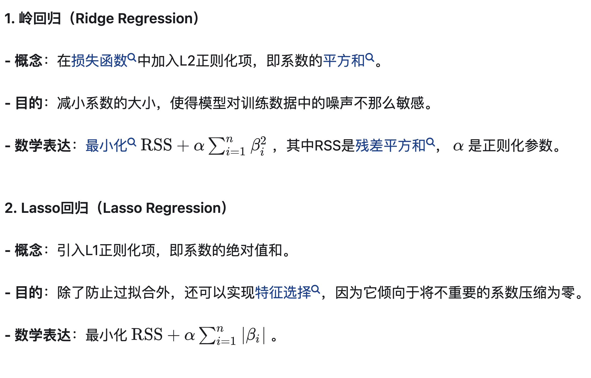

# 4.10 Loss梯度更新为什么这么奇怪

### 关键词：多目标任务

一个神经网络可以有两个损失函数吗?

我们知道在图像处理很多文章的损失函数由多个部分组成，但最后还是会加权合并成一个总的损失，能不能就是同时有两个损失函数，优化同一个网络，交替优化那种，类似于gan，就比如说召回率和精确率，两个有点互斥的感觉，我想两个指标都好，可以这样做吗?初学者，说的不对的地方希望大家指正

网友1:

Faster R-CNN在最初的论文发表（nips2015）之时，就是用不同的loss交替训练模型。具体地说，就是时而通过训练让Region Proposal更准确，时而固定所有的Region Proposals通过训练让最终的boxes更准确。在最初的论文发表之后，作者又实现了joint训练。并且作者声称joint训练的优化速度是交替训练的1.5倍。

作者：dawnbreaker
链接：https://www.zhihu.com/question/338559590/answer/781802397
来源：知乎
著作权归作者所有。商业转载请联系作者获得授权，非商业转载请注明出处。

网友2:

这里要区分是严格多目标还是弱多目标

你说的多个损失加权这种，就是弱多目标，多个目标都有考虑，但对于模型优化来说就是一个目标。你说的两个loss交替优化，本质还是融合了，你可以认为是0.5 0.5加权

再说严格多目标，这个不存在的！同一组参数，不可能同时往两个方向优化

实际应用中，本质都是弱多目标，融合寻找一个权衡。而弱多目标可以work的隐含假设是，多个目标存在不低的相关性，不可忽视

作者：Dylan
链接：https://www.zhihu.com/question/338559590/answer/780820885
来源：知乎
著作权归作者所有。商业转载请联系作者获得授权，非商业转载请注明出处。

多任务学习就是允许多个损失的，不过会加权组合在一起，一并更新梯度。其实这等价于每个损失去更新梯度。

召回率和精确率，都要好，似乎采用级联思想吧。

大家好，我是泰哥。同学们在日常训练模型的过程中，有没有对结果进行过如下观察比较：

- 使用`MSE损失函数`时，预测结果更加偏向异常值
- 而使用`MAE损失函数`训练时，`Loss`与`MSE`的`Loss`相差不多，但是预测结果却更加偏向常规值

作者：hzwer
链接：https://www.zhihu.com/question/375794498/answer/2292320194
来源：知乎
著作权归作者所有。商业转载请联系作者获得授权，非商业转载请注明出处。

**这也是个困扰了我多年的问题：**

**loss = a * loss1 + b * loss2 + c * loss3 怎么设置 a，b，c？**

**我的经验是 loss 的尺度一般不太影响性能，除非本来主 loss 是 loss1，但是因为 b，c 设置太大了导致其他 loss 变成了主 loss。**

**实践上有几个调整方法：**

1. **手动把所有 loss 放缩到差不多的尺度，设 a = 1，b 和 c 取 10^k，k 选完不管了；**
2. **如果有两项 loss，可以 loss = a * loss1 + (1 - a) * loss2，通过控制一个超参数 a 调整 loss；**
3. **我试过的玄学躺平做法 loss = loss1 / loss1.detach() + loss2 / loss2.detach() + loss3 loss3.detach()，分母可能需要加 eps，相当于在每一个 iteration 选定超参数 a, b, c，使得多个 loss 尺度完全一致；进一步更科学一点就 loss = loss1 + loss2 / (loss2 / loss1).detach() + loss3 / (loss3 / loss1).detach()，感觉比 loss 向 1 对齐合理**

**某大佬告诉我，loss 就像菲涅尔透镜，纵使你能设计它的含义，也很难设计它的梯度。所以暴力一轮就躺平了。我个人见解，很多 paper 设计一堆 loss 只是为了让核心故事更完整，未必强过调参。**

### Q：关于正则化

# Q：所谓正则化参数到底是又什么意思？

在看一篇文献时，看到了文中提及用L曲线准则确定正则化参数。这里的正则化参数是什么意思？而且在后面进一步说明中提及，做出了一个函数曲线，并将该曲线的角点对应的值作为最合理的正则化参数，这又有什么理由吗？

目前在看机器学习，对于正则化我只能想到这方面的了，简单来说就是添加参数来防止曲线过拟合。

对于拟合曲线，如果参数太少，那么会造成欠拟合，如果太多，就会过拟合，见蓝色的曲线，过拟合的原因是部分theta太大，这时候，对于所有拟合参数theta1,theta2 ... thetam，可以添加个平衡参数lambda，当lambda设置的很大的时候，那theta就必须缩小才能保证成本函数的最小值，这时候theta的权重就下降了，相应的就是曲线由蓝色转变为紫色，不再过拟合

作者：阿卡林
链接：https://www.zhihu.com/question/68222349/answer/264076169
来源：知乎
著作权归作者所有。商业转载请联系作者获得授权，非商业转载请注明出处。

# 这个正则化解释非常生动！！！！！！！！！

**正则化：加入限制**
为了解决这个问题，艾玛决定给她的食谱加入一些限制（正则化）。这相当于在烹饪中加入一些普遍适用的烹饪原则。

1. **[岭回归](https://www.zhihu.com/search?q=岭回归&search_source=Entity&hybrid_search_source=Entity&hybrid_search_extra={"sourceType"%3A"answer"%2C"sourceId"%3A3283827354})（Ridge）：平衡食材**

艾玛决定所有食材都不能过量（岭回归中的L2正则化）。即使某些食材很受家人喜欢，她也会小心不让它们主导整道菜的味道。这有助于她制作出更平衡、更适合多数人口味的菜肴。

2. **Lasso回归：简化食谱**

艾玛还尝试了另一种方法：去掉一些不太重要的食材（Lasso回归中的L1正则化）。这样她的食谱变得更简单，只保留了最能影响口味的关键食材。有时，简单的食谱反而更容易成功。

在线性回归模型中引入正则化，有助于控制模型复杂度，提高模型在未见数据上的泛化能力。它通过惩罚过大的系数值来降低模型的复杂度，从而防止模型过度适应训练数据的具体特征（即过拟合）。同时，正则化在处理具有多重共线性特征的数据时也非常有效，因为它可以减少参数之间的依赖性，提高模型的稳定性和可靠性。

总的来说，正则化为线性回归模型的构建和优化提供了强大的工具，特别是在面对现实世界复杂数据集时。通过选择合适的正则化方法和调整正则化强度$\alpha$  或r值，可以显著提高模型的性能和适用性。

作者：南木北
链接：https://www.zhihu.com/question/68222349/answer/3283827354
来源：知乎
著作权归作者所有。商业转载请联系作者获得授权，非商业转载请注明出处。

作者：南木北
链接：https://www.zhihu.com/question/68222349/answer/3283827354
来源：知乎
著作权归作者所有。商业转载请联系作者获得授权，非商业转载请注明出处。

疏规则化关键原因在于它能实现特征的自动选择。一般来说，2的大部分元素（特征）都是和 最终的输出没有关系或者不提供任何信息的，在最小化目标函数的时候考虑这些額外的特 征，虽然可以获得更小的训练误差，但在预测新的

# Q：我有一个疑惑，无论是L1还是L2，我已经很清楚了L1是筛选特征，L2是平滑多数特征，那为什么是在损失函数上加上去，为什么这样做能够使得筛选特征或者平滑多数特征呢。

L1和L2正则化是机器学习中常用的两种正则化技术，用于防止模型过拟合，通过在损失函数中添加一个正则项来实现。下面详细解释为什么这样做能够使得筛选特征或者平滑特征：

### 1. L1 正则化（Lasso 正则化）

L1 正则化通过向损失函数添加一个与模型权重（系数）的绝对值成比例的项来工作。数学上，如果原始的损失函数是 $ L(\theta)$，则L1正则化后的损失函数为：

$$
L(\theta) + \lambda \sum_{i=1}^{n} |\theta_i|
$$
其中，$\theta $ 表示模型参数，$\lambda $ 是正则化强度，控制正则化项的影响大小。

**为什么能筛选特征：**

- **L1 正则化倾向于产生一些精确为零的权重，这是因为它尝试将参数值直接推向零（这与成本函数中的绝对值项的性质有关）。**
- **当 $\lambda$足够大时，一些不那么重要的特征的系数会被压缩到0，这样模型就只用剩下的非零系数的特征进行预测，达到了特征选择的效果。**
- 这种性质使得L1正则化特别适用于特征选择，尤其是在特征数目多于样本数的情况下。

### 2. L2 正则化（Ridge 正则化）

L2 正则化通过向损失函数添加一个与模型权重的平方成比例的项来工作。数学上，如果原始的损失函数是 $L(\theta) $，则L2正则化后的损失函数为：
$$
L(\theta) + \lambda \sum_{i=1}^{n} \theta_i^2
$$
**为什么能平滑特征：**
- **L2 正则化倾向于使权重值接近于零但不完全为零。因为平方项的导数$2\theta_i$随着 $\theta_i$ 的减小而减小，导致权重平滑地趋近于零。**
- **它减少参数的大小，限制模型的复杂性，从而使模型的预测更加稳健，不易受到训练数据中小波动的影响。**
- 通过惩罚大的权重值，L2 正则化有助于处理那些参数估计值过大导致模型在新数据上泛化能力差的问题。

### 为什么在损失函数上加正则化项

在损失函数中加入L1或L2正则化项，可以在模型训练过程中同时优化原始的损失目标（如最小化误差）和参数的复杂度。这种做法实际上是在模型的拟合优度（fit）和模型的复杂度（complexity）之间进行权衡。增加正则化项后，优化算法（如梯度下降）不仅仅是在减少误差，而且还在尝试压缩模型权重，从而达到防止过拟合的效果。

通过这种方式，L1和L2正则化帮助构建了更为健壮的模型，既能够有效抓住数据中的主要特征，又能够控制模型的复杂度，防止在新的、未见过的数据上表现不佳。

这是为什么将它们加到损失函数中，而不是作为一个独立的优化目标来处理的主要原因。

# Q：如何正确理解其中正则化的过程

为了更清楚地理解L1正则化如何进行特征选择，让我们通过一个具体的数字例子来展示这个过程。考虑一个简单的线性回归问题，我们的目标是通过最小化损失函数来找到最佳的模型参数。

### 示例设置

假设我们有以下数据集，包括三个特征（$ x_1, x_2, x_3 $）和一个目标变量（$ y $）：

$$
\begin{align*}
x_1 & = [1, 2, 3, 4] \\
x_2 & = [1, 1, 2, 2] \\
x_3 & = [2, 2, 2, 2] \\
y & = [2, 3, 6, 8] \\
\end{align*}
$$
模型的目标是使用这些特征来预测$ y $。我们使用一个带有L1正则化的线性模型，即：

$$
y = \theta_1 x_1 + \theta_2 x_2 + \theta_3 x_3
$$

### 损失函数

我们的损失函数（包括L1正则化项）是：

$$
L(\theta) = \sum_{i=1}^{4} (y_i - (\theta_1 x_{1i} + \theta_2 x_{2i} + \theta_3 x_{3i}))^2 + \lambda \sum_{j=1}^{3} |\theta_j|
$$
假设我们选择了一个相对较大的 $\lambda$ 值（例如 $\lambda = 10$)。

### 训练过程

1. **初始化参数**：$\theta_1 = 0, \theta_2 = 0, \theta_3 = 0$

2. **无正则化拟合**：首先，忽略正则化项，我们通过最小化误差平方和找到一组参数：$\theta_1 = 1, \theta_2 = 0.5, \theta_3 = 1.5$。此时模型试图拟合数据但没有考虑复杂性。

3. **加入L1正则化**：引入正则化后，优化过程不仅要最小化误差，还要最小化参数的绝对值之和。因此，参数更新过程中会考虑每个参数的贡献与其引入的复杂度（由 $\lambda$ 控制）。

   - 在迭代过程中，参数 $\theta_3$（对应于全常数特征 $x_3$）因为增加了过多的复杂度（所有值都一样，信息量低），可能首先被压缩至0。
   - 随着更多迭代，如果 $\lambda$ 足够大，即使是 $\theta_2$ 也可能被压缩至0，尤其是当 $x_2$ 与 $x_1$ 高度相关时。

4. **结果**：最终可能得到 $\theta_1 = 1.9, \theta_2 = 0, \theta_3 = 0$，这意味着模型只使用 $x_1$ 来预测 $y$，从而达到了特征选择的目的。

### 结论

通过这个例子，你可以看到L1正则化如何导致一些参数精确地变为零，从而实现特征选择。选择较大的 $\lambda$ 值使得模型倾向于更简单的形式，即使这可能牺牲一些拟合度。这种特性特别适用于特征数目众多而样本量不足的情况，可以有效防止过拟合并提高模型的泛化能力。

# 这是一个写得非常好的博客（关于loss，为什么加在一起）：

https://c-harlin.github.io/学习笔记/2022/07/30/多任务学习概述.html

将多目标优化问题变成了优化加权后的单目标优化问题。但这种调权重的方法的问题是，如果多个任务间存在竞争的关系一一个任务变好, 其它另任务就会变差, 那么就很难找到一组有效的权重了。**而作者采用的方法是将MTL看做一个带约束优化问题 $\mathrm{C}$, 求解它的过程就是寻找帕累托最优的过程, 即如果一个任务的变好, 是在其他任务变差的前提下实现, 那么我们就称达到帕累托最优Q。**形象地讲, 在刚开始优化时, 每个任务都能变好, 直到优化到某一步, 发现一个任务变好但至少有一个其他任务会变差, 那么我们就认为达到了帕累托最优, 优化结束。

