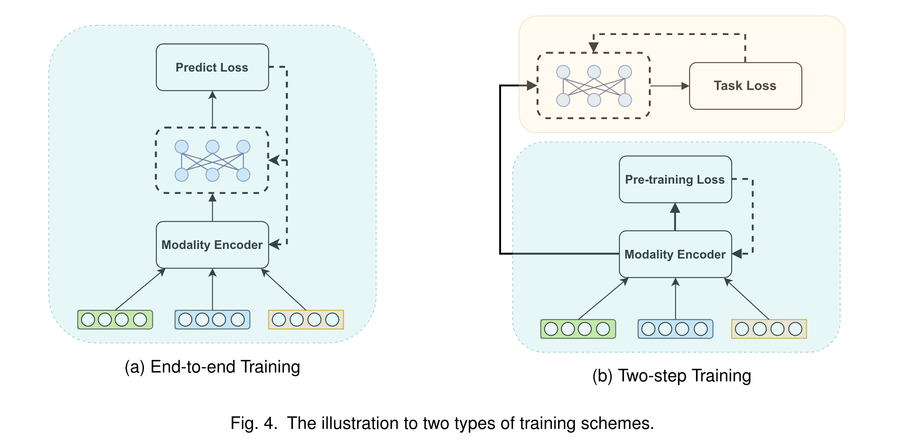

# 4.10 多模态推荐系统综述

Multimodal Recommender Systems: A Survey 

QIDONG LIU*, Xi’an Jiaotong University, City University of Hong Kong, China JIAXI HU*, City University of Hong Kong, Hong Kong SAR YUTIAN XIAO*, City University of Hong Kong, Hong Kong SAR JINGTONG GAO, City University of Hong Kong, Hong Kong SAR XIANGYU ZHAO†, City University of Hong Kong, Hong Kong SAR

## 2. Fusion机制

在多模态推荐场景中，用户和物品的多模态信息种类繁多，数量巨大。因此，有必要对不同的多模态信息进行融合，生成推荐任务所需的特征向量。与桥接相比，融合更关注物品的多模态内部关系。具体来说，它旨在将各种偏好与模式结合起来。由于相互关系和内部关系对于学习综合表征至关重要，许多 MRS 模型 [39, 44] 甚至同时采用了**融合和桥接**两种方法。**注意力机制是应用最广泛的特征融合方法，它可以灵活融合不同权重和侧重点的多模态信息**。在本小节中，如图 2（b）所示，我们首先按融合粒度划分注意力机制，然后介绍 MRS 中存在的其他一些融合方法。 

2.2.1 粗粒度注意力。

* 有些模型运用注意机制在粗粒度水平上融合来自多种模态的信息。
  * 例如，UVCAN[32]将多模态信息分为用户端和物品端，包括各自的 ID 信息和侧面信息。它使用用户侧的多模态数据，通过自我关注为物品侧生成融合权重。
  * 在 UVCAN 的基础上，MCPTR [34] 提出并行合并物品和用户信息。
* 除了用户端和物品端，一些模型还融合了来自不同模态方面的信息。
  * CMBF[7]引入了交叉注意机制，分别共同学习图像和文本模态的语义信息，然后将其合并。
* 此外，一些模型中各种模态的比例也不尽相同。
  * MML[40]基于id信息设计了一个注意力层，并由视觉和文本信息辅助。
  * 在 MCPTR[34]中，每个模态占据相同的位置，由自我注意机制决定融合权重。
  * 相比之下，HCGCN[38]更注重项目本身的视觉和文本信息。

2.2.2 精细关注。

* 多模态数据既包含全局特征，也包含细粒度特征，例如录音的音调或衣服上的图案。由于粗粒度融合通常具有侵入性和不可逆性[27]，因此会破坏原始模态信息，降低推荐性能。因此，一些研究考虑了细粒度融合，即在不同模态之间有选择地融合细粒度特征信息。细粒度融合在时尚推荐场景中非常重要。
  * POG [5] 是一种基于变压器架构的大型在线服装推荐系统。在编码器中，它通过多层注意力挖掘时尚图像中属于搭配方案的深层特征，不断实现细粒度融合。
  * NOR [25] 同时应用了编码器-解码器变换器架构，其中包含细粒度的自注意力结构。它可以根据搭配信息生成相应的方案描述。
* 此外，为了提高可解释性，
  * EFRM[18]还设计了一个语义提取网络（SEN）来提取局部特征，并最终将这两种特征与细粒度注意力偏好融合在一起。
  * VECF [6] 进行图像分割，将每个补丁的图像特征与其他模态进行整合。
  * UVCAN [26] 与 VECF 一样对视频截图进行图像分割，并通过注意力机制分别将图像补丁与 ID 信息和文本信息融合。
  * MM-Rec [52] 首先通过目标检测算法 Mask-RCNN 从新闻图像中提取感兴趣区域，然后利用协同注意机制将 POI 与新闻内容融合在一起。
* 有些模型设计了独特的内部结构，以实现更好的细粒度融合。
  * 例如，MKGformer[8]通过共享一些 QKV 参数和相关的感知融合模块来实现细粒度融合。
  * MGAT [44] 采用门控注意力机制，关注用户的局部偏好。
  * MARIO [21] 通过考虑每种模式对每次交互的单独影响来预测用户偏好。因此，该模型设计了一种模态感知注意力机制，以识别各种模态对每次交互的影响，并针对不同模态做点乘法。

2.2.3 组合关注。

* 在细粒度融合的基础上，一些模型设计了组合融合结构，希望细粒度特征的融合也能保持全局信息的聚合。
  * NOVA [27] 将侧面信息引入到顺序推荐中。它指出，直接用 vanilla attention 融合不同的模态特征通常效果甚微，甚至会降低性能。因此，它提出了一种具有两个分支的非侵入式关注机制，在融合过程中，id 嵌入到一个分离的分支中，以保留交互信息。
  * NRPA [30] 提供了一种个性化注意力网络，它考虑了用户评论所代表的用户偏好。它使用个性化的词级关注，为每个用户/项目选择评论中更重要的词，并通过细粒度和粗粒度融合依次传递评论信息关注层。
  * VLSNR [14] 是顺序推荐的另一种应用--新闻推荐。它可以对用户的临时兴趣和长期兴趣进行建模，并通过多头注意力和 GRU 网络实现细粒度和粗粒度融合。
  * MARank[57]设计了一个多阶注意力层，将注意力和Resnet结合成一个统一的结构来融合信息。

2.2.4 其他融合方法。

​	除了通过注意力权重融合多模态信息外，一些研究还采用了一些简单的方法，包括**平均池化**、**串联操作**[60]和**门控机制**[27]。**不过，这些方法很少单独出现，通常是与上述图形和注意力机制结合使用**。现有工作[27]表明，如果使用得当，简单的互动不会破坏推荐效果，还能降低模型的复杂性。此外，一些早期模型采用了 RNN [14] 和 LSTM [16] 等结构，试图通过多模态信息对用户的时间偏好进行建模。不过，随着注意力机制和 CNN 等深度学习技术的发展，这些技术近年来已较少使用。一些模型通过线性和非线性层融合多模态特征。Lv 等人[35]在融合文本和视觉特征的地方设置了一个线性层。在 MMT-Net[23]中，餐厅数据的三个上下文不变量被人为标记，并通过三层 MLP 网络进行交互。

## 对比学习，解藕学习

同一对象的不同模态表征具有独特和共同的语义信息。因此，如果能区分这些独特和共同的特征，就能显著提高 MRS 的推荐性能和泛化能力。最近，为了解决这个问题，一些模型配备了分离表征学习（Disentangled Representation Learning，DRL）和对比学习（Contrastive Learning，CL）功能，以进行基于交互的特征增强，如图 3 所示。

3.1 分离表征学习 

* 在 RS 中，不同模态的特征对于用户偏好目标项目的特定因素具有不同的重要性。然而，每种模态中不同因素的表征往往是纠缠在一起的，因此许多研究者引入了分解学习技术来挖掘用户偏好中的细致因素，
  * 如 DICER [61]、MacridVAE [36]、CDR [4]。
* 此外，多模态推荐是从高度复杂纠缠的多模态数据中发现由各种隐藏因素形成的有用信息。
  * MDR[49]提出了一种多模态分离推荐方法，它可以从不同模态中学习到携带互补信息和标准信息的良好分离表征。
  * DMRL [28] 考虑了各种模态特征对每个解缠因素的不同贡献，以捕捉用户偏好。
  * 此外，PAMD[15] 设计了一种解纠缠编码器，可在自动保留特定模态特征的同时提取其模态共通特征。
* 此外，对比学习保证了分离模态表征之间的一致性和间隙。
  * 与 MacridVAE 相比，SEM-MacridVAE[48]在从用户行为中学习分离表征时考虑了项目语义信息。

3.2 对比学习 

* 与 DRL 不同，对比学习方法通过数据增强来增强表征，这也有助于处理稀疏性问题。
  * MRS 领域的许多研究都引入了 CL 损失函数，主要用于模态对齐和增强正负样本之间的深层特征信息。
  * MCPTR [34] 提出了一种新颖的 CL 损失函数，它能使同一项目的不同模态表示具有语义相似性。
  * 此外，GHMFC[46] 基于图神经网络得出的实体嵌入表征，构建了两个对比学习模块。
* 两个 CL 损失函数有两个方向，即文本到图像和图像到文本。
  * Cross-CBR [37] 提出了一个 CL 损失函数，用于对齐来自捆绑视图和条目视图的图表示。
  * 而 MICRO [59] 则侧重于共享模态信息和特定模态信息。
  * 在 CMCKG [2]中，实体嵌入是通过知识图谱从描述属性和结构链接信息中获得的，从而实现对比损失。
  * 在 HCGCN [38]中，为了强制将视觉和文本项目特征映射到同一语义空间，它参考了 CLIP [41]，该方法采用对比学习，最大化批次中正确视觉-文本对的相似度。此外，它还为不同的 CL 损失函数设置了权重。
* 由于对比学习的核心是挖掘正样本和负样本之间的关系，因此许多模型在推荐场景中采用数据增强方法来构建正样本。
  * MGMC [62] 设计了一种图增强方法来增强样本，并引入元学习来提高模型的泛化能力。
  * MML [40] 是一种序列推荐模型，它通过构建用户历史购买项目序列的子集来扩展训练数据。
  * LHBPMR [38] 从图卷积中选择具有相似偏好的项目来构建正样本。
  * MMGCL [54] 通过模态边缘损失和模态屏蔽来构建正样本。
  * Victor [24] 首次通过中文语义构建样本。
  * Combo-Fashion [64] 是一个捆绑式时尚推荐模型，因此它构建了否定和肯定的时尚匹配方案。
* 现有模型大多考虑删除多模态数据中不属于用户偏好的信息。
  * 相比之下，QRec[56]从相反的角度出发，在多模态信息中加入均匀噪声作为正样本，以提高模型的泛化能力。
  * 此外，虽然 UMPR [53] 没有明确的 CL 损失函数，但它也构建了一个描述视觉正样本和负样本之间差异的损失函数。

## Training

由于多模态推荐系统使用图片、文本、音频和其他多媒体信息，因此在处理这些多模态数据时，通常会采用其他领域的一些常用编码器，如 Vit [13]、Resnet [17] 和 Bert [12]。这些预训练模型的参数往往非常庞大。例如，Vit-Base [13] 的参数数高达 8600 万，这对计算资源是一个巨大的挑战。为了解决这个问题，大多数 MRS 直接采用预训练编码器，只以端到端模式训练推荐模型。NOVA [27] 和 VLSNR [14] 使用预训练编码器对图像和文本特征进行编码，然后将得到的多模态特征向量嵌入模型并为用户推荐。它们表明，在不更新编码器参数的情况下引入多模态数据也能提高推荐性能。MCPTR [34] 通过推荐和对比损失，仅用 100 个历时就对编码器参数进行了微调。一些端到端方法也旨在减少计算量，同时提高推荐性能。它们通常会减少训练时需要更新的参数数量。例如，MKGformer [8] 是一种多层变换器结构，其中许多注意层参数是共享的，以减少计算量。FREEDOM [63] 的设计冻结了图结构的一些参数，大大降低了内存成本，并达到了去噪效果，从而提高了推荐性能。

